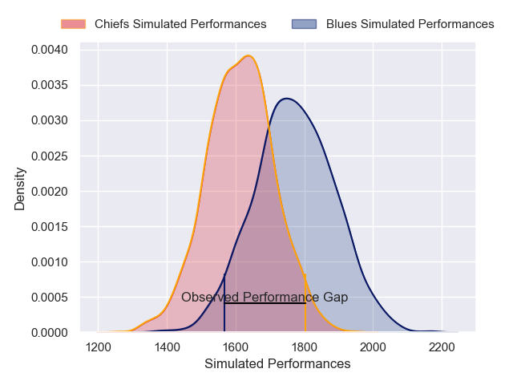
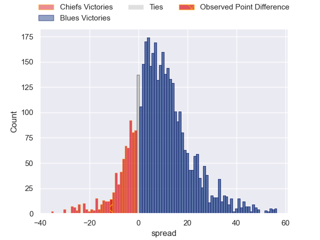
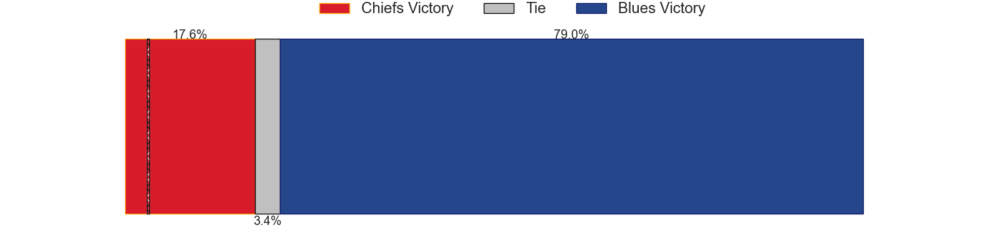
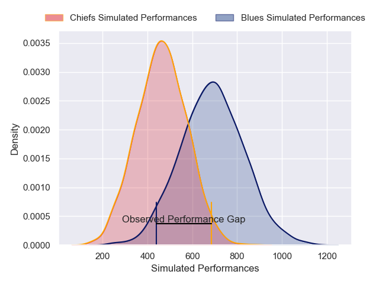
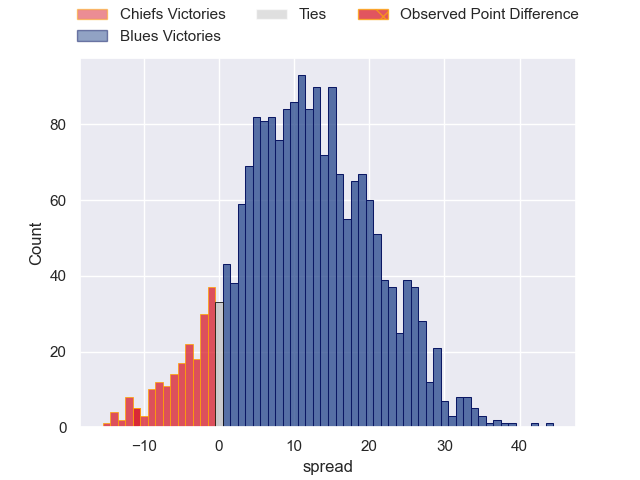

---  
layout: page  
title: Chiefs at Blues; 25-14  
date: 2025-02-15 18:00:00 -0500  
categories: "Super Rugby Pacific 2025" match review  
---
# Chiefs at Blues; 25-14

# Club Level Predictions

The first set of predictions treats a club as the smallest object, as the club develops its members, organizes a gameplan, and deploys its players as needed for each match. This club model has a prediction of 0.705, which translates to predicting Blues to win by 7.9.

Our Over/Under is 48.5 - and combined with the spread above, we have a predicted scoreline of 21 to 28

Each club has a rating and a rating deviation (similar to a Glicko rating), and expected performances can be generated. This allows for simulated matches and spreads like the ones below.
## Projected Performances - Club Model

## Projected Spreads - Club Model

## Projected Results - Club Model

# Player Level Predictions

Treating teams instead as an entity made up of the currently active players, I have ratings for each player in an altogether different system. These can be combined to form team ratings once teamsheets are announced, weighting starters a bit higher than the reserves. After the match is played, players can be weighted by their minutes on the field, allowing for an accurate measure of the team's composition. With these compiled team ratings, we can make predictions, measure inaccuracy, and update the individual player ratings.
## Prediction without Player Minutes: Blues by 14.1

Blues by 6.2 on a neutral pitch

## Projected Performances - Player Model

## Projected Spreads - Player Model

## Projected Results - Player Model

|   Away Minutes | Away Player         |   Away Percentile |   Number |   Home Percentile | Home Player        |   Home Minutes |
|---------------:|:--------------------|------------------:|---------:|------------------:|:-------------------|---------------:|
|             23 | Ollie Norris        |             94.22 |        1 |             97.27 | Ofa Tu'ungafasi    |             39 |
|             83 | Brodie McAlister    |             92.01 |        2 |             62.41 | Ricky Riccitelli   |             83 |
|             39 | George Dyer         |             92.21 |        3 |             71.57 | Marcel Renata      |             83 |
|             83 | Naitoa Ah Kuoi      |             96.8  |        4 |             78.15 | Patrick Tuipulotu  |             51 |
|             83 | Naitoa Ah Kuoi      |             96.8  |        4 |             78.15 | Patrick Tuipulotu  |              7 |
|             37 | Josh Lord           |             77.5  |        5 |             94.63 | Laghlan McWhannell |             51 |
|             53 | Simon Parker        |             80.97 |        6 |             29.99 | Anton Segner       |             60 |
|             85 | Kaylum Boshier      |             76.01 |        7 |             99.06 | Dalton Papalii     |             44 |
|             12 | Luke Jacobson       |             92.28 |        8 |             68.06 | Cameron Suafoa     |             68 |
|             32 | Xavier Roe          |             53.09 |        9 |             23.2  | Taufa Funaki       |             83 |
|             19 | Josh Jacomb         |             80.42 |       10 |             90.62 | Harry Plummer      |             10 |
|             73 | Etene Nanai-Seturo  |             88.13 |       11 |             72.36 | Caleb Clarke       |             28 |
|             64 | Quinn Tupaea        |             95.71 |       12 |             62.92 | AJ Lam             |             39 |
|             83 | Daniel Rona         |             95.3  |       13 |             79.67 | Rieko Ioane        |             11 |
|             56 | Leroy Carter        |             79.59 |       14 |             77.74 | Mark Tele'a        |             32 |
|             56 | Leroy Carter        |             79.59 |       14 |             77.74 | Mark Tele'a        |             83 |
|             56 | Leroy Carter        |             79.59 |       14 |             77.74 | Mark Tele'a        |             74 |
|             56 | Leroy Carter        |             79.59 |       14 |             77.74 | Mark Tele'a        |             15 |
|             58 | Damian McKenzie     |             95.96 |       15 |            100    | Beauden Barrett    |             55 |
|             58 | Bradley Slater      |             91.84 |       16 |            nan    | Nathaniel Pole     |             51 |
|             16 | Aidan Ross          |             99.52 |       17 |             54.86 | Josh Fusitu'a      |             32 |
|             22 | Reuben O'Neill      |             47.87 |       18 |             92.93 | Angus Ta'avao      |             10 |
|             27 | Tupou Vaa'i         |             90.21 |       19 |             23.81 | Che Clark          |             83 |
|             33 | Tupou Vaa'i         |             90.21 |       19 |             23.81 | Che Clark          |             83 |
|             33 | Samipeni Finau      |             95.22 |       20 |             71.7  | Adrian Choat       |             72 |
|             33 | Cortez Ratima       |             83.51 |       21 |             72.85 | Finlay Christie    |             23 |
|             85 | Anton Lienert-Brown |             95.91 |       22 |             85.39 | Corey Evans        |             85 |
|             48 | Emoni Narawa        |             91.93 |       23 |             87.68 | Cole Forbes        |             32 |

