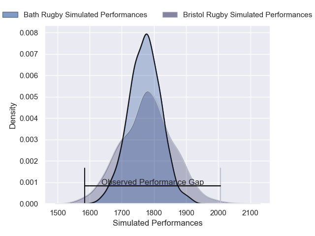
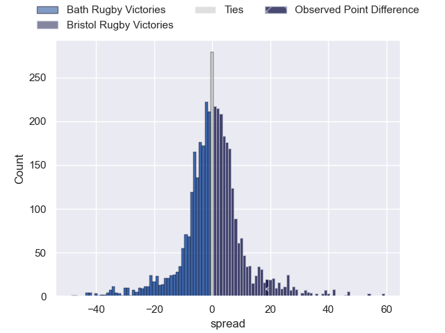
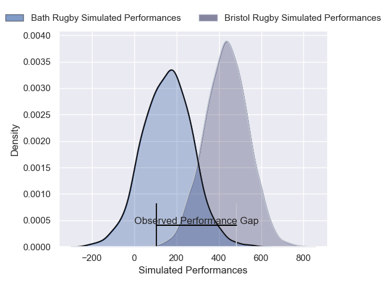
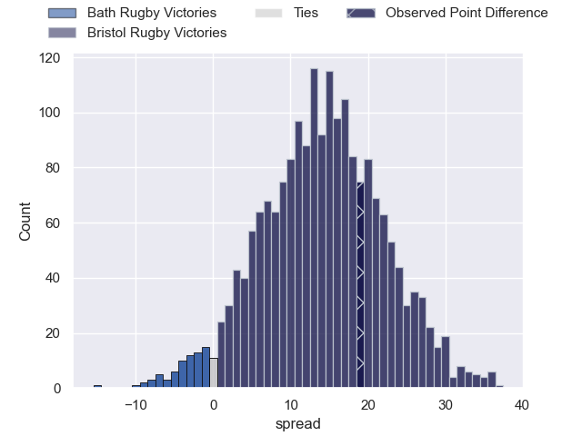

---  
layout: page  
title: Bath Rugby at Bristol Rugby; 21-40  
date: 2025-02-15 18:00:00 -0500  
categories: "Premiership Rugby Cup 24/25" match review  
---
# Bath Rugby at Bristol Rugby; 21-40

# Club Level Predictions

The first set of predictions treats a club as the smallest object, as the club develops its members, organizes a gameplan, and deploys its players as needed for each match. This club model has a prediction of 0.512, which translates to predicting Bristol Rugby to win by 0.4.

Our Over/Under is 50.5 - and combined with the spread above, we have a predicted scoreline of 25 to 26

Each club has a rating and a rating deviation (similar to a Glicko rating), and expected performances can be generated. This allows for simulated matches and spreads like the ones below.
## Projected Performances - Club Model

## Projected Spreads - Club Model

## Projected Results - Club Model

# Player Level Predictions

Treating teams instead as an entity made up of the currently active players, I have ratings for each player in an altogether different system. These can be combined to form team ratings once teamsheets are announced, weighting starters a bit higher than the reserves. After the match is played, players can be weighted by their minutes on the field, allowing for an accurate measure of the team's composition. With these compiled team ratings, we can make predictions, measure inaccuracy, and update the individual player ratings.
## Prediction without Player Minutes: Bristol Rugby by 20.5

Bristol Rugby by 13.5 on a neutral pitch

## Projected Performances - Player Model

## Projected Spreads - Player Model

## Projected Results - Player Model

|   Away Minutes | Away Player         |   Away Percentile |   Number |   Home Percentile | Home Player                |   Home Minutes |
|---------------:|:--------------------|------------------:|---------:|------------------:|:---------------------------|---------------:|
|             80 | Arthur Cordwell     |             19.87 |        1 |             94.06 | Yann Thomas                |             80 |
|              0 | Johnny Stewart      |             54.37 |        2 |             90.57 | Gabriel Oghre              |              0 |
|             80 | Billy Sela          |             94.63 |        3 |             54.15 | George Kloska              |              0 |
|             80 | Will Jeanes         |             40.72 |        4 |             79.36 | Josh Caulfield             |             80 |
|             80 | Ewan Richards       |             72.73 |        5 |             79.17 | Joe Owen                   |             51 |
|              0 | Arthur Green        |             79.79 |        6 |             99.62 | Steven Luatua              |             56 |
|             80 | Ethan Staddon       |             57.48 |        7 |             97.14 | Fitz Harding               |              0 |
|             80 | Alfie Barbeary      |             90.41 |        8 |             66.74 | Viliame Mata               |              0 |
|             80 | Tom Carr-Smith      |             49.3  |        9 |             94.95 | Kieran Marmion             |              0 |
|             64 | Orlando Bailey      |             80.96 |       10 |             92.26 | Harry Byrne                |             80 |
|             80 | Ruaridh McConnochie |             88.34 |       11 |             69.59 | Ratu Naulago               |             80 |
|             80 | Cameron Redpath     |             21.68 |       12 |             96.58 | Benhard Janse van Rensburg |             80 |
|             80 | Louie Hennessey     |              6.02 |       13 |             91.8  | Benjamin Elizalde          |             80 |
|              0 | Joe Cokanasiga      |             95.43 |       14 |             85.26 | Kalaveti Ravouvou          |             80 |
|              0 | Ciaran Donoghue     |             61.59 |       15 |             74.74 | Richard Lane               |             80 |

