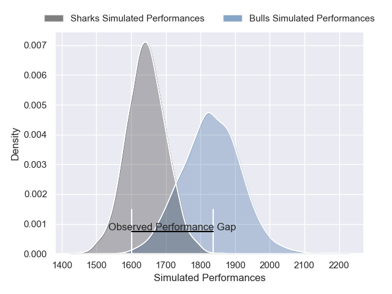
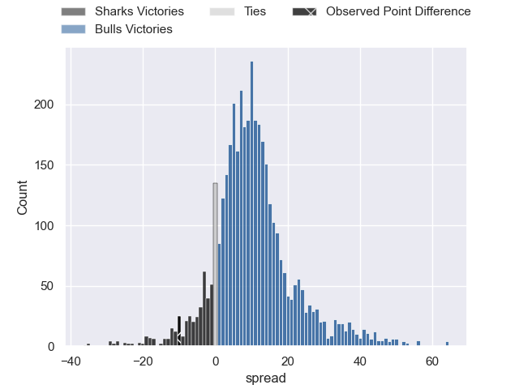
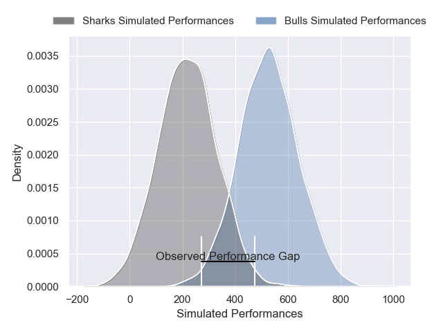
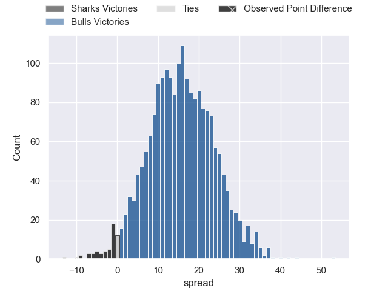

---  
layout: page  
title: Sharks at Bulls; 29-19  
date: 2025-02-15 18:00:00 -0500  
categories: "United Rugby Championship 24/25" match review  
---
# Sharks at Bulls; 29-19

# Club Level Predictions

The first set of predictions treats a club as the smallest object, as the club develops its members, organizes a gameplan, and deploys its players as needed for each match. This club model has a prediction of 0.743, which translates to predicting Bulls to win by 9.3.

Our Over/Under is 49.5 - and combined with the spread above, we have a predicted scoreline of 20 to 29

Each club has a rating and a rating deviation (similar to a Glicko rating), and expected performances can be generated. This allows for simulated matches and spreads like the ones below.
## Projected Performances - Club Model

## Projected Spreads - Club Model

## Projected Results - Club Model

# Player Level Predictions

Treating teams instead as an entity made up of the currently active players, I have ratings for each player in an altogether different system. These can be combined to form team ratings once teamsheets are announced, weighting starters a bit higher than the reserves. After the match is played, players can be weighted by their minutes on the field, allowing for an accurate measure of the team's composition. With these compiled team ratings, we can make predictions, measure inaccuracy, and update the individual player ratings.
## Prediction without Player Minutes: Bulls by 20.8

Bulls by 12.5 on a neutral pitch

## Projected Performances - Player Model

## Projected Spreads - Player Model

## Projected Results - Player Model

|   Away Minutes | Away Player         |   Away Percentile |   Number |   Home Percentile | Home Player         |   Home Minutes |
|---------------:|:--------------------|------------------:|---------:|------------------:|:--------------------|---------------:|
|             30 | Ntuthuko Mchunu     |             12.53 |        1 |             14    | Jan-Hendrik Wessels |             70 |
|             81 | Bongi Mbonambi      |             99.49 |        2 |             91.16 | Johan Grobbelaar    |             58 |
|             19 | Trevor Nyakane      |             82.18 |        3 |             99.35 | Wilco Louw          |             35 |
|             81 | Corne Rahl          |             22.43 |        4 |              1.98 | Ruan Vermaak        |             25 |
|              6 | Jason Jenkins       |             70.59 |        5 |              4.62 | JF van Heerden      |             82 |
|             41 | Tinotenda Mavesere  |             78.32 |        6 |             84.62 | Marco van Staden    |             75 |
|             62 | Vincent Tshituka    |             94.46 |        7 |             44.89 | Reinhardt Ludwig    |             82 |
|              7 | Phepsi Buthelezi    |             48.45 |        8 |             95.88 | Nizaam Carr         |             51 |
|             30 | Grant Williams      |             84.66 |        9 |             85.34 | Embrose Papier      |             81 |
|             81 | Siya Masuku         |             76.84 |       10 |             95.79 | Willie le Roux      |              7 |
|             54 | Ethan Hooker        |             76.36 |       11 |             96.26 | Sergeal Petersen    |             56 |
|             46 | Lukhanyo Am         |             93.95 |       12 |             94.36 | Harold Vorster      |             56 |
|             52 | Jurenzo Julius      |             84.92 |       13 |             69.03 | David Kriel         |             81 |
|             82 | Yaw Penxe           |              7.85 |       14 |             98.97 | Canan Moodie        |              7 |
|             36 | Jordan Hendrikse    |             85.89 |       15 |             87.76 | Devon Williams      |             51 |
|             81 | Ethan Bester        |             48.3  |       16 |             97.11 | Akker van der Merwe |             54 |
|             54 | Ruan Dreyer         |             99.02 |       17 |             90.64 | Gerhard Steenekamp  |             81 |
|             41 | Hanro Jacobs        |            nan    |       18 |             14.65 | Francois Klopper    |             45 |
|             50 | Jeandre Labuschagne |             12.51 |       19 |             93.7  | Jannes Kirsten      |             30 |
|             24 | Jannes Potgieter    |            nan    |       20 |             31.61 | Mpilo Gumede        |             36 |
|             29 | Bradley Davids      |             64.48 |       21 |             93.28 | Zak Burger          |             30 |
|             49 | Francois Venter     |             31.38 |       22 |             64.42 | Boeta Chamberlain   |             45 |
|             29 | Jaco Williams       |            nan    |       23 |              5.7  | Aphiwe Dyantyi      |             25 |

