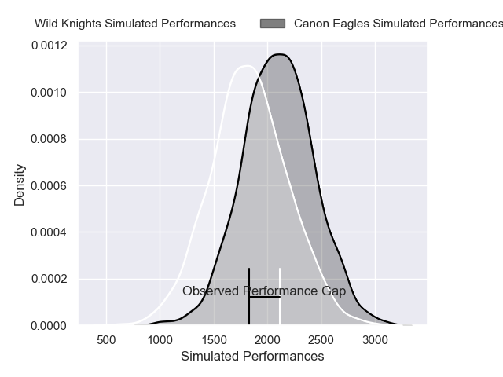
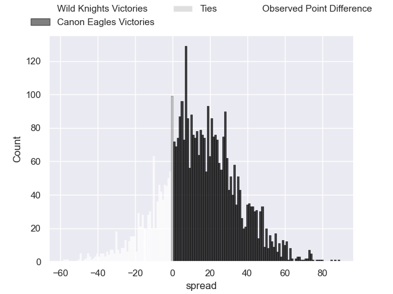
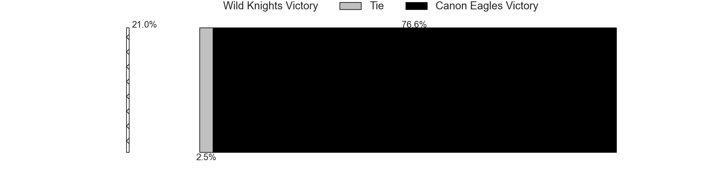
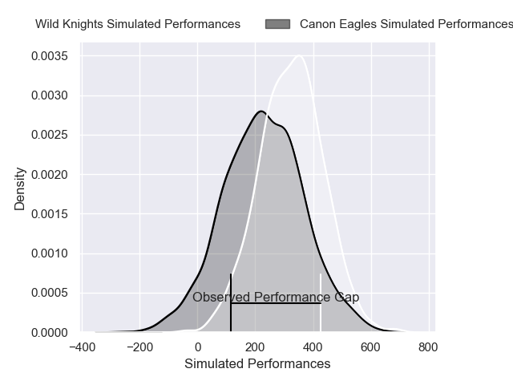
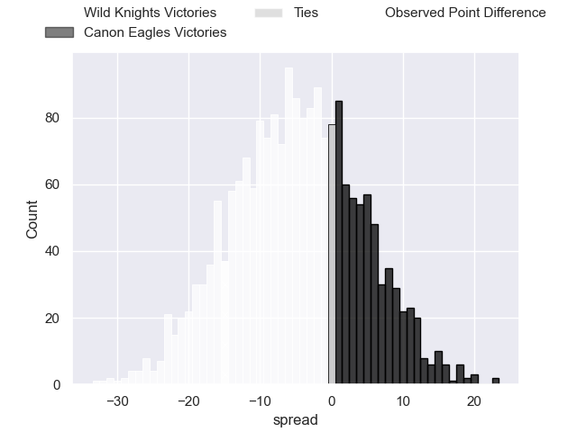
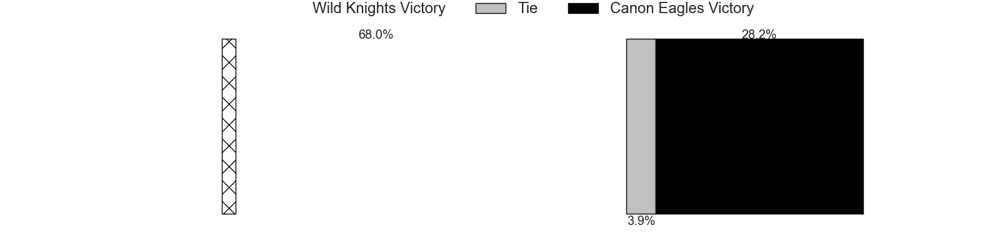

---  
layout: page  
title: Wild Knights at Canon Eagles; 51-36  
date: 2025-02-15 18:00:00 -0500  
categories: "ALL.RUGBY 2025" match review  
---
# Wild Knights at Canon Eagles; 51-36

# Club Level Predictions

The first set of predictions treats a club as the smallest object, as the club develops its members, organizes a gameplan, and deploys its players as needed for each match. This club model has a prediction of 0.748, which translates to predicting Canon Eagles to win by 14.2.

Our Over/Under is 27.5 - and combined with the spread above, we have a predicted scoreline of 7 to 21

Each club has a rating and a rating deviation (similar to a Glicko rating), and expected performances can be generated. This allows for simulated matches and spreads like the ones below.
## Projected Performances - Club Model

## Projected Spreads - Club Model

## Projected Results - Club Model

# Player Level Predictions

Treating teams instead as an entity made up of the currently active players, I have ratings for each player in an altogether different system. These can be combined to form team ratings once teamsheets are announced, weighting starters a bit higher than the reserves. After the match is played, players can be weighted by their minutes on the field, allowing for an accurate measure of the team's composition. With these compiled team ratings, we can make predictions, measure inaccuracy, and update the individual player ratings.
## Prediction without Player Minutes: Wild Knights by 10.7

Wild Knights by 12.9 on a neutral pitch

## Projected Performances - Player Model

## Projected Spreads - Player Model

## Projected Results - Player Model

|   Away Minutes | Away Player       |   Away Percentile |   Number |   Home Percentile | Home Player      |   Home Minutes |
|---------------:|:------------------|------------------:|---------:|------------------:|:-----------------|---------------:|
|             80 | Yusaku Kihara     |             61.81 |        1 |             37.38 | Takato Okabe     |              0 |
|             18 | Atsushi Sakate    |             86.11 |        2 |             39.79 | Yusuke Niwai     |             80 |
|             18 | Taiki Fujii       |             50.24 |        3 |             33.63 | Ryosuke Iwaihara |             80 |
|              0 | Esei Ha'Angana    |             45.31 |        4 |             34.09 | Liaki Moli       |             77 |
|             60 | Lood de Jager     |             98.3  |        5 |             34.66 | Matt Philip      |             70 |
|             80 | Ryota Hasegawa    |             60.58 |        6 |             18.78 | Billy Harmon     |             45 |
|             80 | Lachlan Boshier   |             60.58 |        7 |             40.8  | Masato Furukawa  |             43 |
|             80 | Jack Cornelsen    |             97.44 |        8 |             35.82 | Amanaki Mafi     |             43 |
|             20 | Taiki Koyama      |             96.34 |        9 |             93.73 | Faf de Klerk     |             80 |
|             17 | Kyohei Yamasawa   |             45.61 |       10 |             30.75 | Yuragi Muto      |             62 |
|             29 | Tomoki Osada      |             48.41 |       11 |             54.76 | Viliame Takayawa |              4 |
|             37 | Damian de Allende |            100    |       12 |             62.03 | Yusuke Kajimura  |             80 |
|             35 | Dylan Riley       |             99.38 |       13 |             35.06 | Ryo Tabata       |             65 |
|             37 | Koki Takeyama     |             54.48 |       14 |             33.4  | Chihito Matsui   |             80 |
|             63 | Ryuji Noguchi     |             54.7  |       15 |             61.8  | Brendan Owen     |             80 |
|              3 | Kenji Sato        |            nan    |       16 |             54.89 | Shunta Nakamura  |             62 |
|             27 | Craig Millar      |             41.21 |       17 |            nan    | Tomoki Minami    |             80 |
|             40 | Asaeli Ai Valu    |             98.29 |       18 |            nan    | Shota Matsuoka   |             80 |
|             73 | Liam Mitchell     |            nan    |       19 |             54.92 | Cormac Daly      |             80 |
|            nan | nan               |            nan    |       20 |            nan    | Lekima Nasamila  |             80 |
|            nan | nan               |            nan    |       21 |            nan    | Toshiki Amano    |             80 |
|             80 | Vince Aso         |            nan    |       22 |             51.26 | Yu Tamura        |             80 |
|             80 | Tom Parton        |             81.63 |       23 |             21.09 | Jumpei Ogura     |              0 |
|            nan | nan               |            nan    |       24 |            nan    | Brad Wilkin      |             45 |

