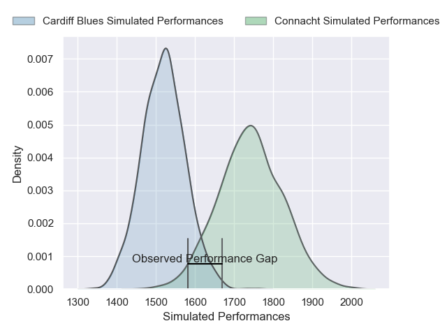
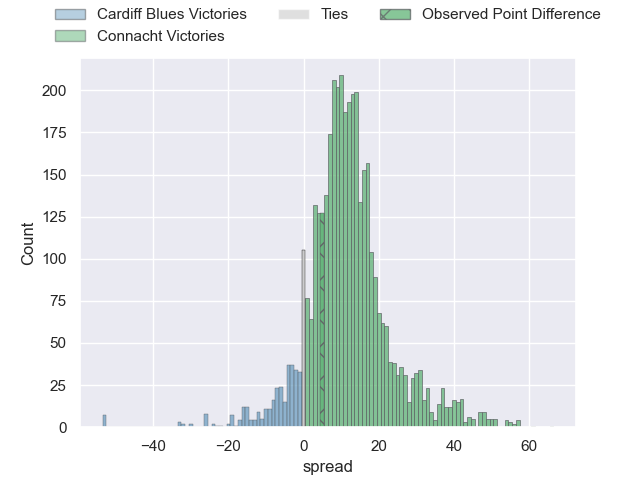
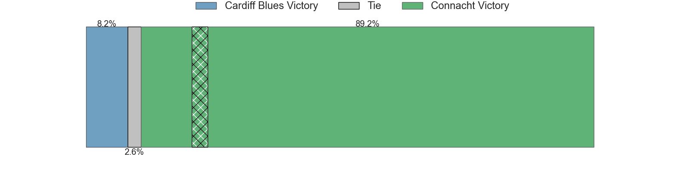
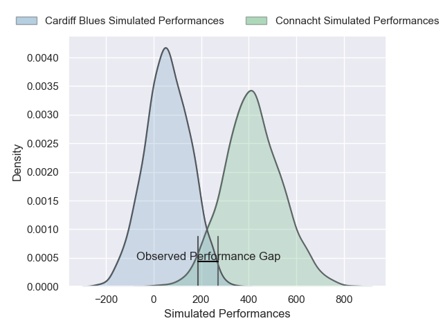
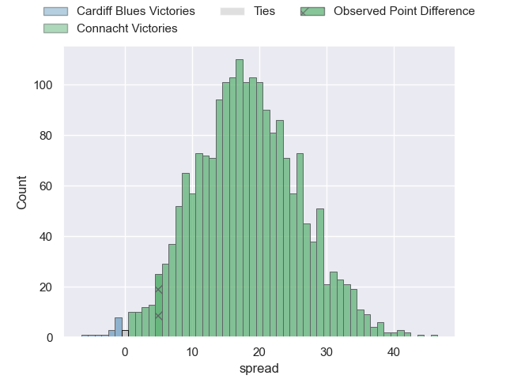
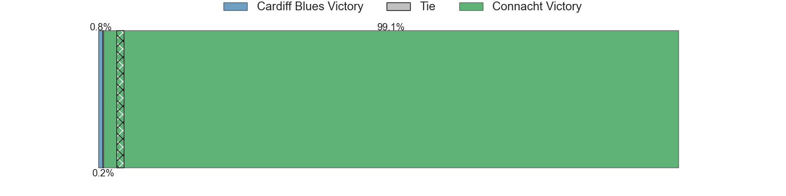

---  
layout: page  
title: Cardiff Blues at Connacht; 19-24  
date: 2025-02-15 18:00:00 -0500  
categories: "United Rugby Championship 24/25" match review  
---
# Cardiff Blues at Connacht; 19-24

# Club Level Predictions

The first set of predictions treats a club as the smallest object, as the club develops its members, organizes a gameplan, and deploys its players as needed for each match. This club model has a prediction of 0.78, which translates to predicting Connacht to win by 11.2.

Our Over/Under is 43.5 - and combined with the spread above, we have a predicted scoreline of 16 to 27

Each club has a rating and a rating deviation (similar to a Glicko rating), and expected performances can be generated. This allows for simulated matches and spreads like the ones below.
## Projected Performances - Club Model

## Projected Spreads - Club Model

## Projected Results - Club Model

# Player Level Predictions

Treating teams instead as an entity made up of the currently active players, I have ratings for each player in an altogether different system. These can be combined to form team ratings once teamsheets are announced, weighting starters a bit higher than the reserves. After the match is played, players can be weighted by their minutes on the field, allowing for an accurate measure of the team's composition. With these compiled team ratings, we can make predictions, measure inaccuracy, and update the individual player ratings.
## Prediction without Player Minutes: Connacht by 18.9

Connacht by 10.6 on a neutral pitch

## Projected Performances - Player Model

## Projected Spreads - Player Model

## Projected Results - Player Model

|   Away Minutes | Away Player        |   Away Percentile |   Number |   Home Percentile | Home Player           |   Home Minutes |
|---------------:|:-------------------|------------------:|---------:|------------------:|:----------------------|---------------:|
|             36 | Rhys Barratt       |             30.92 |        1 |             95.66 | Peter Dooley          |             53 |
|             21 | Liam Belcher       |             63.95 |        2 |             49.49 | Dave Heffernan        |             61 |
|             29 | Rhys Litterick     |             40.48 |        3 |             33.49 | Jack Aungier          |             82 |
|             53 | Josh McNally       |             79.19 |        4 |             92.56 | Josh Murphy           |             80 |
|              0 | Seb Davies         |              3.58 |        5 |             94.82 | Joe Joyce             |             21 |
|             21 | Alex Mann          |              2.72 |        6 |             35.33 | Cian Prendergast      |             39 |
|             46 | Dan Thomas         |             62.89 |        7 |             21.37 | Shamus Hurley-Langton |             82 |
|             82 | Alun Lawrence      |             70.56 |        8 |             57.83 | Paul Boyle            |             42 |
|             29 | Johan Mulder       |             31.44 |        9 |             84.54 | Ben Murphy            |             82 |
|             29 | Callum Sheedy      |             89.79 |       10 |             72.08 | Josh Ioane            |             40 |
|             82 | Harri Millard      |              8.72 |       11 |             56.77 | Chay Mullins          |             80 |
|             22 | Rory Jennings      |             12.46 |       12 |              6.54 | Cathal Forde          |             45 |
|             53 | Rey Lee-Lo         |             86.72 |       13 |             34.73 | Hugh Gavin            |             53 |
|             18 | Gabriel Hamer-Webb |             85.81 |       14 |             75.14 | Shayne Bolton         |             14 |
|             21 | Cameron Winnett    |             10.3  |       15 |             42.83 | Piers O'Conor         |             41 |
|             25 | Efan Daniel        |            nan    |       16 |            nan    | Dylan Tierney-Martin  |             82 |
|             82 | Danny Southworth   |             59.04 |       17 |             39.36 | Jordan Duggan         |             82 |
|             61 | Will Davies-King   |             15.34 |       18 |            nan    | Sam Illo              |             29 |
|             27 | Rory Thornton      |              6.31 |       19 |             71.37 | Oisin Dowling         |             56 |
|             53 | Ben Donnell        |             93.63 |       20 |             20.25 | Sean Jansen           |             82 |
|             56 | Thomas Young       |             67.1  |       21 |             50.34 | Matthew Devine        |             82 |
|             25 | Callum Braley      |            nan    |       22 |             90.83 | JJ Hanrahan           |             31 |
|             31 | Jacob Beetham      |             10.71 |       23 |             96.36 | Santiago Cordero      |             80 |

