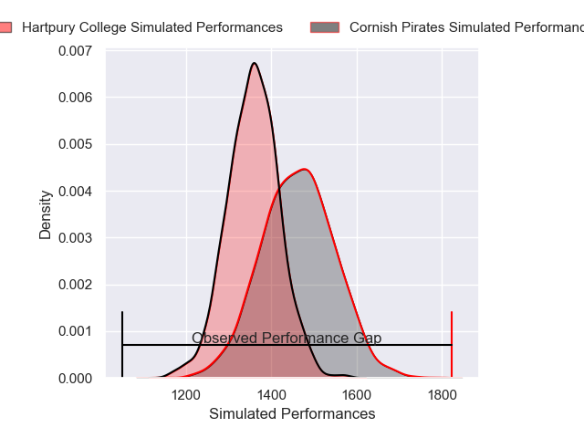
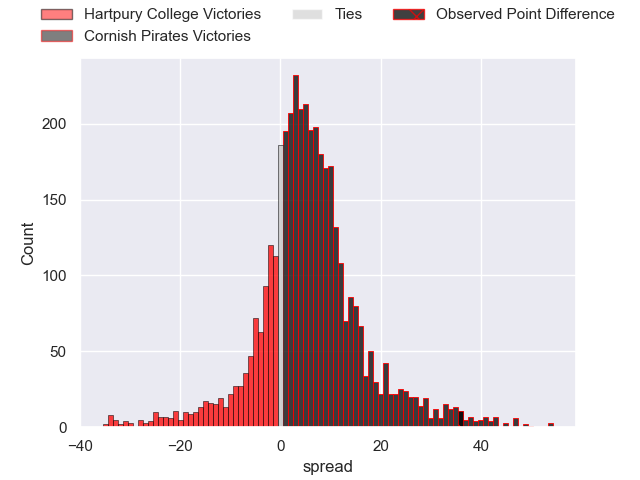
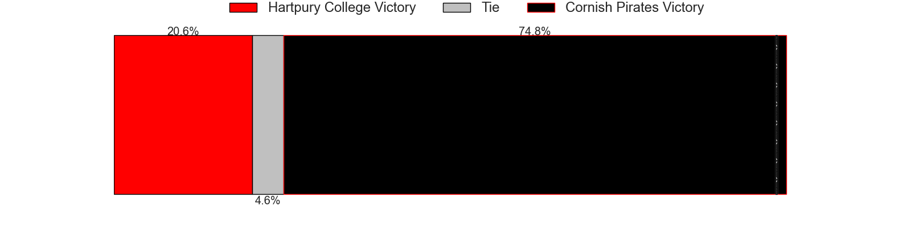
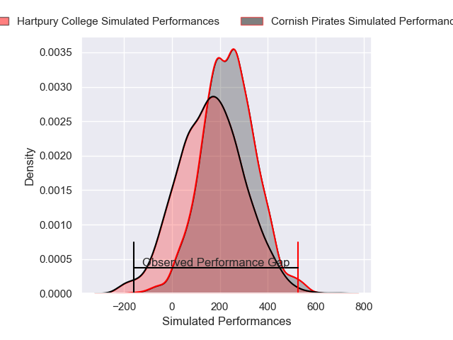
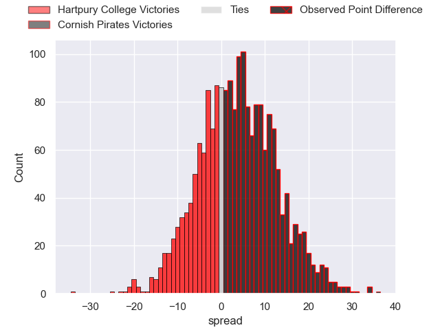
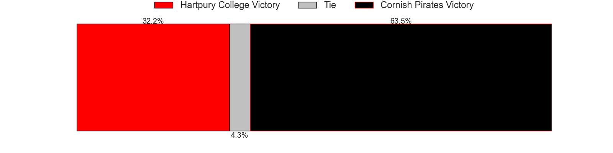

---  
layout: page  
title: Hartpury College at Cornish Pirates; 7-43  
date: 2025-02-15 18:00:00 -0500  
categories: "Premiership Rugby Cup 24/25" match review  
---
# Hartpury College at Cornish Pirates; 7-43

# Club Level Predictions

The first set of predictions treats a club as the smallest object, as the club develops its members, organizes a gameplan, and deploys its players as needed for each match. This club model has a prediction of 0.649, which translates to predicting Cornish Pirates to win by 5.4.

Our Over/Under is 58.5 - and combined with the spread above, we have a predicted scoreline of 26 to 32

Each club has a rating and a rating deviation (similar to a Glicko rating), and expected performances can be generated. This allows for simulated matches and spreads like the ones below.
## Projected Performances - Club Model

## Projected Spreads - Club Model

## Projected Results - Club Model

# Player Level Predictions

Treating teams instead as an entity made up of the currently active players, I have ratings for each player in an altogether different system. These can be combined to form team ratings once teamsheets are announced, weighting starters a bit higher than the reserves. After the match is played, players can be weighted by their minutes on the field, allowing for an accurate measure of the team's composition. With these compiled team ratings, we can make predictions, measure inaccuracy, and update the individual player ratings.
## Prediction without Player Minutes: Cornish Pirates by 6.7

Cornish Pirates by 2.1 on a neutral pitch

## Projected Performances - Player Model

## Projected Spreads - Player Model

## Projected Results - Player Model

|   Away Minutes | Away Player          |   Away Percentile |   Number |   Home Percentile | Home Player       |   Home Minutes |
|---------------:|:---------------------|------------------:|---------:|------------------:|:------------------|---------------:|
|              6 | James Gibbons        |             48.74 |        1 |             78.6  | Oisin Michel      |             80 |
|             57 | Ethan Hunt           |             70.07 |        2 |             80.44 | Sol Moody         |             80 |
|             80 | Alex Gibson          |              5.29 |        3 |             63.06 | James French      |             50 |
|             80 | Cameron Cobbett      |             15.83 |        4 |             60.32 | Alfie Bell        |             34 |
|             80 | Dale Lemon           |             41.47 |        5 |             53.53 | Josh King         |             26 |
|             50 | Peter Paramore       |             32.76 |        6 |             58.83 | Matt Cannon       |             60 |
|             74 | Samuel Lewis         |             54.63 |        7 |             84.24 | Joe Elderkin      |             40 |
|             50 | Josh Gray            |             71.55 |        8 |             49.48 | Chris Mills       |             25 |
|             50 | Stan Folks-Underhill |             27.76 |        9 |             55.69 | Cam Jones         |             28 |
|             45 | Nathan Chamberlain   |             41.89 |       10 |             86.74 | Bruce Houston     |             30 |
|             52 | Oliver Holliday      |             75.89 |       11 |             91.87 | Will Trewin       |             30 |
|             50 | Cam Scott            |             32.31 |       12 |             43.79 | Charlie McCaig    |             45 |
|             53 | Robbie Smith         |              5.64 |       13 |             76.82 | Matthew McNab     |             80 |
|             80 | Bradley Denty        |             68.04 |       14 |             81.59 | Arthur Relton     |             49 |
|             54 | Alex Forrester       |             17.01 |       15 |             39.63 | Iwan Price-Thomas |             30 |
|             50 | Harry Edwards        |             20.5  |       16 |             43.37 | Billy Young       |             74 |
|             52 | Owen Popple          |            nan    |       17 |             78.52 | Ollie Andrews     |             80 |
|             80 | Casey Williams       |            nan    |       18 |            nan    | Samuel Cantwell   |             80 |
|             80 | Jack Rees Davies     |             45.15 |       19 |            nan    | Milo Hallam       |             80 |
|             80 | Harry Short          |             85    |       20 |            nan    | Will Rigelsford   |             50 |
|             54 | Cameron Murray       |            nan    |       21 |            nan    | Louie Sinclair    |             50 |
|             40 | Joe Randall          |            nan    |       22 |            nan    | nan               |            nan |
|             74 | Joseph Williams      |            nan    |       23 |            nan    | nan               |            nan |

