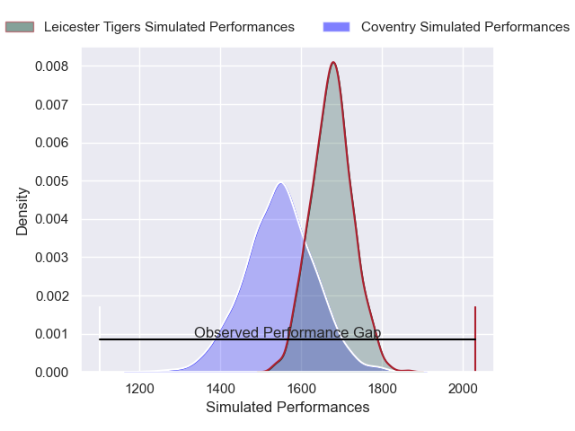
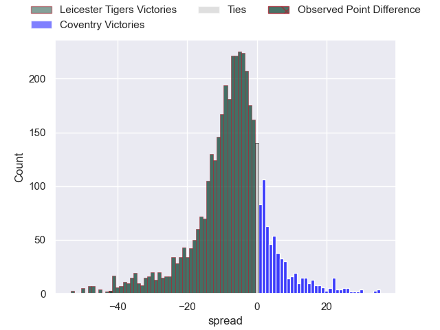
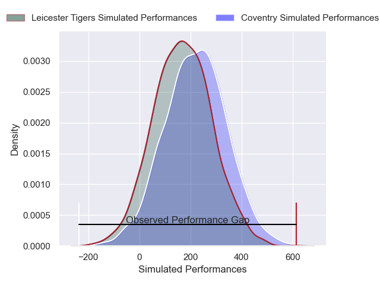
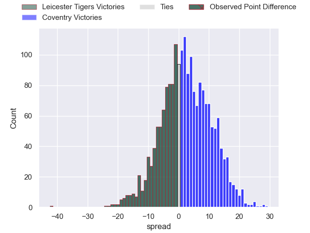

---  
layout: page  
title: Leicester Tigers at Coventry; 68-26  
date: 2025-02-15 18:00:00 -0500  
categories: "Premiership Rugby Cup 24/25" match review  
---
# Leicester Tigers at Coventry; 68-26

# Club Level Predictions

The first set of predictions treats a club as the smallest object, as the club develops its members, organizes a gameplan, and deploys its players as needed for each match. This club model has a prediction of 0.324, which translates to predicting Leicester Tigers to win by 6.5.

Our Over/Under is 50.5 - and combined with the spread above, we have a predicted scoreline of 29 to 22

Each club has a rating and a rating deviation (similar to a Glicko rating), and expected performances can be generated. This allows for simulated matches and spreads like the ones below.
## Projected Performances - Club Model

## Projected Spreads - Club Model

## Projected Results - Club Model

# Player Level Predictions

Treating teams instead as an entity made up of the currently active players, I have ratings for each player in an altogether different system. These can be combined to form team ratings once teamsheets are announced, weighting starters a bit higher than the reserves. After the match is played, players can be weighted by their minutes on the field, allowing for an accurate measure of the team's composition. With these compiled team ratings, we can make predictions, measure inaccuracy, and update the individual player ratings.
## Prediction without Player Minutes: Coventry by 1.1

Leicester Tigers by 2.5 on a neutral pitch

## Projected Performances - Player Model

## Projected Spreads - Player Model

## Projected Results - Player Model

|   Away Minutes | Away Player           |   Away Percentile |   Number |   Home Percentile | Home Player          |   Home Minutes |
|---------------:|:----------------------|------------------:|---------:|------------------:|:---------------------|---------------:|
|             80 | James Cronin          |             96.82 |        1 |             86.97 | Toby Trinder         |              0 |
|             17 | Finn Theobald-Thomas  |             62.95 |        2 |             81.13 | Jordon Poole         |             80 |
|             60 | Ale Loman             |             96.17 |        3 |             31.27 | Vilikesa Nairau      |             80 |
|             60 | Harry Wells           |             92.9  |        4 |             96.4  | Senitiki Nayalo      |             80 |
|             80 | Come Clayver Joussain |             42.9  |        5 |              6.53 | Rhys Anstey          |             80 |
|              0 | Finn Carnduff         |             89.9  |        6 |             78.65 | Tom Ball             |             80 |
|             80 | Emeka Ilione          |             87.99 |        7 |              5.72 | Aaron Hinkley        |             80 |
|             80 | Kyle Hatherell        |              3.2  |        8 |             16.2  | Chester Owen         |             80 |
|             60 | Tom Whiteley          |             86.76 |        9 |             21.08 | Sam Maunder          |              0 |
|             56 | Ben Volavola          |             51.05 |       10 |             51.67 | Tommy Mathews        |              0 |
|             80 | Josh Bassett          |             92.35 |       11 |             75.65 | James Martin         |             80 |
|             46 | Solomone Kata         |             16.7  |       12 |              4.88 | Dafydd-Rhys Tiueti   |             80 |
|             80 | Dan Kelly             |             96.99 |       13 |             38.9  | Thomas Hitchcock     |             80 |
|             20 | Will Wand             |             79.48 |       14 |              2.15 | David Opoku-Fordjour |             80 |
|             80 | James Shillcock       |             34.45 |       15 |             26.51 | Ryan Hutler          |             80 |

