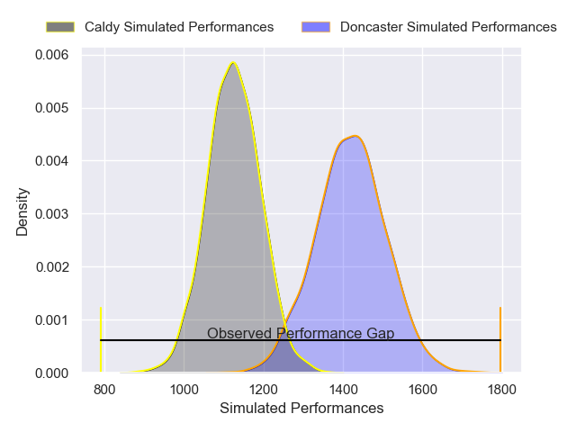
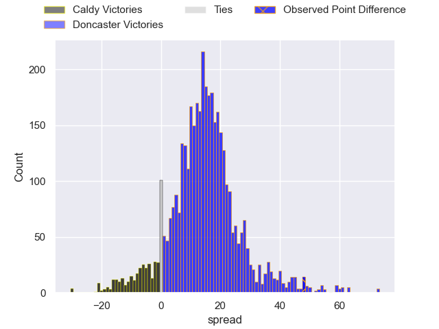
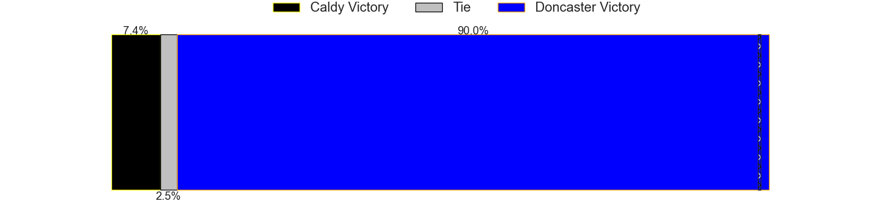
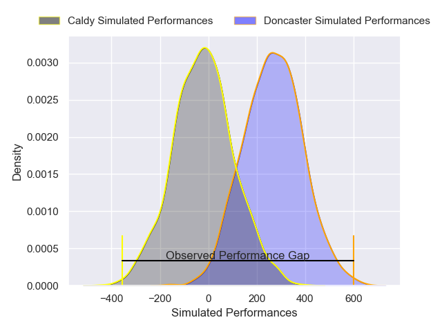
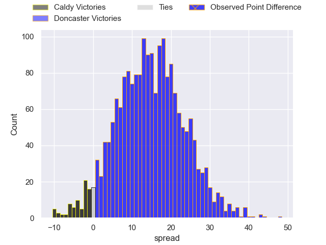

---  
layout: page  
title: Caldy at Doncaster; 0-48  
date: 2025-02-15 18:00:00 -0500  
categories: "Premiership Rugby Cup 24/25" match review  
---
# Caldy at Doncaster; 0-48

# Club Level Predictions

The first set of predictions treats a club as the smallest object, as the club develops its members, organizes a gameplan, and deploys its players as needed for each match. This club model has a prediction of 0.839, which translates to predicting Doncaster to win by 14.7.

Our Over/Under is 53.5 - and combined with the spread above, we have a predicted scoreline of 19 to 34

Each club has a rating and a rating deviation (similar to a Glicko rating), and expected performances can be generated. This allows for simulated matches and spreads like the ones below.
## Projected Performances - Club Model

## Projected Spreads - Club Model

## Projected Results - Club Model

# Player Level Predictions

Treating teams instead as an entity made up of the currently active players, I have ratings for each player in an altogether different system. These can be combined to form team ratings once teamsheets are announced, weighting starters a bit higher than the reserves. After the match is played, players can be weighted by their minutes on the field, allowing for an accurate measure of the team's composition. With these compiled team ratings, we can make predictions, measure inaccuracy, and update the individual player ratings.
## Prediction without Player Minutes: Doncaster by 15.5

Doncaster by 10.8 on a neutral pitch

## Projected Performances - Player Model

## Projected Spreads - Player Model

## Projected Results - Player Model

|   Away Minutes | Away Player       |   Away Percentile |   Number |   Home Percentile | Home Player        |   Home Minutes |
|---------------:|:------------------|------------------:|---------:|------------------:|:-------------------|---------------:|
|             56 | Monty Weatherby   |             19.68 |        1 |             94.62 | Logovi'i Mulipola  |             40 |
|             80 | Matt Gallagher    |             19.73 |        2 |             29.93 | George Roberts     |             32 |
|             56 | Joe Sproston      |              3.86 |        3 |             27.31 | Joe Jones          |             80 |
|             80 | Alex Groves       |             54.33 |        4 |             52.17 | Ben Murphy         |             80 |
|             80 | Thomas Sanders    |             15.91 |        5 |             57.44 | Adam Hopkinson     |             47 |
|             33 | Sam Olyott        |              3.66 |        6 |             80.79 | Morgan Strong      |             59 |
|             47 | Tristan Woodman   |             20.62 |        7 |             38.14 | Archie Smeaton     |             21 |
|             58 | Callum Ridgway    |              3.34 |        8 |             27.56 | Taniela Ramasibana |             19 |
|             47 | Jacob  Tansey     |             11.86 |        9 |             56.7  | Alex Dolly         |             24 |
|             80 | Sam Rogers        |             31.67 |       10 |              6.25 | Morgan Bunting     |             24 |
|             40 | Lucas Wiggins     |             42.02 |       11 |             33.21 | Aidan Cross        |             47 |
|             32 | Michael Barlow    |              9.19 |       12 |              9.81 | Connor Edwards     |             61 |
|             32 | Connor Wilkinson  |              5.01 |       13 |             54.14 | Zach Kerr          |             80 |
|              9 | William Robinson  |              4.73 |       14 |             94.62 | Semesa Rokoduguni  |             59 |
|             19 | Matt Kilcourse    |             29.09 |       15 |             74.75 | Maliq Holden       |             21 |
|             80 | Nathan Rushton    |             12.77 |       16 |             43.37 | Conor Davidson     |             80 |
|             80 | Jack Ellam        |            nan    |       17 |             11.9  | Benjamin Chapman   |             80 |
|             80 | Ryan Higginson    |             11    |       18 |             99.2  | Lewis Thiede       |             80 |
|             80 | Freddie Stevenson |             21.28 |       19 |             72.45 | Fred Davies        |             80 |
|             22 | Ollie Wynn        |             18.38 |       20 |            nan    | Ethan Hulme        |             76 |
|              4 | Charlie Attis     |            nan    |       21 |             38.79 | Cory Teague        |             71 |
|             80 | Dylan Carroll     |            nan    |       22 |              4.98 | Ollie Fox          |             10 |
|            nan | nan               |            nan    |       23 |            nan    | Sam Wadsworth      |             57 |

