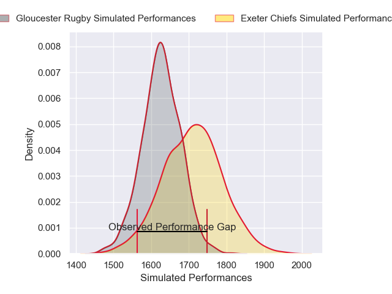
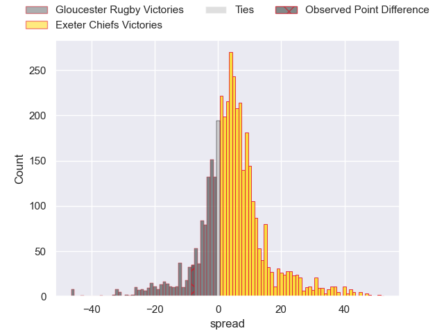
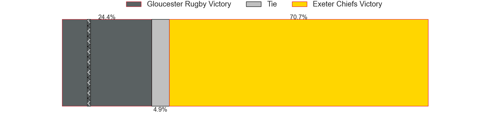
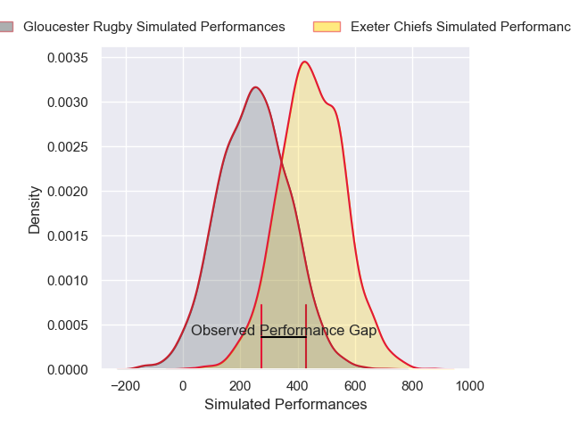
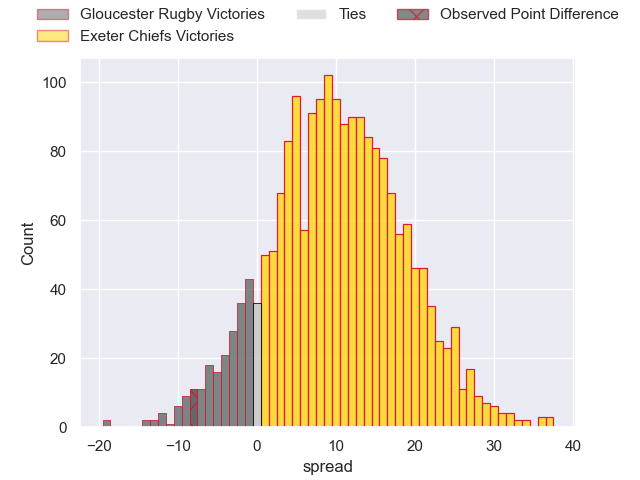
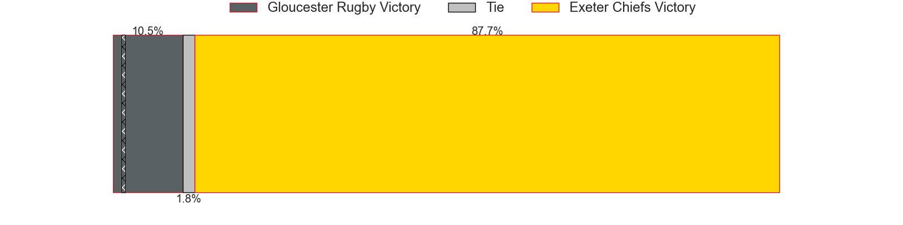

---  
layout: page  
title: Gloucester Rugby at Exeter Chiefs; 22-14  
date: 2025-02-15 18:00:00 -0500  
categories: "Premiership Rugby Cup 24/25" match review  
---
# Gloucester Rugby at Exeter Chiefs; 22-14

# Club Level Predictions

The first set of predictions treats a club as the smallest object, as the club develops its members, organizes a gameplan, and deploys its players as needed for each match. This club model has a prediction of 0.611, which translates to predicting Exeter Chiefs to win by 4.0.

Our Over/Under is 50.5 - and combined with the spread above, we have a predicted scoreline of 23 to 27

Each club has a rating and a rating deviation (similar to a Glicko rating), and expected performances can be generated. This allows for simulated matches and spreads like the ones below.
## Projected Performances - Club Model

## Projected Spreads - Club Model

## Projected Results - Club Model

# Player Level Predictions

Treating teams instead as an entity made up of the currently active players, I have ratings for each player in an altogether different system. These can be combined to form team ratings once teamsheets are announced, weighting starters a bit higher than the reserves. After the match is played, players can be weighted by their minutes on the field, allowing for an accurate measure of the team's composition. With these compiled team ratings, we can make predictions, measure inaccuracy, and update the individual player ratings.
## Prediction without Player Minutes: Exeter Chiefs by 15.9

Exeter Chiefs by 8.0 on a neutral pitch

## Projected Performances - Player Model

## Projected Spreads - Player Model

## Projected Results - Player Model

|   Away Minutes | Away Player           |   Away Percentile |   Number |   Home Percentile | Home Player               |   Home Minutes |
|---------------:|:----------------------|------------------:|---------:|------------------:|:--------------------------|---------------:|
|             68 | Archie McArthur       |             84.9  |        1 |             97.75 | Scott Sio                 |             16 |
|             10 | George McGuigan       |             60.03 |        2 |             86.9  | Dan Frost                 |             30 |
|             80 | Alfie Petch           |             14.06 |        3 |             91.49 | Josh Iosefa-Scott         |             80 |
|             52 | Freddie Clarke        |             43.69 |        4 |             69.59 | Lewis Pearson             |             64 |
|             50 | Cameron Jordan        |             95.76 |        5 |             14.97 | Richard Capstick          |             34 |
|             54 | Cameron Jordan        |             95.76 |        5 |             14.97 | Richard Capstick          |             34 |
|             54 | Freddie Stevens       |             64.57 |        6 |             93.06 | Ethan Roots               |             80 |
|             70 | Caio James            |             77.69 |        7 |             85.94 | Jacques Vermeulen         |             80 |
|             66 | Olly Allport          |             62.63 |        8 |             81.63 | Greg Fisilau              |             80 |
|             56 | Charlie Chapman       |             63.75 |        9 |             80.76 | Stu Townsend              |             80 |
|             26 | Charlie Atkinson      |             86.25 |       10 |             30    | Will Haydon-Wood          |             80 |
|             28 | Jack Cotgreave        |             57.61 |       11 |             64.01 | Paul Brown-Bampoe         |              5 |
|             30 | Morgan Adderly-Jones  |             81.72 |       12 |             88.76 | Will Rigg                 |             31 |
|             26 | William Butler        |             84.47 |       13 |             70.38 | Joe Hawkins               |              5 |
|             80 | Louis Hillman-Cooper  |             66.98 |       14 |             73.65 | Ben Hammersley            |             31 |
|             74 | Jake Morris           |             20.61 |       15 |             83.64 | Tom Wyatt                 |             46 |
|             38 | Toti Benz-Salomon     |             60    |       16 |            nan    | Kwenzokuhle Ndumiso Blose |             54 |
|             26 | Morgan Nelson         |             90.48 |       17 |             97.45 | Jack Yeandle              |             26 |
|             80 | Jonathan Benz-Salomon |             90.28 |       18 |             29.72 | Marcus Street             |             24 |
|             80 | Ioan Jones            |             95.73 |       19 |             81.16 | Martin Moloney            |             20 |
|             60 | Michael Austin        |             65.46 |       20 |             63.94 | Christ Tshiunza           |             43 |
|            nan | nan                   |            nan    |       21 |             87.46 | Tom Cairns                |             80 |
|            nan | nan                   |            nan    |       22 |             68.23 | Tamati Tua                |             60 |
|            nan | nan                   |            nan    |       23 |              4.65 | Josh Hodge                |             80 |

