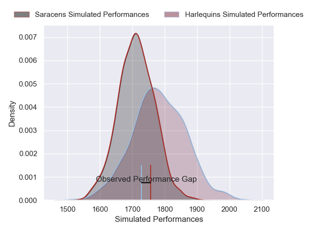
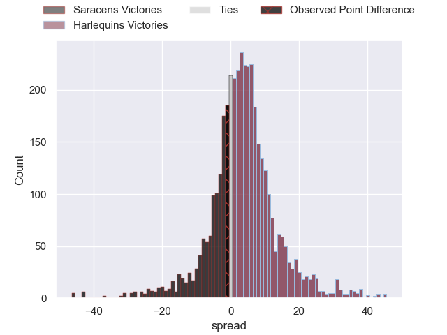
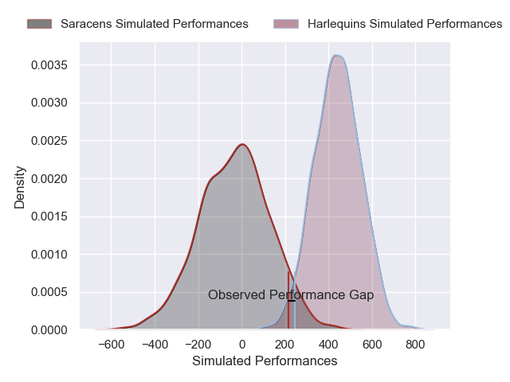
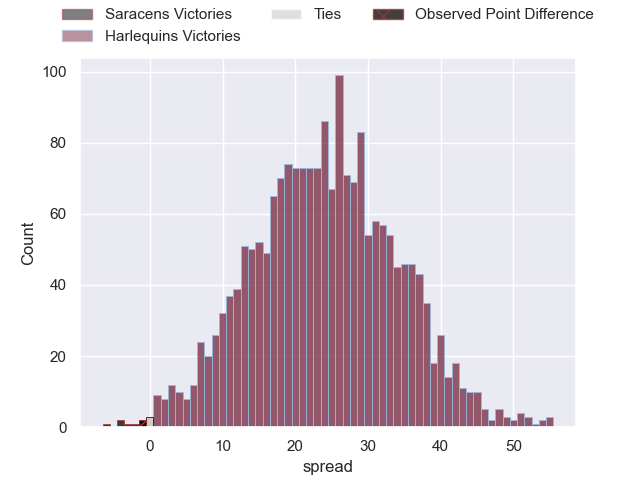

---  
layout: page  
title: Saracens at Harlequins; 30-29  
date: 2025-02-15 18:00:00 -0500  
categories: "Premiership Rugby Cup 24/25" match review  
---
# Saracens at Harlequins; 30-29

# Club Level Predictions

The first set of predictions treats a club as the smallest object, as the club develops its members, organizes a gameplan, and deploys its players as needed for each match. This club model has a prediction of 0.598, which translates to predicting Harlequins to win by 3.5.

Our Over/Under is 50.5 - and combined with the spread above, we have a predicted scoreline of 23 to 27

Each club has a rating and a rating deviation (similar to a Glicko rating), and expected performances can be generated. This allows for simulated matches and spreads like the ones below.
## Projected Performances - Club Model

## Projected Spreads - Club Model

## Projected Results - Club Model

# Player Level Predictions

Treating teams instead as an entity made up of the currently active players, I have ratings for each player in an altogether different system. These can be combined to form team ratings once teamsheets are announced, weighting starters a bit higher than the reserves. After the match is played, players can be weighted by their minutes on the field, allowing for an accurate measure of the team's composition. With these compiled team ratings, we can make predictions, measure inaccuracy, and update the individual player ratings.
## Prediction without Player Minutes: Harlequins by 19.3

Harlequins by 5.5 on a neutral pitch

## Projected Performances - Player Model

## Projected Spreads - Player Model

## Projected Results - Player Model

|   Away Minutes | Away Player       |   Away Percentile |   Number |   Home Percentile | Home Player     |   Home Minutes |
|---------------:|:------------------|------------------:|---------:|------------------:|:----------------|---------------:|
|             80 | Eroni Mawi        |             96.63 |        1 |             79.2  | Wyn Jones       |             53 |
|             80 | James Hadfield    |             86.73 |        2 |             89.46 | Sam Riley       |             83 |
|             80 | Alec Clarey       |             93.65 |        3 |             46.67 | Simon Kerrod    |             53 |
|             80 | Olamide Sodeke    |             81.36 |        4 |             94.26 | Joe Launchbury  |             28 |
|             80 | Hugh Tizard       |             91.15 |        5 |             58.29 | Stephan Lewies  |              9 |
|             51 | Harry Wilson      |             29.24 |        6 |             58.95 | George Hammond  |             54 |
|             54 | Harry Wilson      |             29.24 |        6 |             58.95 | George Hammond  |             54 |
|             74 | Harry Wilson      |             29.24 |        6 |             58.95 | George Hammond  |             54 |
|             80 | Max Eke           |             67.2  |        7 |             67.48 | Will Evans      |             28 |
|             47 | Nathan Michelow   |             88.1  |        8 |             64.51 | Alex Dombrandt  |              6 |
|             80 | Gareth Simpson    |             78.01 |        9 |             96.05 | Danny Care      |             51 |
|             20 | Louie Johnson     |             27.29 |       10 |             65.62 | Jarrod Evans    |             24 |
|             60 | Brandon Jackson   |             55.38 |       11 |             82.65 | Cassius Cleaves |             26 |
|             80 | Josh Hallett      |             59.55 |       12 |             22.06 | Ben Waghorn     |             80 |
|             46 | Angus Hall        |             71.2  |       13 |             83.35 | Will Joseph     |             80 |
|             20 | Tobias Elliott    |             74.03 |       14 |             71.24 | Nick David      |             80 |
|             80 | Alex Goode        |             93.74 |       15 |             55.15 | Leigh Halfpenny |             54 |
|             54 | Phil Brantingham  |              8.67 |       16 |            nan    | Jordan Els      |             83 |
|             54 | Sam Crean         |             78.15 |       17 |             10.88 | Jack Walker     |             54 |
|             42 | Harvey Beaton     |             47.63 |       18 |             89.24 | William Hobson  |             78 |
|             40 | Kaden Pearce-Paul |             58    |       19 |             24.01 | Irne Herbst     |             53 |
|             80 | Reggie Hammick    |             38.99 |       20 |             38.32 | Lewis Gjaltema  |             26 |
|             51 | Charlie Bracken   |             65.12 |       21 |             27.07 | Tyrone Green    |             34 |
|             16 | Tiff Eden         |              7.71 |       22 |             20.83 | Jamie Benson    |             14 |
|              6 | Jack Bracken      |             60.76 |       23 |             50.94 | Lucas Schmid    |             80 |

