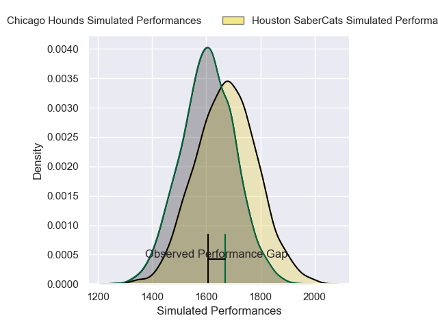
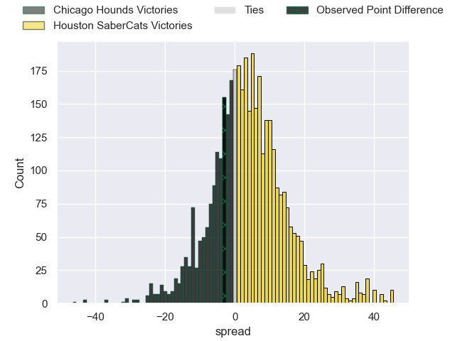
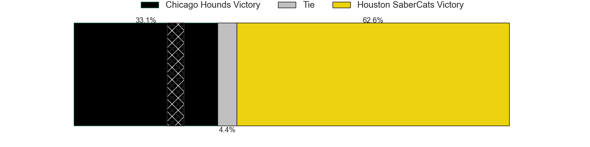
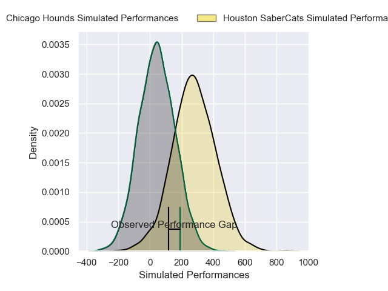
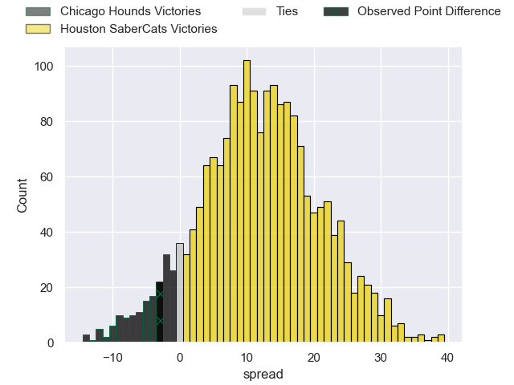
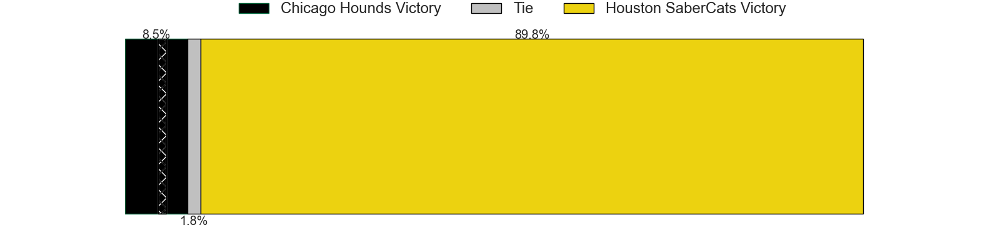

---  
layout: page  
title: Chicago Hounds at Houston SaberCats; 25-22  
date: 2025-02-15 18:00:00 -0500  
categories: "Major League Rugby 2025" match review  
---
# Chicago Hounds at Houston SaberCats; 25-22

# Club Level Predictions

The first set of predictions treats a club as the smallest object, as the club develops its members, organizes a gameplan, and deploys its players as needed for each match. This club model has a prediction of 0.597, which translates to predicting Houston SaberCats to win by 3.6.

Our Over/Under is 48.5 - and combined with the spread above, we have a predicted scoreline of 22 to 26

Each club has a rating and a rating deviation (similar to a Glicko rating), and expected performances can be generated. This allows for simulated matches and spreads like the ones below.
## Projected Performances - Club Model

## Projected Spreads - Club Model

## Projected Results - Club Model

# Player Level Predictions

Treating teams instead as an entity made up of the currently active players, I have ratings for each player in an altogether different system. These can be combined to form team ratings once teamsheets are announced, weighting starters a bit higher than the reserves. After the match is played, players can be weighted by their minutes on the field, allowing for an accurate measure of the team's composition. With these compiled team ratings, we can make predictions, measure inaccuracy, and update the individual player ratings.
## Prediction without Player Minutes: Houston SaberCats by 9.3

Houston SaberCats by 6.0 on a neutral pitch

## Projected Performances - Player Model

## Projected Spreads - Player Model

## Projected Results - Player Model

|   Away Minutes | Away Player        |   Away Percentile |   Number |   Home Percentile | Home Player        |   Home Minutes |
|---------------:|:-------------------|------------------:|---------:|------------------:|:-------------------|---------------:|
|             80 | Faka'osi Pifeleti  |             65.83 |        1 |             24.25 | Valdermar Lee-Lo   |             80 |
|             50 | Dylan Fawsitt      |             98.47 |        2 |             25.17 | Seth Smith         |             80 |
|             65 | Charlie Abel       |             64.77 |        3 |             41.01 | Pono Davis         |             80 |
|             17 | James Scott        |             78.51 |        4 |             92.65 | Justin Basson      |             63 |
|             63 | Hamish Bain        |             64.18 |        5 |             28.09 | Nathan Den Hoedt   |             80 |
|             80 | Mason Flesch       |              2.29 |        6 |             24.74 | Emmanuel Albert    |             80 |
|             63 | Maclean Jones      |             26.93 |        7 |             30.47 | Marno Redelinghuys |             15 |
|             44 | Lucas Rumball      |              0.82 |        8 |             23.71 | Ronan Murphy       |             80 |
|             61 | Mitch Short        |             53.79 |        9 |             61.21 | Andre Warner       |             80 |
|             61 | Tim Swiel          |              4.84 |       10 |             23.37 | Davy Coetzer       |             80 |
|             59 | Mark O'Keeffe      |             65.05 |       11 |             26.26 | Seimou Smith       |             80 |
|             17 | Ollie Devoto       |             16.72 |       12 |             93.03 | Sam Hill           |             80 |
|             17 | Bryce Campbell     |             82.36 |       13 |             34.67 | Dominic Akina      |             36 |
|             15 | Noah Brown         |             58.69 |       14 |             29.07 | Jeremy Misailegalu |             69 |
|             28 | Ben Pollack        |             50.21 |       15 |              8.51 | Drew Wild          |             19 |
|             44 | Jackson Zabierek   |            nan    |       16 |             96.77 | Pita Anae Ah-Sue   |             80 |
|             57 | Liam Fletcher      |            nan    |       17 |            nan    | LaRome White       |             78 |
|             80 | Ignacio Peculo     |             87.79 |       18 |            nan    | Michael Scott      |             36 |
|             21 | Jonah Dietenberger |            nan    |       19 |              9.8  | Johan Momsen       |             80 |
|              6 | Luke White         |              5.57 |       20 |            nan    | Keni Nasoqeqe      |             54 |
|             17 | Michael Baska      |            nan    |       21 |             81.65 | Sam Tuifua         |             44 |
|             65 | Adriaan Carelse    |            nan    |       22 |              2.76 | Jay Renton         |             11 |
|             50 | Noah Flesch        |             44.51 |       23 |            nan    | Max Schumacher     |             15 |

