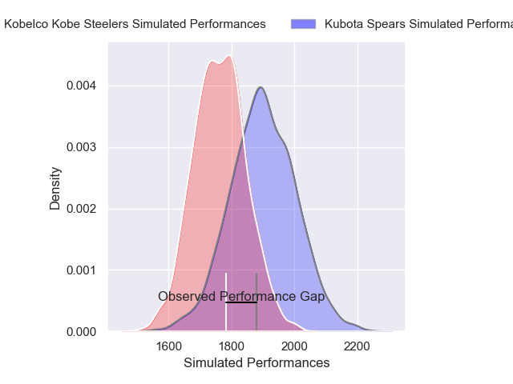
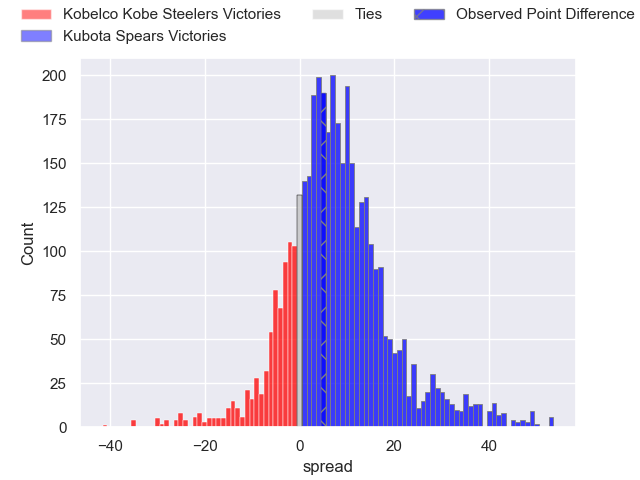
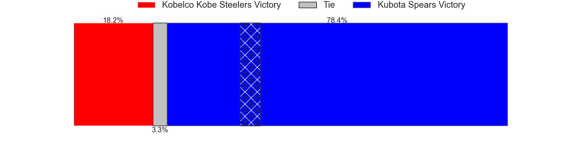
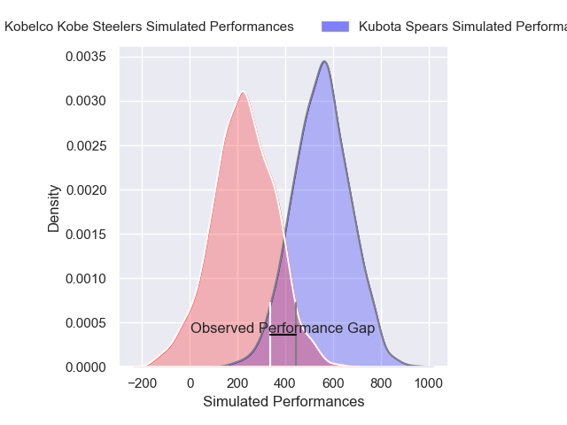
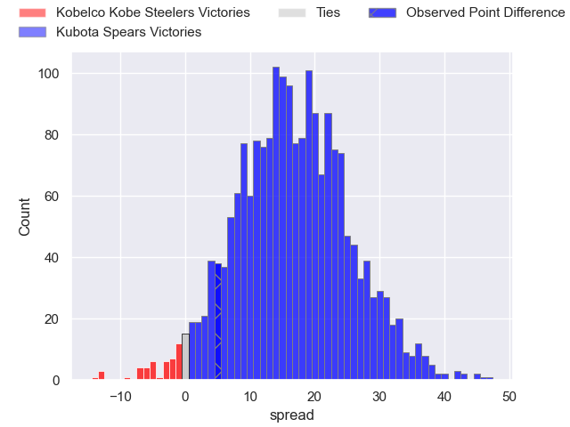
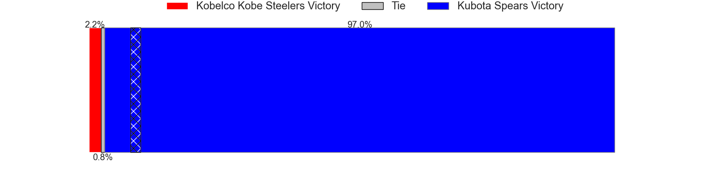

---  
layout: page  
title: Kobelco Kobe Steelers at Kubota Spears; 20-25  
date: 2025-02-15 18:00:00 -0500  
categories: "Japan Rugby League One 24/25" match review  
---
# Kobelco Kobe Steelers at Kubota Spears; 20-25

# Club Level Predictions

The first set of predictions treats a club as the smallest object, as the club develops its members, organizes a gameplan, and deploys its players as needed for each match. This club model has a prediction of 0.681, which translates to predicting Kubota Spears to win by 6.8.

Our Over/Under is 46.5 - and combined with the spread above, we have a predicted scoreline of 20 to 27

Each club has a rating and a rating deviation (similar to a Glicko rating), and expected performances can be generated. This allows for simulated matches and spreads like the ones below.
## Projected Performances - Club Model

## Projected Spreads - Club Model

## Projected Results - Club Model

# Player Level Predictions

Treating teams instead as an entity made up of the currently active players, I have ratings for each player in an altogether different system. These can be combined to form team ratings once teamsheets are announced, weighting starters a bit higher than the reserves. After the match is played, players can be weighted by their minutes on the field, allowing for an accurate measure of the team's composition. With these compiled team ratings, we can make predictions, measure inaccuracy, and update the individual player ratings.
## Prediction without Player Minutes: Kubota Spears by 12.8

Kubota Spears by 8.7 on a neutral pitch

## Projected Performances - Player Model

## Projected Spreads - Player Model

## Projected Results - Player Model

|   Away Minutes | Away Player          |   Away Percentile |   Number |   Home Percentile | Home Player            |   Home Minutes |
|---------------:|:---------------------|------------------:|---------:|------------------:|:-----------------------|---------------:|
|             80 | Shigure Takao        |             74.78 |        1 |             49.88 | Yota Kamimori          |             82 |
|             33 | Kenta Matsuoka       |             65.14 |        2 |             69.73 | Hayate Era             |             26 |
|             54 | Hiroshi Yamashita    |             94.96 |        3 |             71.36 | Keijiro Tamefusa       |             48 |
|              3 | Gerard Cowley-Tuioti |             84.92 |        4 |             55.98 | David Van Zeeland      |             82 |
|              3 | Brodie Retallick     |            100    |        5 |             99.62 | Ruan Botha             |             34 |
|              3 | Waisake Raratubua    |             75.64 |        6 |             90.93 | Lappies Labuschagne    |             34 |
|             77 | Tiennan Costley      |             81.47 |        7 |             90.07 | Takeo Suenaga          |             34 |
|             82 | Amanaki Saumaki      |             69.48 |        8 |             91.34 | Faulua Makisi          |             82 |
|             26 | Atsushi Hiwasa       |             91.55 |        9 |             95.86 | Bryn Hall              |             50 |
|             80 | Bryn Gatland         |             92    |       10 |             99.16 | Bernard Foley          |             78 |
|             82 | Ryota Funabiki       |             59.16 |       11 |             57.66 | Hibiki Yamada          |             19 |
|             48 | Seungsin Lee         |              4    |       12 |             91.9  | Harumichi Tatekawa     |             19 |
|             69 | Ngani Laumape        |             87.69 |       13 |             80.1  | Halatoa Vailea         |             80 |
|             82 | Ataata Moeakiola     |             33.36 |       14 |             95.05 | Gerhard van den Heever |             82 |
|             56 | Kenta Matsunaga      |             52.07 |       15 |             86.51 | Shaun Stevenson        |             78 |
|             82 | Kauvaka Kaivelata    |             47.84 |       16 |            nan    | Kazuki Kato            |             66 |
|             48 | Naohiro Kotaki       |             29.59 |       17 |            100    | Malcolm Marx           |             63 |
|             48 | Takuya Kitade        |             83.16 |       18 |             84.95 | Opeti Helu             |             63 |
|             15 | Go Maeda             |            nan    |       19 |             91.28 | Sione Teaupa           |             63 |
|             67 | Rakuhei Yamashita    |             95.14 |       20 |             89.91 | Koga Nezuka            |             63 |
|             82 | Timothy Lafaele      |             47.28 |       21 |             87.11 | Finau Tupa             |             29 |
|              9 | Willie Potgieter     |             30.37 |       22 |            nan    | Shunta Koga            |             72 |
|             82 | Daiki Nakajima       |             44.66 |       23 |            nan    | nan                    |            nan |

