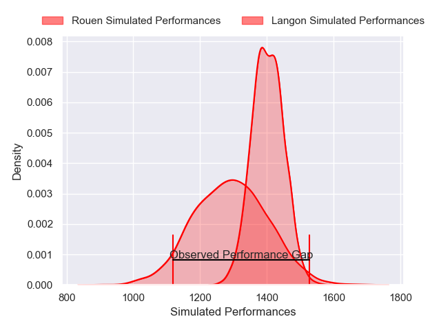
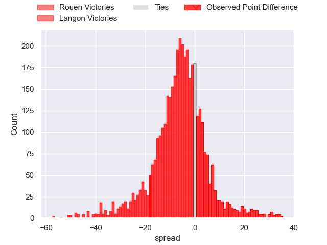
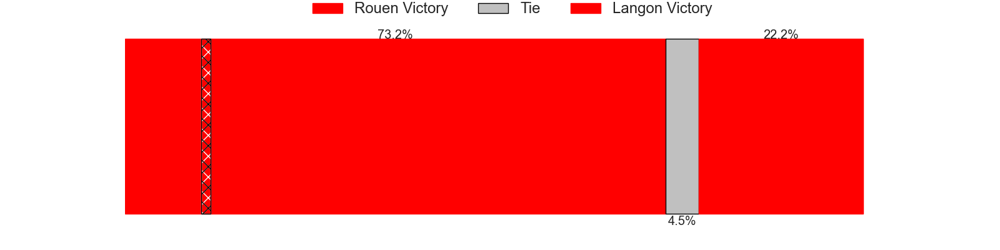
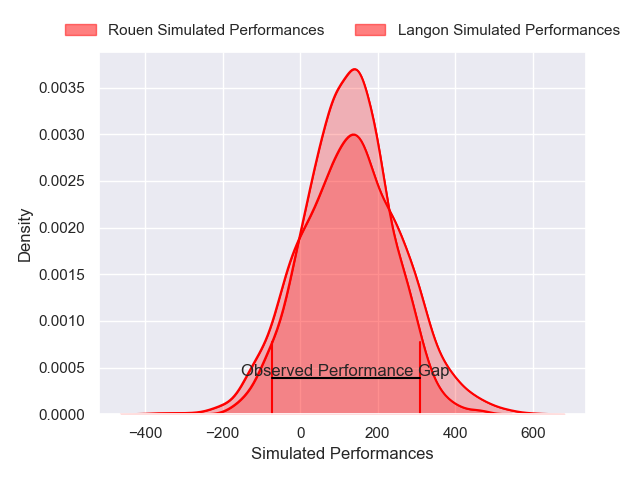
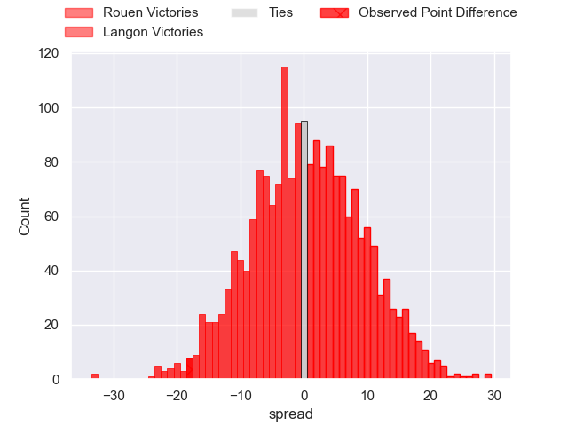

---  
layout: page  
title: Rouen at Langon; 34-16  
date: 2025-02-15 18:00:00 -0500  
categories: "Nationale 24/25" match review  
---
# Rouen at Langon; 34-16

# Club Level Predictions

The first set of predictions treats a club as the smallest object, as the club develops its members, organizes a gameplan, and deploys its players as needed for each match. This club model has a prediction of 0.343, which translates to predicting Rouen to win by 5.7.

Our Over/Under is 38.5 - and combined with the spread above, we have a predicted scoreline of 22 to 16

Each club has a rating and a rating deviation (similar to a Glicko rating), and expected performances can be generated. This allows for simulated matches and spreads like the ones below.
## Projected Performances - Club Model

## Projected Spreads - Club Model

## Projected Results - Club Model

# Player Level Predictions

Treating teams instead as an entity made up of the currently active players, I have ratings for each player in an altogether different system. These can be combined to form team ratings once teamsheets are announced, weighting starters a bit higher than the reserves. After the match is played, players can be weighted by their minutes on the field, allowing for an accurate measure of the team's composition. With these compiled team ratings, we can make predictions, measure inaccuracy, and update the individual player ratings.
## Prediction without Player Minutes: Langon by 0.4

Rouen by 1.9 on a neutral pitch

## Projected Performances - Player Model

## Projected Spreads - Player Model

## Projected Results - Player Model

|   Away Minutes | Away Player           |   Away Percentile |   Number |   Home Percentile | Home Player              |   Home Minutes |
|---------------:|:----------------------|------------------:|---------:|------------------:|:-------------------------|---------------:|
|             35 | Ewan Clément          |             39.76 |        1 |             20.24 | Lucas Hernandez          |             80 |
|             30 | Lucas Malbert         |             28.74 |        2 |             39.97 | Julien Graffouillère     |             60 |
|             80 | Sidi-Mohammed Diallo  |             66.43 |        3 |             37.19 | Loïc Clave               |             80 |
|             50 | Octave Leleu          |             57.06 |        4 |             18.46 | Thomas Geffré            |             40 |
|             30 | Jean Leleu            |             42.84 |        5 |             39.64 | Helmi Mimouna            |             51 |
|             74 | Ernest Eudier         |             68.98 |        6 |             43.11 | Thomas Mendy             |             67 |
|             75 | Julien Ruaud          |             91.28 |        7 |             30.93 | Ludovic Sempé            |             26 |
|             35 | Abdelkarim Fofana     |             80.58 |        8 |              9.6  | Isikili Seva Davetawalu  |             80 |
|             80 | Ilan El Khattabi      |             13.4  |        9 |             34.71 | Baptiste Tisne Cardeneau |             80 |
|              6 | Maxime Javaux         |             51.88 |       10 |              8.12 | Vincent Debladis         |             80 |
|              6 | Benjamin Descamps     |             70.69 |       11 |             12.24 | Quentin Lefort           |             50 |
|              6 | Theo Dachary          |              4.49 |       12 |             34.22 | Charli Espagnet          |             80 |
|             29 | Marin Boulier         |             57.1  |       13 |             29.52 | Guillaume Christophe     |             80 |
|             72 | Sakiusa Bureitakiyaca |             74.21 |       14 |             25.23 | Maxime Lartigue          |             80 |
|             27 | Aloïs Chayla          |             51.92 |       15 |             33.74 | Nathan Gagnac            |             69 |
|             49 | Willy N'Diaye         |             14.9  |       16 |              4.98 | Maxime Gau               |             76 |
|             13 | Soso Bekoshvili       |             81.04 |       17 |             55.48 | Thomas Bishop            |             29 |
|             74 | Florent Campeggia     |             72.16 |       18 |              7.82 | Thomas De Molder         |             80 |
|             30 | Benjamin Pehau        |             78.96 |       19 |             28.67 | Ratu Nailoma Vatubua     |             14 |
|             30 | Mathieu Bonnot        |             56.46 |       20 |             80.39 | Sionasa Vunisa           |             80 |
|             80 | Alexis Decaux         |             82.97 |       21 |             57.31 | Maxime Lancon            |             33 |
|             28 | Manolo Laffond        |             57.92 |       22 |             71.48 | Bastien Cazale-Debat     |             52 |
|             25 | Axel Malaret          |             43.23 |       23 |             39.55 | Nathan Lobjoit           |             52 |

