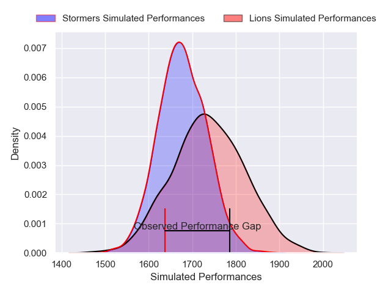
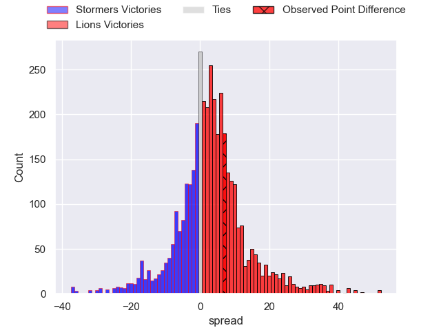
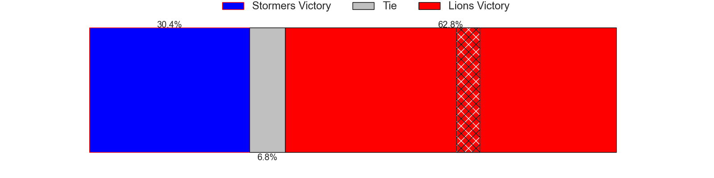
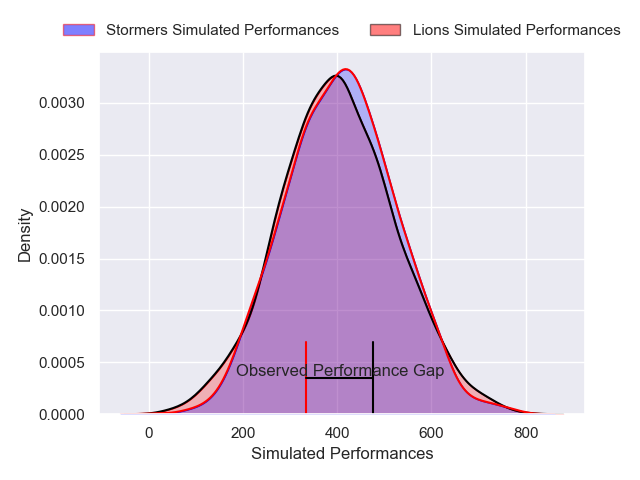
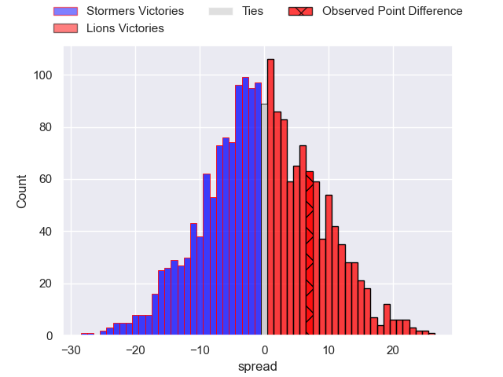

---  
layout: page  
title: Stormers at Lions; 23-30  
date: 2025-02-15 18:00:00 -0500  
categories: "United Rugby Championship 24/25" match review  
---
# Stormers at Lions; 23-30

# Club Level Predictions

The first set of predictions treats a club as the smallest object, as the club develops its members, organizes a gameplan, and deploys its players as needed for each match. This club model has a prediction of 0.586, which translates to predicting Lions to win by 3.1.

Our Over/Under is 54.5 - and combined with the spread above, we have a predicted scoreline of 26 to 29

Each club has a rating and a rating deviation (similar to a Glicko rating), and expected performances can be generated. This allows for simulated matches and spreads like the ones below.
## Projected Performances - Club Model

## Projected Spreads - Club Model

## Projected Results - Club Model

# Player Level Predictions

Treating teams instead as an entity made up of the currently active players, I have ratings for each player in an altogether different system. These can be combined to form team ratings once teamsheets are announced, weighting starters a bit higher than the reserves. After the match is played, players can be weighted by their minutes on the field, allowing for an accurate measure of the team's composition. With these compiled team ratings, we can make predictions, measure inaccuracy, and update the individual player ratings.
## Prediction without Player Minutes: Lions by 7.6

Lions by 1.2 on a neutral pitch

## Projected Performances - Player Model

## Projected Spreads - Player Model

## Projected Results - Player Model

|   Away Minutes | Away Player        |   Away Percentile |   Number |   Home Percentile | Home Player            |   Home Minutes |
|---------------:|:-------------------|------------------:|---------:|------------------:|:-----------------------|---------------:|
|             69 | Alistair Vermaak   |             82.33 |        1 |             55.34 | Juan Schoeman          |              4 |
|             26 | JJ Kotze           |              3.23 |        2 |             84.18 | PJ Botha               |             34 |
|             32 | Frans Malherbe     |             73.25 |        3 |             73.01 | Asenathi Ntlabakanye   |             82 |
|             19 | Salmaan Moerat     |             77.97 |        4 |             89.45 | Etienne Oosthuizen     |             48 |
|             63 | Ruben van Heerden  |             85.59 |        5 |             73.45 | Darrien-Lane Landsberg |             34 |
|             63 | Ruben van Heerden  |             85.59 |        5 |             73.45 | Darrien-Lane Landsberg |             15 |
|             26 | Deon Fourie        |             95.5  |        6 |             88.47 | JC Pretorius           |             34 |
|             17 | Ben-Jason Dixon    |             63.36 |        7 |             92.69 | Ruan Venter            |             82 |
|             65 | Evan Roos          |             87.47 |        8 |             98.12 | Francke Horn           |             82 |
|             63 | Herschel Jantjies  |             91.58 |        9 |             89    | Morne van den Berg     |              9 |
|             74 | Jurie Matthee      |             31.04 |       10 |             89.38 | Gianni Lombard         |             19 |
|             69 | Angelo Davids      |             95.36 |       11 |             95.08 | Edwill van der Merwe   |             19 |
|             82 | Daniel du Plessis  |             89.99 |       12 |             93.77 | Marius Louw            |              9 |
|             82 | Wandisile Simelane |             64.66 |       13 |             73.75 | Henco van Wyk          |             19 |
|             21 | Ben Loader         |             89.42 |       14 |             57.7  | Richard Kriel          |             56 |
|             63 | Warrick Gelant     |             98.18 |       15 |             96.97 | Quan Horn              |             63 |
|             26 | Andre-Hugo Venter  |             76.02 |       16 |             90.82 | Jaco Visagie           |             69 |
|             82 | Brok Harris        |             99.92 |       17 |            nan    | SJ Kotze               |             82 |
|             34 | Neethling Fouche   |             84.18 |       18 |            nan    | RF Schoeman            |             56 |
|             48 | Gary Porter        |             18.17 |       19 |             56.97 | Ruan Delport           |             48 |
|             13 | Paul De Villiers   |            nan    |       20 |             26.43 | Jarod Cairns           |             48 |
|             82 | Marcel Theunissen  |             42.55 |       21 |             70.45 | Nico Steyn             |             48 |
|             41 | Paul de Wet        |             80.93 |       22 |            nan    | Lubabalo Dobela        |             82 |
|             67 | Jonathan Roche     |             54.03 |       23 |             19.2  | Manuel Rass            |             82 |
|             67 | Jonathan Roche     |             54.03 |       23 |             19.2  | Manuel Rass            |             73 |

