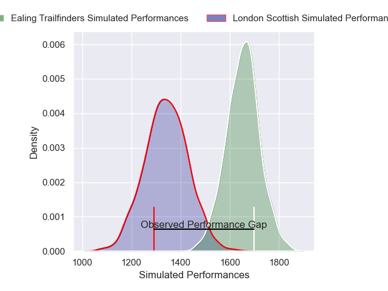
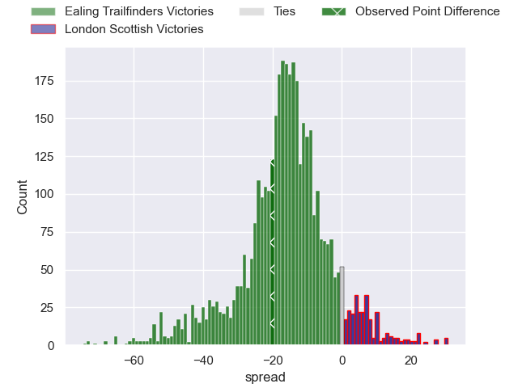
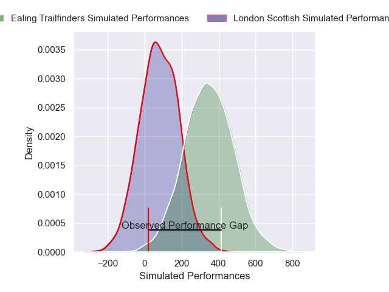
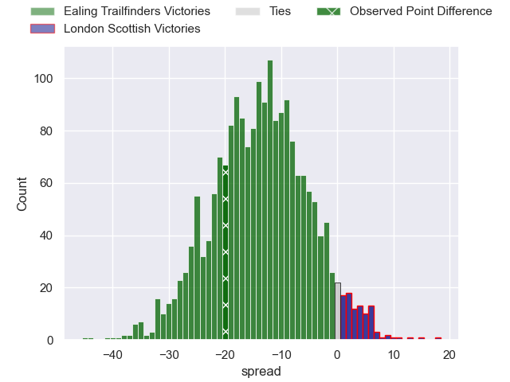

---  
layout: page  
title: Ealing Trailfinders at London Scottish; 35-15  
date: 2025-02-15 18:00:00 -0500  
categories: "Premiership Rugby Cup 24/25" match review  
---
# Ealing Trailfinders at London Scottish; 35-15

# Club Level Predictions

The first set of predictions treats a club as the smallest object, as the club develops its members, organizes a gameplan, and deploys its players as needed for each match. This club model has a prediction of 0.146, which translates to predicting Ealing Trailfinders to win by 15.7.

Our Over/Under is 58.5 - and combined with the spread above, we have a predicted scoreline of 37 to 21

Each club has a rating and a rating deviation (similar to a Glicko rating), and expected performances can be generated. This allows for simulated matches and spreads like the ones below.
## Projected Performances - Club Model

## Projected Spreads - Club Model

## Projected Results - Club Model

# Player Level Predictions

Treating teams instead as an entity made up of the currently active players, I have ratings for each player in an altogether different system. These can be combined to form team ratings once teamsheets are announced, weighting starters a bit higher than the reserves. After the match is played, players can be weighted by their minutes on the field, allowing for an accurate measure of the team's composition. With these compiled team ratings, we can make predictions, measure inaccuracy, and update the individual player ratings.
## Prediction without Player Minutes: Ealing Trailfinders by 15.3

Ealing Trailfinders by 19.7 on a neutral pitch

## Projected Performances - Player Model

## Projected Spreads - Player Model

## Projected Results - Player Model

|   Away Minutes | Away Player         |   Away Percentile |   Number |   Home Percentile | Home Player           |   Home Minutes |
|---------------:|:--------------------|------------------:|---------:|------------------:|:----------------------|---------------:|
|              4 | James Kenny         |             21.4  |        1 |             76.97 | Will Prior            |              9 |
|             83 | Mike Willemse       |             85.2  |        2 |             48.98 | Calum Scott           |             30 |
|             62 | George Davis        |             82.34 |        3 |              3.5  | Ashley Challenger     |             30 |
|             83 | Bobby de Wee        |             95    |        4 |              8.11 | Jonny Green           |             20 |
|             80 | Sean Lonsdale       |             36.57 |        5 |             16.31 | Alex Wardell          |             75 |
|             80 | Rob Farrar          |             86.63 |        6 |              7.16 | Ioan Rhys Davies      |             80 |
|              0 | Jordy Reid          |             76.6  |        7 |              5.54 | Jack Ingall           |             80 |
|              0 | Will Montgomery     |             37.73 |        8 |             56.49 | Zach Carr             |             20 |
|             80 | Craig Hampson       |             89.66 |        9 |             21.38 | Jonny Law             |              6 |
|              0 | Dan Jones           |             80.42 |       10 |             19.79 | Alexander Lloyd-Seed  |             20 |
|             45 | Tom Collins         |             99.35 |       11 |              1.21 | Noah Ferdinand        |             80 |
|             78 | Francis Moore       |             53.54 |       12 |              3.9  | Robert David McCallum |             11 |
|             80 | Reuben Bird-Tulloch |             77.44 |       13 |             15.9  | Hayden Hyde           |             60 |
|             38 | Angus Kernohan      |             90.65 |       14 |             19.16 | Roma Zheng            |             40 |
|             83 | Tobi Wilson         |             83.2  |       15 |             79.05 | Jonah Holmes          |             14 |
|             83 | Elliott Chilvers    |             54.35 |       16 |             12.77 | Ntinga Mpiko          |             60 |
|             83 | Scott Buckley       |            nan    |       17 |            nan    | George Head           |             80 |
|             53 | Kabous Bezuidenhout |            nan    |       18 |             27.75 | Caleb Ashworth        |             26 |
|             70 | Daniel Cutmore      |             91.89 |       19 |             14.42 | Lewis Barrett         |             60 |
|             13 | Danny Bridge        |             55.78 |       20 |            nan    | Tom Johnson           |             80 |
|             71 | Micheal Stronge     |              7.93 |       21 |              6.21 | Stephen Kerins        |             17 |
|             21 | Craig Willis        |             98.32 |       22 |             13.68 | Tom Wilstead          |             28 |
|             40 | Dan O'Brien         |             25.54 |       23 |             81.33 | Bryn Bradley          |             28 |

