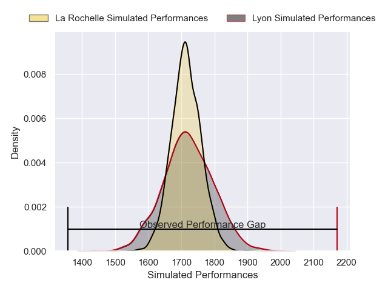
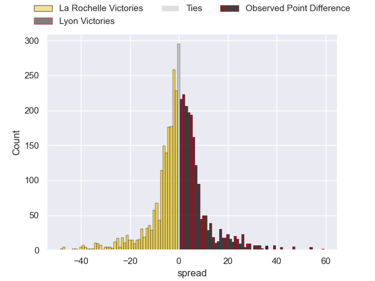
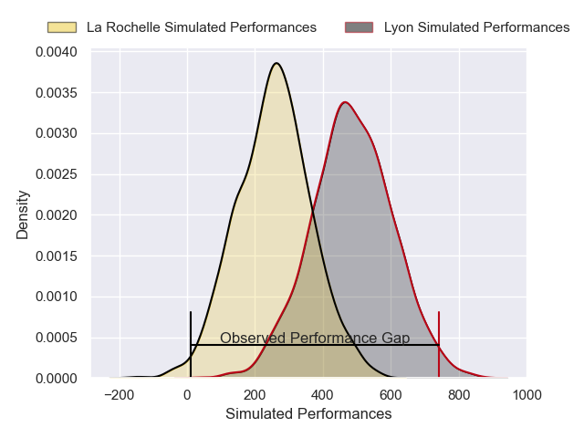
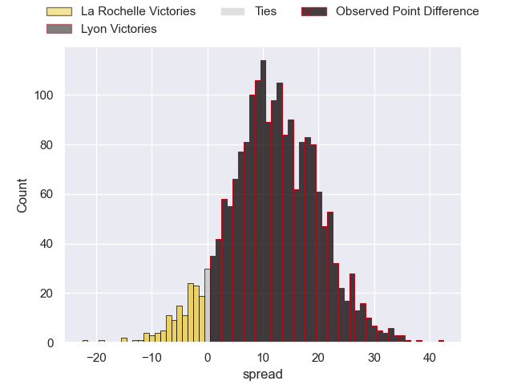
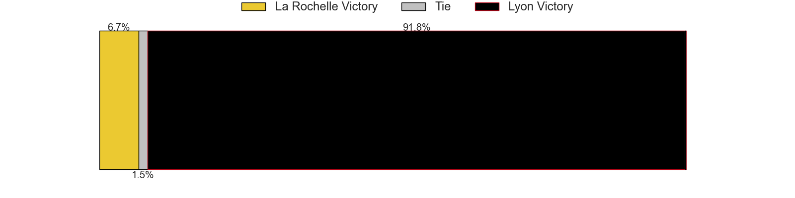

---  
layout: page  
title: La Rochelle at Lyon; 17-53  
date: 2025-02-15 18:00:00 -0500  
categories: "Top 14 Orange 24/25" match review  
---
# La Rochelle at Lyon; 17-53

# Club Level Predictions

The first set of predictions treats a club as the smallest object, as the club develops its members, organizes a gameplan, and deploys its players as needed for each match. This club model has a prediction of 0.511, which translates to predicting Lyon to win by 0.4.

Our Over/Under is 56.5 - and combined with the spread above, we have a predicted scoreline of 28 to 28

Each club has a rating and a rating deviation (similar to a Glicko rating), and expected performances can be generated. This allows for simulated matches and spreads like the ones below.
## Projected Performances - Club Model

## Projected Spreads - Club Model

## Projected Results - Club Model

# Player Level Predictions

Treating teams instead as an entity made up of the currently active players, I have ratings for each player in an altogether different system. These can be combined to form team ratings once teamsheets are announced, weighting starters a bit higher than the reserves. After the match is played, players can be weighted by their minutes on the field, allowing for an accurate measure of the team's composition. With these compiled team ratings, we can make predictions, measure inaccuracy, and update the individual player ratings.
## Prediction without Player Minutes: Lyon by 7.9

La Rochelle by 4.7 on a neutral pitch

## Projected Performances - Player Model

## Projected Spreads - Player Model

## Projected Results - Player Model

|   Away Minutes | Away Player            |   Away Percentile |   Number |   Home Percentile | Home Player          |   Home Minutes |
|---------------:|:-----------------------|------------------:|---------:|------------------:|:---------------------|---------------:|
|             26 | Reda Wardi             |             95.77 |        1 |             15.88 | Hamza Kaabeche       |             40 |
|             26 | Tolu Latu              |             86.45 |        2 |             95.54 | Camille Chat         |             41 |
|             26 | Joel Sclavi            |             74.19 |        3 |             75.57 | Cedate Gomes Sa      |             47 |
|             42 | Kane Douglas           |             82.86 |        4 |             69.51 | Mickael Guillard     |             83 |
|             31 | Simon Huchet           |             46.88 |        5 |             80.97 | Alban Roussel        |             19 |
|             41 | Tyreese Leupolu        |             45.95 |        6 |             86.37 | Dylan Cretin         |             24 |
|             52 | Thomas Lavault         |             88.94 |        7 |             17.35 | Theo William         |             62 |
|             81 | Lucas Andjisseramatchi |             32.41 |        8 |             88.27 | Arno Botha           |             12 |
|             26 | Thomas Berjon          |             85.89 |        9 |             93.9  | Baptiste Couilloud   |             83 |
|             26 | Antoine Hastoy         |             67.15 |       10 |             82.85 | Leo Berdeu           |             13 |
|             17 | Hoani Bosmorin         |             44.68 |       11 |             73.13 | Alfred Parisien      |             83 |
|             83 | Simeli Daunivucu       |             31.64 |       12 |             70.85 | Theo Millet          |             83 |
|             60 | Ulupano Seuteni        |             79.46 |       13 |              7.88 | Josiah Maraku        |             73 |
|             21 | Jack Nowell            |             96.64 |       14 |             92.44 | Vincent Rattez       |             83 |
|             81 | Brice Dulin            |             98.96 |       15 |             56.99 | Alexandre Tchaptchet |             59 |
|             37 | Quentin Lespiaucq      |             67.41 |       16 |             31.56 | Guillaume Marchand   |             81 |
|             57 | Alexandre Kaddouri     |             42.59 |       17 |            nan    | Wayan de Benedittis  |             67 |
|             37 | Charles Kante-Samba    |            nan    |       18 |             64.11 | Felix Lambey         |             57 |
|             11 | Nika Sutidze           |             43.57 |       19 |             20.68 | Maxime Gouzou        |             26 |
|             37 | Nika Sutidze           |             43.57 |       19 |             20.68 | Maxime Gouzou        |             26 |
|             49 | Mathis Brunet          |            nan    |       20 |             68.82 | Martin Page-Relo     |             21 |
|             74 | Teddy Thomas           |             72.01 |       21 |              4.8  | Martin Meliande      |             41 |
|             40 | Romain Lamit           |            nan    |       22 |             99.48 | Semi Radradra        |             81 |
|             81 | Aleksandre Kuntelia    |             43.73 |       23 |            nan    | Valentin Simutoga    |             77 |

