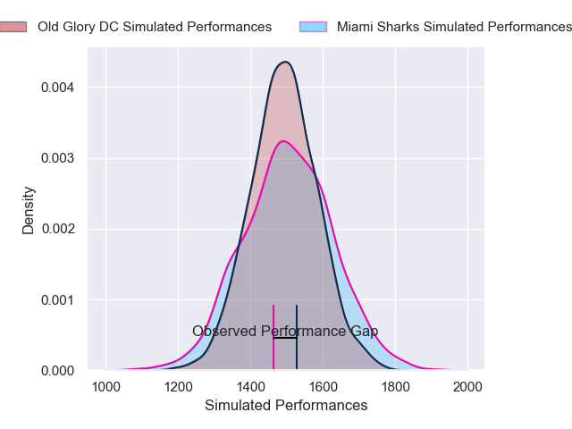
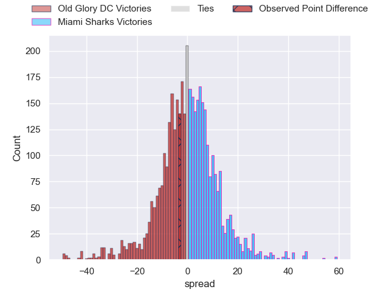
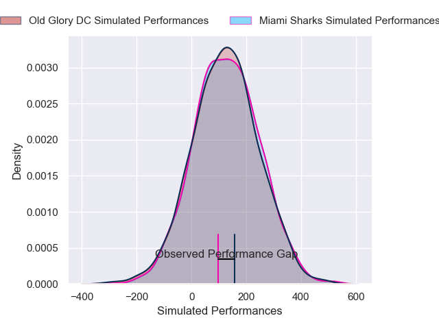
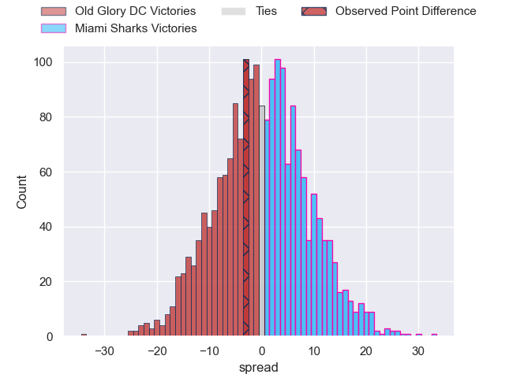

---  
layout: page  
title: Old Glory DC at Miami Sharks; 25-22  
date: 2025-02-15 18:00:00 -0500  
categories: "Major League Rugby 2025" match review  
---
# Old Glory DC at Miami Sharks; 25-22

# Club Level Predictions

The first set of predictions treats a club as the smallest object, as the club develops its members, organizes a gameplan, and deploys its players as needed for each match. This club model has a prediction of 0.511, which translates to predicting Miami Sharks to win by 0.4.

Our Over/Under is 48.5 - and combined with the spread above, we have a predicted scoreline of 24 to 25

Each club has a rating and a rating deviation (similar to a Glicko rating), and expected performances can be generated. This allows for simulated matches and spreads like the ones below.
## Projected Performances - Club Model

## Projected Spreads - Club Model

## Projected Results - Club Model

# Player Level Predictions

Treating teams instead as an entity made up of the currently active players, I have ratings for each player in an altogether different system. These can be combined to form team ratings once teamsheets are announced, weighting starters a bit higher than the reserves. After the match is played, players can be weighted by their minutes on the field, allowing for an accurate measure of the team's composition. With these compiled team ratings, we can make predictions, measure inaccuracy, and update the individual player ratings.
## Prediction without Player Minutes: Miami Sharks by 0.5

Old Glory DC by 1.7 on a neutral pitch

## Projected Performances - Player Model

## Projected Spreads - Player Model

## Projected Results - Player Model

|   Away Minutes | Away Player              |   Away Percentile |   Number |   Home Percentile | Home Player         |   Home Minutes |
|---------------:|:-------------------------|------------------:|---------:|------------------:|:--------------------|---------------:|
|             50 | Jack Iscaro              |             28.07 |        1 |             42.68 | Ma'ake Muti         |             80 |
|             60 | Facundo Gattas           |             75.34 |        2 |             48.81 | Sean McNulty        |             60 |
|             20 | Calixto Martinez         |             20.67 |        3 |             42.68 | Alec McDonnell      |             80 |
|             12 | Rob Harley               |             91.42 |        4 |             33.18 | Mauro Rebussone     |             30 |
|             68 | Tevita Naqali            |             52.03 |        5 |             42.6  | Federico Gutierrez  |             80 |
|              6 | Jamason Fa'anana-Schultz |             22.92 |        6 |             58.93 | Manuel Ardao        |             30 |
|             80 | Cory Daniel              |             70.11 |        7 |             34.77 | Benja Bonassoa      |             46 |
|              0 | Lautaro Bavaro           |             17.11 |        8 |             37.53 | Marques Fuala'au    |             80 |
|             81 | Connor Buckley           |             50.86 |        9 |             25.69 | Tomas Cubelli       |             20 |
|             34 | Jason Robertson          |              0.84 |       10 |             39.79 | Martin Elias        |             80 |
|             34 | Axel Muller              |             84.86 |       11 |             43.83 | Connor Burns        |             68 |
|             20 | Jason Emery              |              5.95 |       12 |             68.72 | Tomas Cubilla       |             24 |
|             81 | Steffan Hughes           |             80.41 |       13 |              4.82 | Matias Orlando      |             12 |
|             81 | Perry Humphreys          |             29.72 |       14 |             28.32 | Tomas Malanos       |             17 |
|             20 | Damien Hoyland           |             63.9  |       15 |             15.56 | Santiago Videla     |             17 |
|             80 | KoiKoi Nelligan          |            nan    |       16 |             15.48 | Kirby Myhill        |             80 |
|             81 | Joe Wrafter              |            nan    |       17 |            nan    | Jonas Petrakopoulos |             20 |
|             26 | Sam Davies               |             91.37 |       18 |            nan    | Alex Tucci          |             80 |
|             81 | Bill Whiteside           |            nan    |       19 |            nan    | Tomas Casares       |             50 |
|             29 | Collin Grosse            |            nan    |       20 |            nan    | Tomas Bekerman      |             80 |
|             21 | Ethan McVeigh            |            nan    |       21 |            nan    | Damien Morley       |             80 |
|             46 | John Powers-Velasquez    |            nan    |       22 |              8.72 | Guiseppe du Toit    |             60 |
|             60 | Owen Sheehy              |            nan    |       23 |             45.79 | Marcos Young        |             30 |

