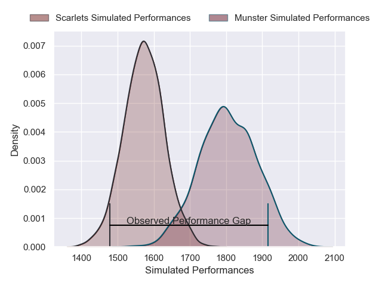
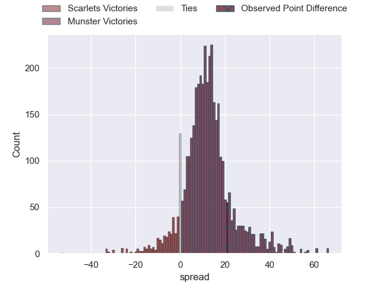
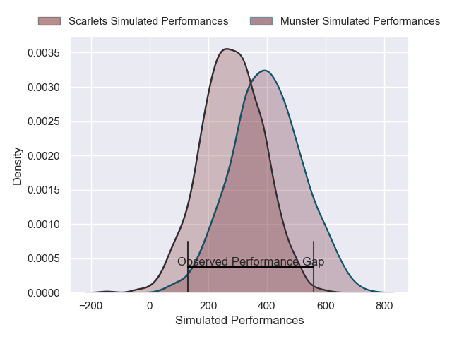
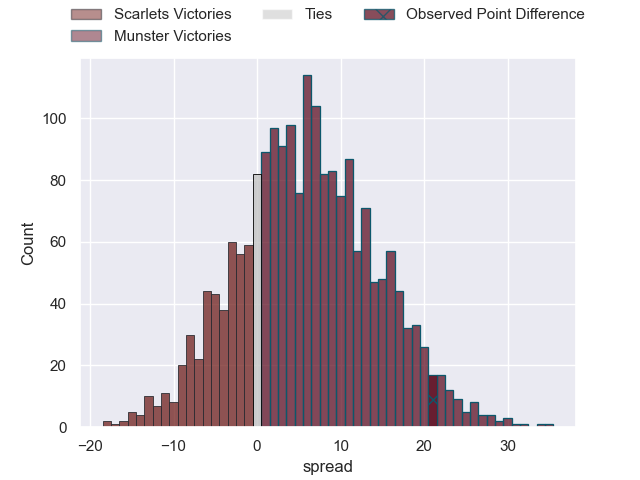

---  
layout: page  
title: Scarlets at Munster; 8-29  
date: 2025-02-15 18:00:00 -0500  
categories: "United Rugby Championship 24/25" match review  
---
# Scarlets at Munster; 8-29

# Club Level Predictions

The first set of predictions treats a club as the smallest object, as the club develops its members, organizes a gameplan, and deploys its players as needed for each match. This club model has a prediction of 0.788, which translates to predicting Munster to win by 11.6.

Our Over/Under is 46.5 - and combined with the spread above, we have a predicted scoreline of 17 to 29

Each club has a rating and a rating deviation (similar to a Glicko rating), and expected performances can be generated. This allows for simulated matches and spreads like the ones below.
## Projected Performances - Club Model

## Projected Spreads - Club Model

## Projected Results - Club Model

# Player Level Predictions

Treating teams instead as an entity made up of the currently active players, I have ratings for each player in an altogether different system. These can be combined to form team ratings once teamsheets are announced, weighting starters a bit higher than the reserves. After the match is played, players can be weighted by their minutes on the field, allowing for an accurate measure of the team's composition. With these compiled team ratings, we can make predictions, measure inaccuracy, and update the individual player ratings.
## Prediction without Player Minutes: Munster by 7.5

Scarlets by 2.3 on a neutral pitch

## Projected Performances - Player Model

## Projected Spreads - Player Model

## Projected Results - Player Model

|   Away Minutes | Away Player          |   Away Percentile |   Number |   Home Percentile | Home Player        |   Home Minutes |
|---------------:|:---------------------|------------------:|---------:|------------------:|:-------------------|---------------:|
|             40 | Kemsley Mathias      |             82.41 |        1 |             59.45 | Josh Wycherley     |             61 |
|             82 | Marnus van der Merwe |             92.62 |        2 |             90.39 | Diarmuid Barron    |             53 |
|             57 | Archer Holz          |             55.21 |        3 |             83.79 | Oli Jager          |             80 |
|             24 | Max Douglas          |             84.19 |        4 |             59.38 | Thomas Ahern       |             80 |
|             25 | Sam Lousi            |             76.61 |        5 |             36.84 | Fineen Wycherley   |             82 |
|             19 | Taine Plumtree       |             90.56 |        6 |             75.98 | Jack O'Donoghue    |             27 |
|             30 | Dan Davis            |             78.36 |        7 |             87.13 | Alex Kendellen     |             27 |
|             80 | Vaea Fifita          |             95.1  |        8 |             68.87 | Gavin Coombes      |              2 |
|             21 | Gareth Davies        |             27.7  |        9 |             52.44 | Ethan Coughlan     |             45 |
|             61 | Ioan Lloyd           |             24.27 |       10 |             81.38 | Billy Burns        |              2 |
|             82 | Steffan Evans        |             84.33 |       11 |             57.84 | Diarmuid Kilgallen |             68 |
|             53 | Johnny Williams      |             91.08 |       12 |             95.75 | Rory Scannell      |             55 |
|             21 | Joe Roberts          |             30.81 |       13 |             79.15 | Tom Farrell        |             82 |
|             29 | Ellis Mee            |             37.41 |       14 |             91.7  | Shane Daly         |             67 |
|             25 | Ioan Nicholas        |             13.15 |       15 |             56.16 | Ben O'Connor       |             80 |
|             80 | Ryan Elias           |             95.88 |       16 |             95.37 | Niall Scannell     |             70 |
|             24 | Alec Hepburn         |             91.21 |       17 |            nan    | Kieran Ryan        |             80 |
|             21 | Sam Wainwright       |             49.19 |       18 |             94.38 | John Ryan          |             80 |
|             24 | Alex Craig           |             75.38 |       19 |             12.15 | Brian Gleeson      |             80 |
|             82 | Jarrod Taylor        |             70.26 |       20 |             17.64 | John Hodnett       |             80 |
|             36 | Archie Hughes        |             57.67 |       21 |            nan    | Paddy Patterson    |             21 |
|             61 | Charlie Titcombe     |            nan    |       22 |             25.94 | Tony Butler        |             42 |
|              0 | Macs Page            |             26.14 |       23 |            nan    | Shay McCarthy      |             25 |

