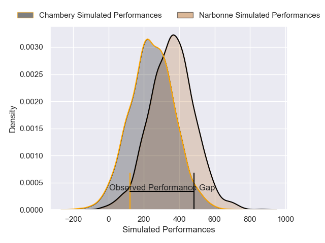
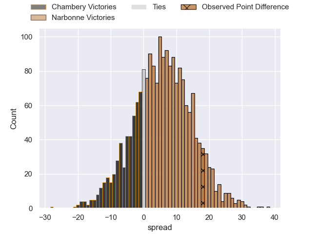
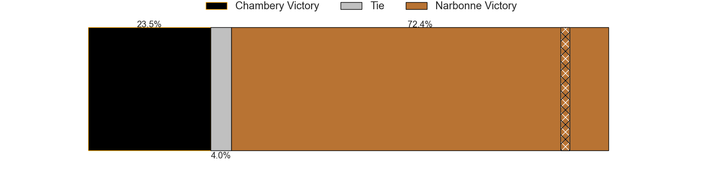

---  
layout: page  
title: Chambery at Narbonne; 8-26  
date: 2025-02-15 18:00:00 -0500  
categories: "Nationale 24/25" match review  
---
# Chambery at Narbonne; 8-26

# Club Level Predictions

The first set of predictions treats a club as the smallest object, as the club develops its members, organizes a gameplan, and deploys its players as needed for each match. This club model has a prediction of 0.533, which translates to predicting Narbonne to win by 1.2.

Our Over/Under is 41.5 - and combined with the spread above, we have a predicted scoreline of 20 to 21

Each club has a rating and a rating deviation (similar to a Glicko rating), and expected performances can be generated. This allows for simulated matches and spreads like the ones below.
## Projected Performances - Club Model

## Projected Spreads - Club Model

## Projected Results - Club Model

# Player Level Predictions

Treating teams instead as an entity made up of the currently active players, I have ratings for each player in an altogether different system. These can be combined to form team ratings once teamsheets are announced, weighting starters a bit higher than the reserves. After the match is played, players can be weighted by their minutes on the field, allowing for an accurate measure of the team's composition. With these compiled team ratings, we can make predictions, measure inaccuracy, and update the individual player ratings.
## Prediction without Player Minutes: Chambery by 2.0

Chambery by 15.0 on a neutral pitch

## Projected Performances - Player Model

## Projected Spreads - Player Model

## Projected Results - Player Model

|   Away Minutes | Away Player              |   Away Percentile |   Number |   Home Percentile | Home Player               |   Home Minutes |
|---------------:|:-------------------------|------------------:|---------:|------------------:|:--------------------------|---------------:|
|             17 | Nugzar Somkhishvili      |             90.89 |        1 |             26.28 | Gregory Fichten           |             30 |
|             80 | Quentin Beaudaux         |             48.13 |        2 |             10.71 | Clément Esteriola         |             30 |
|             32 | Lasha Tabidze            |             83.32 |        3 |             29.37 | Chris Talakai             |             80 |
|             16 | Fabien Witz              |             72.57 |        4 |             91.71 | Darrell Dyer              |             80 |
|             64 | Corentin Astier          |             80.58 |        5 |              3.2  | Leva Fifita               |             80 |
|              4 | Taniela Matakaiongo      |             71.82 |        6 |             53.68 | Arthur Christienne        |             80 |
|             80 | Colin Lebian             |             80.04 |        7 |             12.8  | Paul Belzons              |             80 |
|              0 | Tui Uru                  |             82.68 |        8 |             10.52 | Charles Malet             |             80 |
|             81 | Mateo Guerret            |             66.72 |        9 |              8.79 | Pierrick Nova             |             28 |
|              0 | Thibault Moreno          |             78.11 |       10 |              8.84 | Gilles Bosch              |             17 |
|             76 | Arthur Nennig            |             88.04 |       11 |             27.01 | Étienne Ducom             |             51 |
|             63 | Emmanuel Vaitulukina     |             78.05 |       12 |             62.26 | Parataiso Silafai-Lea'ana |             64 |
|             29 | Joseph Exshaw            |             64    |       13 |             98.97 | Peter Betham              |             80 |
|              4 | Va'aufauese Apelu Maliko |             72.06 |       14 |             14.58 | Pierre-Hugo Ducom         |             16 |
|             51 | Paul Altier              |             60.58 |       15 |              0.41 | Boris Goutard             |             24 |
|             76 | Paul Altier              |             60.58 |       15 |              0.41 | Boris Goutard             |             24 |
|             80 | Enzo Segui               |             50.69 |       16 |             37.02 | Théo Castinel             |             69 |
|             24 | Julien Pierdomenico      |            nan    |       17 |             80.1  | Mehdi Boundjema           |             16 |
|             16 | Osman Dimen              |             54.27 |       18 |             17.98 | Mohammed Loukia           |             11 |
|             29 | Pierre-Nicolas Dance     |             54.54 |       19 |             64.74 | Grégoire Labit            |             80 |
|             40 | Antoine Ferreira         |             57.59 |       20 |             79.59 | Lopeti Timani             |             80 |
|             80 | Aubin Eymeri             |             49.31 |       21 |             58.45 | Erwan Nicolas             |             80 |
|             65 | Bastien Reymond          |             77.13 |       22 |             34.95 | Tom Chauvet               |             56 |
|             80 | Maewen Sao               |             50.56 |       23 |             78.13 | Clément Clavières         |             80 |

