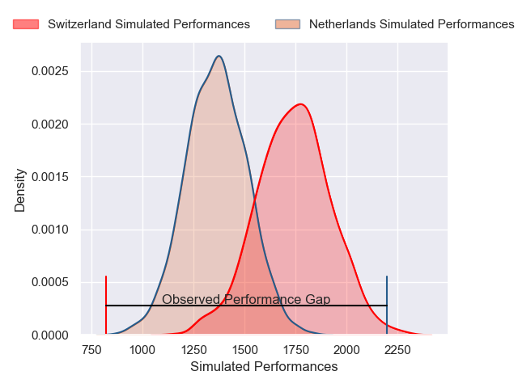
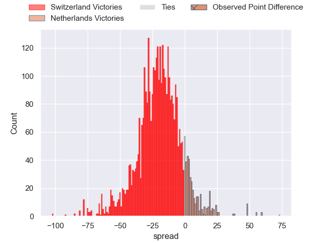
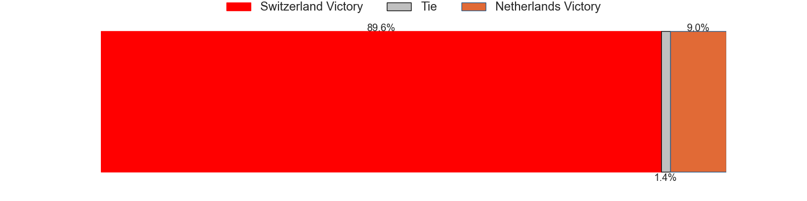
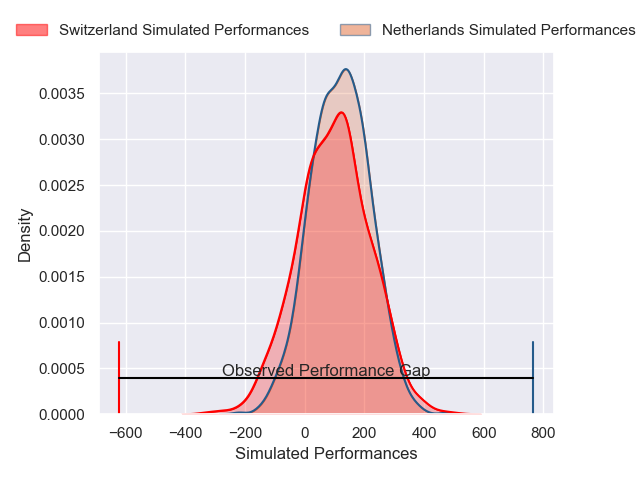
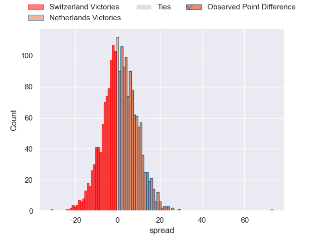

---  
layout: page  
title: Switzerland at Netherlands; 0-73  
date: 2025-02-15 18:00:00 -0500  
categories: "Rugby Europe Championship 2025" match review  
---
# Switzerland at Netherlands; 0-73

# Club Level Predictions

The first set of predictions treats a club as the smallest object, as the club develops its members, organizes a gameplan, and deploys its players as needed for each match. This club model has a prediction of 0.129, which translates to predicting Switzerland to win by 19.0.

Our Over/Under is 45.5 - and combined with the spread above, we have a predicted scoreline of 32 to 13

Each club has a rating and a rating deviation (similar to a Glicko rating), and expected performances can be generated. This allows for simulated matches and spreads like the ones below.
## Projected Performances - Club Model

## Projected Spreads - Club Model

## Projected Results - Club Model

# Player Level Predictions

Treating teams instead as an entity made up of the currently active players, I have ratings for each player in an altogether different system. These can be combined to form team ratings once teamsheets are announced, weighting starters a bit higher than the reserves. After the match is played, players can be weighted by their minutes on the field, allowing for an accurate measure of the team's composition. With these compiled team ratings, we can make predictions, measure inaccuracy, and update the individual player ratings.
## Prediction without Player Minutes: Netherlands by 1.4

Switzerland by 1.0 on a neutral pitch

## Projected Performances - Player Model

## Projected Spreads - Player Model

## Projected Results - Player Model

|   Away Minutes | Away Player       |   Away Percentile |   Number |   Home Percentile | Home Player         |   Home Minutes |
|---------------:|:------------------|------------------:|---------:|------------------:|:--------------------|---------------:|
|             80 | Maxence Gisclard  |             16.35 |        1 |             65.74 | Shane Fikken        |             51 |
|             80 | Tom Nublat        |             22.28 |        2 |             80.27 | Robbie Coetzee      |             80 |
|             80 | Samuel Sjöberg    |             21.32 |        3 |             71.77 | Thymo Peters        |             80 |
|             80 | Jorn Vögtli       |             25.78 |        4 |             64.66 | Monty Leverstein    |             80 |
|             80 | Tim Vögtli        |             25.78 |        5 |             66.07 | Koen Bloemen        |             73 |
|              0 | Antoine Cramont   |             41.17 |        6 |             43.36 | Spike Salman        |             22 |
|             45 | Thomas Mccarthy   |             28.18 |        7 |             37.54 | Tim De Jong         |             16 |
|             18 | Cyril Lin         |             26.8  |        8 |             42.27 | Christopher Raymond |             16 |
|             58 | Campbell Swanson  |             25    |        9 |             55.34 | Boris Hadinegoro    |             31 |
|             15 | Jules Porcher     |             27.16 |       10 |             44    | Vikas Meijer        |              3 |
|             35 | Jean Morard       |             35.61 |       11 |             66.36 | Kaj Verhoorn        |             69 |
|             11 | Louis Pharaony    |             36.21 |       12 |             55.08 | David Weersma       |              3 |
|             29 | Jeremy To'A       |             25.64 |       13 |            nan    | nan                 |            nan |
|             18 | Willy Meyer       |             41.03 |       14 |            nan    | nan                 |            nan |
|             64 | Jolan Vincent     |             18.67 |       15 |            nan    | nan                 |            nan |
|             58 | Maxime Luçon      |             39.29 |       16 |            nan    | nan                 |            nan |
|             64 | Simon Bonvin      |            nan    |       17 |            nan    | nan                 |            nan |
|             49 | Benjamin Bodinham |            nan    |       18 |            nan    | nan                 |            nan |
|             80 | Jonathan Dallet   |            nan    |       19 |            nan    | nan                 |            nan |
|             77 | Henry Pharaony    |            nan    |       20 |            nan    | Joris Smits         |             80 |
|            nan | nan               |            nan    |       22 |            nan    | Mark Coebergh       |             80 |
|            nan | nan               |            nan    |       23 |            nan    | Björn Dolman        |             69 |

