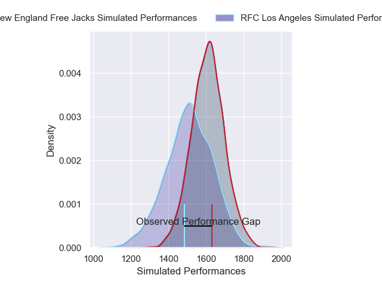
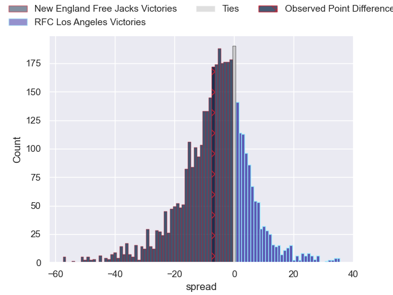
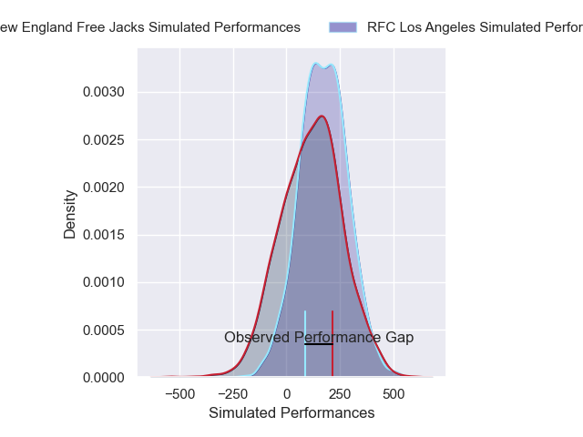
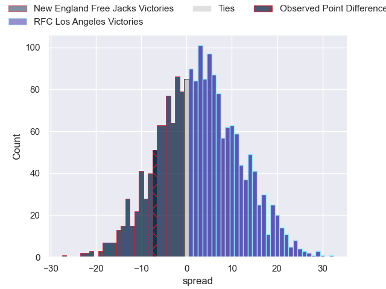
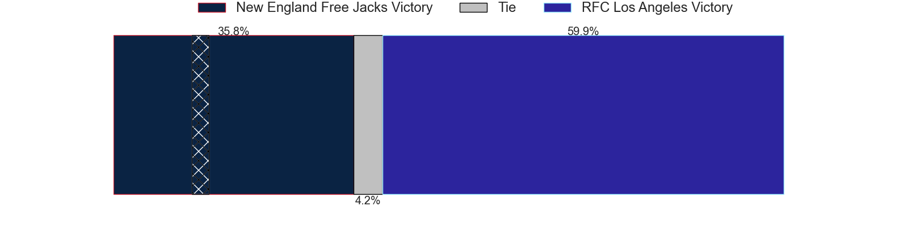

---  
layout: page  
title: New England Free Jacks at RFC Los Angeles; 24-17  
date: 2025-02-15 18:00:00 -0500  
categories: "Major League Rugby 2025" match review  
---
# New England Free Jacks at RFC Los Angeles; 24-17

# Club Level Predictions

The first set of predictions treats a club as the smallest object, as the club develops its members, organizes a gameplan, and deploys its players as needed for each match. This club model has a prediction of 0.364, which translates to predicting New England Free Jacks to win by 5.0.

Our Over/Under is 51.5 - and combined with the spread above, we have a predicted scoreline of 28 to 23

Each club has a rating and a rating deviation (similar to a Glicko rating), and expected performances can be generated. This allows for simulated matches and spreads like the ones below.
## Projected Performances - Club Model

## Projected Spreads - Club Model

## Projected Results - Club Model

# Player Level Predictions

Treating teams instead as an entity made up of the currently active players, I have ratings for each player in an altogether different system. These can be combined to form team ratings once teamsheets are announced, weighting starters a bit higher than the reserves. After the match is played, players can be weighted by their minutes on the field, allowing for an accurate measure of the team's composition. With these compiled team ratings, we can make predictions, measure inaccuracy, and update the individual player ratings.
## Prediction without Player Minutes: RFC Los Angeles by 8.0

RFC Los Angeles by 5.7 on a neutral pitch

## Projected Performances - Player Model

## Projected Spreads - Player Model

## Projected Results - Player Model

|   Away Minutes | Away Player          |   Away Percentile |   Number |   Home Percentile | Home Player           |   Home Minutes |
|---------------:|:---------------------|------------------:|---------:|------------------:|:----------------------|---------------:|
|              7 | Malakai Hala-Ngatai  |              3.99 |        1 |             42.31 | Alessandro Heaney     |             19 |
|             15 | Andrew Quattrin      |              2.89 |        2 |             27.72 | Ben Sugars            |             80 |
|             39 | Kaleb Geiger         |             84.21 |        3 |             30.27 | Cronan Gleeson        |             80 |
|             80 | Piers Von Dadelszen  |             58.06 |        4 |             59.38 | Jason Damm            |             17 |
|             70 | Sam Caird            |              1.89 |        5 |             89.73 | Reegan O'Gorman       |             79 |
|             80 | Jed Melvin           |             89.11 |        6 |              2.87 | Tim Anstee            |             40 |
|             80 | Joe Johnston         |             80.8  |        7 |             31.04 | Edward Timpson        |             80 |
|             80 | Jeronimo Gomez Vara  |             57.73 |        8 |             29.07 | Ben Houston           |             80 |
|             54 | John Poland          |             14.14 |        9 |             73.79 | Gonzalo Bertranou     |             26 |
|             39 | Harrison Boyle       |             50.53 |       10 |             84.63 | Christian Leali'ifano |             36 |
|             59 | Paula Balekana       |              3.74 |       11 |             80.09 | Andrew Coe            |             36 |
|             61 | Le Roux Malan        |             93.13 |       12 |             40    | Nick Chan             |             19 |
|             68 | Wayne van der Bank   |             57.13 |       13 |             34.46 | Matias Jensen         |             54 |
|             40 | Isaac Olson          |             26.64 |       14 |             90    | Christian Dyer        |             30 |
|             80 | Simon-Peter Toleafoa |             56.43 |       15 |             39.21 | Cam Gerlach           |             19 |
|             80 | Connal McInerney     |             85.88 |       16 |            nan    | Mike Sosene-Feagai    |             44 |
|             80 | Foster Dewitt        |            nan    |       17 |            nan    | Dec Leaney            |             40 |
|             80 | Cole Keith           |             40.93 |       18 |            nan    | Maliu Niuafe          |              2 |
|             80 | Matthew Carrion      |            nan    |       19 |              0.86 | Matt Heaton           |             12 |
|             61 | Kaipono Kayoshi      |            nan    |       20 |            nan    | Ben Strang            |             26 |
|              1 | Oscar Lennon         |             66.21 |       21 |            nan    | Tas Smith             |             80 |
|             63 | Noah Bain            |            nan    |       22 |            nan    | Billy Meakes          |             40 |
|             80 | Josiah Morra         |             18.13 |       23 |            nan    | Seth Purdey           |             80 |

