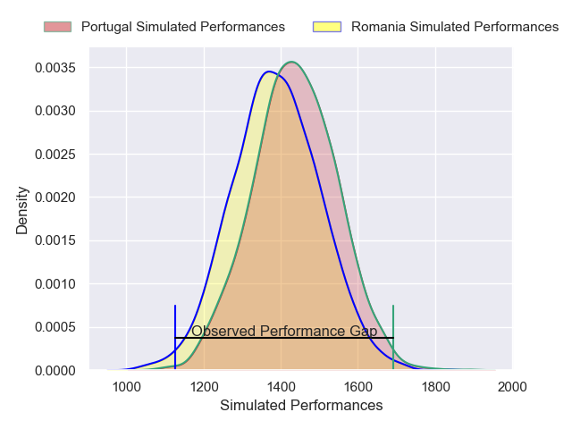
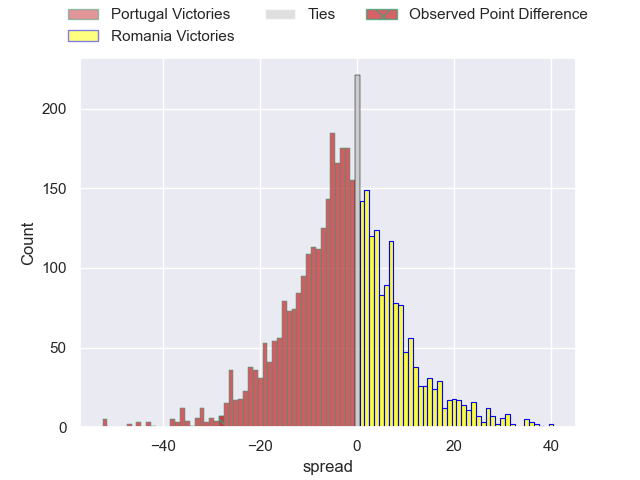
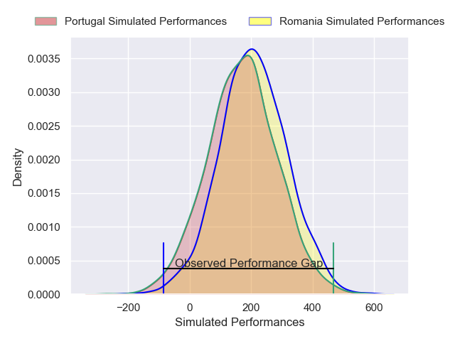
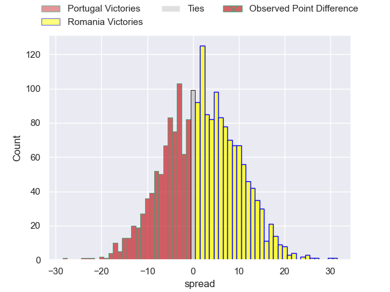

---  
layout: page  
title: Portugal at Romania; 34-6  
date: 2025-02-15 18:00:00 -0500  
categories: "Rugby Europe Championship 2025" match review  
---
# Portugal at Romania; 34-6

# Club Level Predictions

The first set of predictions treats a club as the smallest object, as the club develops its members, organizes a gameplan, and deploys its players as needed for each match. This club model has a prediction of 0.431, which translates to predicting Portugal to win by 2.6.

Our Over/Under is 44.5 - and combined with the spread above, we have a predicted scoreline of 24 to 21

Each club has a rating and a rating deviation (similar to a Glicko rating), and expected performances can be generated. This allows for simulated matches and spreads like the ones below.
## Projected Performances - Club Model

## Projected Spreads - Club Model

## Projected Results - Club Model

# Player Level Predictions

Treating teams instead as an entity made up of the currently active players, I have ratings for each player in an altogether different system. These can be combined to form team ratings once teamsheets are announced, weighting starters a bit higher than the reserves. After the match is played, players can be weighted by their minutes on the field, allowing for an accurate measure of the team's composition. With these compiled team ratings, we can make predictions, measure inaccuracy, and update the individual player ratings.
## Prediction without Player Minutes: Portugal by 5.1

Portugal by 9.2 on a neutral pitch

## Projected Performances - Player Model

## Projected Spreads - Player Model

## Projected Results - Player Model

|   Away Minutes | Away Player            |   Away Percentile |   Number |   Home Percentile | Home Player       |   Home Minutes |
|---------------:|:-----------------------|------------------:|---------:|------------------:|:------------------|---------------:|
|           81   | David Costa            |             64.1  |        1 |             28.11 | Alexandru Savin   |             81 |
|           29   | Luka Begic             |             54.42 |        2 |             61.05 | Stefan Buruiana   |             26 |
|           15   | Diogo Hasse Ferreira   |             10.6  |        3 |             80.48 | Gheorghe Gajion   |             32 |
|           15   | Jose Madeira           |             93.69 |        4 |              1.22 | Adrian Motoc      |              0 |
|           40.5 | José Rebelo De Andrade |             64.03 |        5 |             59.89 | Andrei Mahu       |             16 |
|           28   | Diego Pinheiro Ruiz    |             71.42 |        6 |             28.12 | Cristi Boboc      |             81 |
|            4   | Nicolas Martins        |             90.16 |        7 |             24.37 | Kemal Altinok     |             64 |
|           36   | Vasco Baptista         |             63.05 |        8 |              5.01 | Cristian Chirica  |             58 |
|           27   | Samuel Marques         |             87.8  |        9 |             53.61 | Gabriel Rupanu    |             25 |
|           36   | Joris De Moura         |             89.17 |       10 |             22.71 | Hinckley Vaovasa  |             80 |
|           59   | Rodrigo Marta          |             96.2  |       11 |              5.47 | Tevita Manumua    |             21 |
|           55   | Tomas Appleton         |             88.56 |       12 |             32.79 | Alin Conache      |             33 |
|           81   | Jose Lima              |             85.19 |       13 |             50.97 | Mihai Graure      |             33 |
|           54   | Raffaele Storti        |             91.65 |       14 |             47.08 | Iliesa Tiqe       |              0 |
|           65   | Simao Bento            |             24.65 |       15 |              2.63 | Marius Simionescu |             33 |
|           48   | Abel Da Cunha          |             65.62 |       16 |            nan    | Tudor Butnariu    |             69 |
|           76   | Santiago Lopes         |            nan    |       17 |             21.29 | Iulian Hartig     |             40 |
|           77   | António Prim           |            nan    |       18 |            nan    | Dragoș Mihai      |             49 |
|            2   | Antonio Rebelo Andrade |            nan    |       19 |             13.18 | Marius Iftimiciuc |             40 |
|           80   | Martim Belo            |             40.3  |       20 |             53.77 | Yanis Horvat      |             81 |
|           50   | Francisco Magalhães    |            nan    |       21 |            nan    | Daniel Plai       |             81 |
|           11   | Manuel Vareiro         |            nan    |       22 |             93.94 | Paul Popoaia      |             81 |
|           80   | Diogo Rodrigues        |            nan    |       23 |             43.01 | Adrian Mitu       |             45 |

