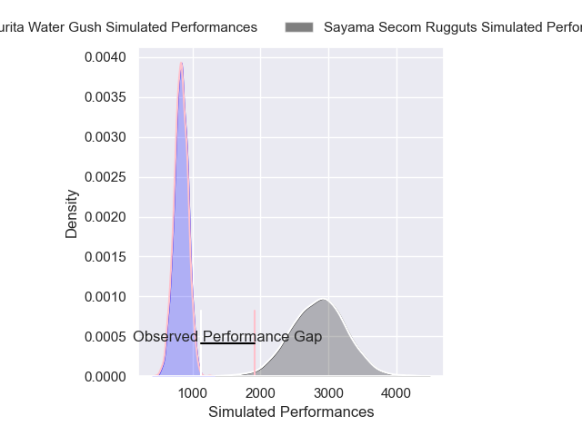
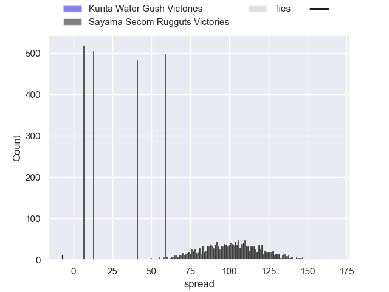
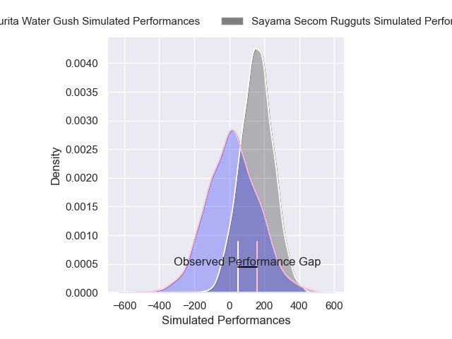
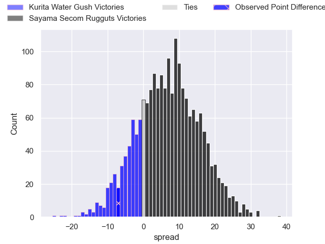
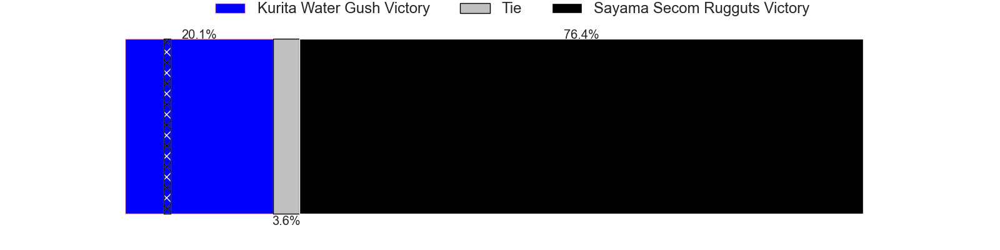

---  
layout: page  
title: Kurita Water Gush at Sayama Secom Rugguts; 40-33  
date: 2025-02-15 18:00:00 -0500  
categories: "Japan Rugby League One D3 24/25" match review  
---
# Kurita Water Gush at Sayama Secom Rugguts; 40-33

# Club Level Predictions

The first set of predictions treats a club as the smallest object, as the club develops its members, organizes a gameplan, and deploys its players as needed for each match. This club model has a prediction of 1.0, which translates to predicting Sayama Secom Rugguts to win by 100.9.

Our Over/Under is 74.5 - and combined with the spread above, we have a predicted scoreline of -13 to 88

Each club has a rating and a rating deviation (similar to a Glicko rating), and expected performances can be generated. This allows for simulated matches and spreads like the ones below.
## Projected Performances - Club Model

## Projected Spreads - Club Model

## Projected Results - Club Model

# Player Level Predictions

Treating teams instead as an entity made up of the currently active players, I have ratings for each player in an altogether different system. These can be combined to form team ratings once teamsheets are announced, weighting starters a bit higher than the reserves. After the match is played, players can be weighted by their minutes on the field, allowing for an accurate measure of the team's composition. With these compiled team ratings, we can make predictions, measure inaccuracy, and update the individual player ratings.
## Prediction without Player Minutes: Sayama Secom Rugguts by 12.6

Sayama Secom Rugguts by 10.3 on a neutral pitch

## Projected Performances - Player Model

## Projected Spreads - Player Model

## Projected Results - Player Model

|   Away Minutes | Away Player      |   Away Percentile |   Number |   Home Percentile | Home Player       |   Home Minutes |
|---------------:|:-----------------|------------------:|---------:|------------------:|:------------------|---------------:|
|             80 | Kei Takusagawa   |             74.92 |        1 |             75.98 | Kentaro Ueno      |             56 |
|             80 | Kota Hojo        |             60.21 |        2 |             55.06 | Tatsuki Tanina    |             19 |
|             80 | Rui Kuriyama     |             78.18 |        3 |             73.05 | Motoki Kaneko     |             10 |
|             80 | Kota Nakamura    |              3.03 |        4 |             61.08 | Itsuki Fujii      |             27 |
|             64 | Daymon Leasuasu  |              1.04 |        5 |             84.94 | Troy Callander    |             39 |
|             80 | Harrison Brewer  |             92.56 |        6 |             18.11 | Paker Ash         |             51 |
|             80 | Taisei Nakao     |             72.83 |        7 |             52.81 | Ryusuke Yamamoto  |             44 |
|             16 | Tevita Oto       |             67.38 |        8 |             80.6  | Whetu Douglas     |             11 |
|             61 | Ren Shinwada     |             69.34 |        9 |             28.57 | Rikuya Takashima  |             76 |
|             80 | Piers Francis    |             16.53 |       10 |             54.18 | Shota Kutsuna     |             80 |
|             56 | Koshi Emoto      |             39.74 |       11 |             49.81 | Tatsuki Kanza     |             12 |
|             80 | Leo Gordon       |             78.84 |       12 |             98.13 | TJ Faiane         |             19 |
|             70 | So Matsushima    |             50.62 |       13 |             22.61 | Fisipuna Tuiaki   |             56 |
|             80 | Kentaro Sugimori |              5.22 |       14 |             60.54 | Yushi Okuda       |             83 |
|             61 | Yuta Sugiyama    |             69.1  |       15 |             80.38 | Chase Tiatia      |             45 |
|             61 | Issa Hosoya      |             72.8  |       16 |            nan    | Toshiki Sato      |              9 |
|              7 | Hiroki Handa     |             32.64 |       17 |            nan    | Kanaru Takahashi  |             35 |
|             80 | Ryutaro Iguchi   |             35.94 |       18 |            nan    | Shigeto Yamashita |             80 |
|             64 | Aki Kajiwara     |            nan    |       19 |            nan    | Shota Okuno       |             19 |
|             24 | Kengo Nakamura   |              5.53 |       20 |            nan    | Kento Mizutani    |             16 |
|             69 | Jamie Vakalahi   |             13.28 |       21 |             31.12 | Haruya Nakasu     |             52 |
|             67 | Kakeru Sugihara  |             26.13 |       22 |            nan    | Yuto Takano       |              2 |
|             61 | Katsuki Ishizuka |             41.29 |       23 |            nan    | Ayumu Sawada      |             19 |

