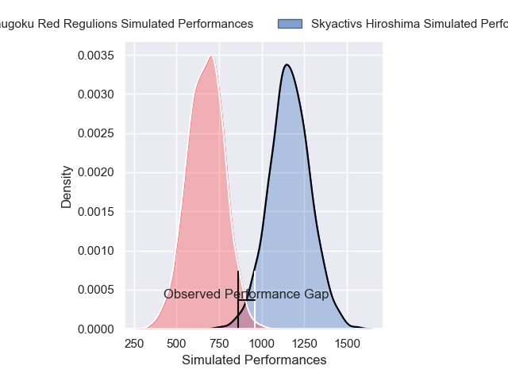
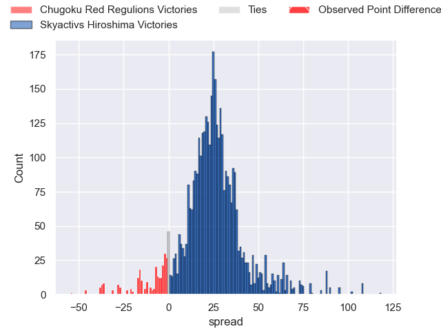
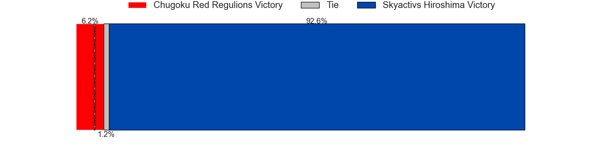
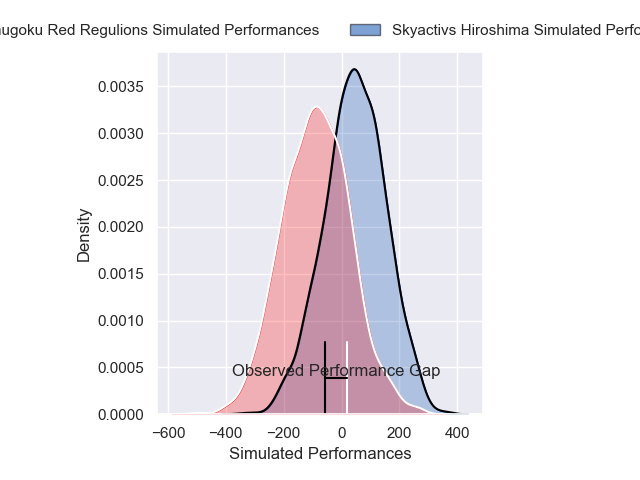
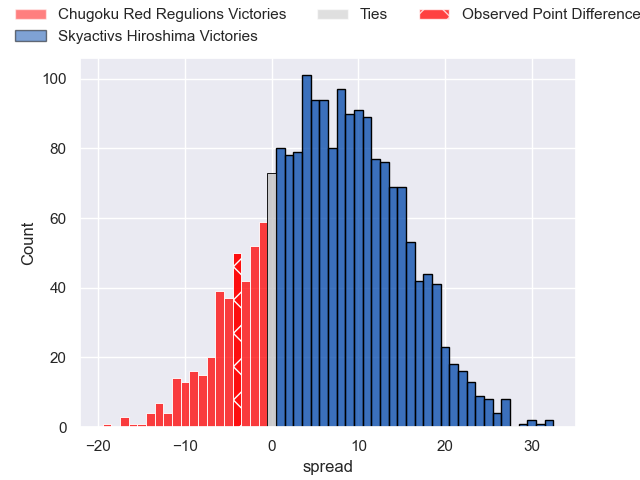
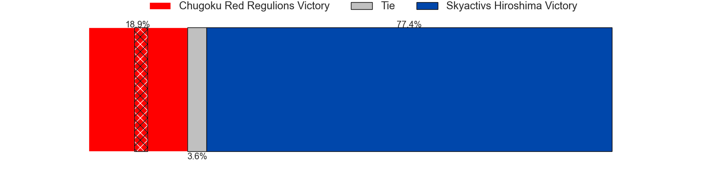

---  
layout: page  
title: Chugoku Red Regulions at Skyactivs Hiroshima; 26-22  
date: 2025-02-15 18:00:00 -0500  
categories: "Japan Rugby League One D3 24/25" match review  
---
# Chugoku Red Regulions at Skyactivs Hiroshima; 26-22

# Club Level Predictions

The first set of predictions treats a club as the smallest object, as the club develops its members, organizes a gameplan, and deploys its players as needed for each match. This club model has a prediction of 0.936, which translates to predicting Skyactivs Hiroshima to win by 24.7.

Our Over/Under is 52.5 - and combined with the spread above, we have a predicted scoreline of 14 to 38

Each club has a rating and a rating deviation (similar to a Glicko rating), and expected performances can be generated. This allows for simulated matches and spreads like the ones below.
## Projected Performances - Club Model

## Projected Spreads - Club Model

## Projected Results - Club Model

# Player Level Predictions

Treating teams instead as an entity made up of the currently active players, I have ratings for each player in an altogether different system. These can be combined to form team ratings once teamsheets are announced, weighting starters a bit higher than the reserves. After the match is played, players can be weighted by their minutes on the field, allowing for an accurate measure of the team's composition. With these compiled team ratings, we can make predictions, measure inaccuracy, and update the individual player ratings.
## Prediction without Player Minutes: Skyactivs Hiroshima by 3.3

Skyactivs Hiroshima by 0.7 on a neutral pitch

## Projected Performances - Player Model

## Projected Spreads - Player Model

## Projected Results - Player Model

|   Away Minutes | Away Player          |   Away Percentile |   Number |   Home Percentile | Home Player        |   Home Minutes |
|---------------:|:---------------------|------------------:|---------:|------------------:|:-------------------|---------------:|
|             73 | Kojiro Arito         |             13.27 |        1 |              1.55 | Koshi Kato         |             21 |
|             67 | Kentaro Iwanaga      |             17.15 |        2 |             72.56 | Taichi Yoko        |             78 |
|             80 | Haruki Miyata        |             48.45 |        3 |             72.48 | Tadatsugu Kanayama |             16 |
|             80 | Taro Nishikawa       |              0.38 |        4 |             26.42 | Rame Sato          |             80 |
|             80 | Tomonari Aoki        |             42.99 |        5 |             61.46 | Andrew Davidson    |             18 |
|             32 | Kota Moriyama        |             24.79 |        6 |             49.09 | Iori Suzuki        |             29 |
|             23 | Kohei Matsunaga      |              0.95 |        7 |              1.62 | Tomoki Ashida      |             15 |
|             39 | Ed Quirk             |              0.85 |        8 |             10.45 | Tevin Ferris       |              4 |
|             83 | Atsushi Mizofuchi    |             23    |        9 |             56.27 | Syoya Maeda        |             68 |
|             13 | Hayato Miyazaki      |             62.13 |       10 |              0.42 | Ryoutarou Saito    |             80 |
|             80 | Keigo Hatanaka       |             11.1  |       11 |             59.61 | Kohei Tanaka       |             24 |
|              7 | Hashizo Yoshida      |              9.23 |       12 |              0.21 | Shuhei Lee         |             20 |
|             32 | Syougo Azuma         |             35.48 |       13 |             41.49 | Kaito Sasaoka      |             24 |
|             32 | Kentaro Fujii        |             13.15 |       14 |             19.03 | Yuto Nakamura      |             60 |
|             10 | Kennta Kitayama      |             26.72 |       15 |              0.21 | Ginjiro Sakiguchi  |             20 |
|             20 | Hirofumi Higashikawa |             14.37 |       16 |             26.06 | Tomonori Koyanagi  |             80 |
|             83 | Shinya Hirayama      |             20.23 |       17 |             62.89 | Taiyo Fukuyama     |             61 |
|             53 | Shohei Tsukamoto     |              4.36 |       18 |            nan    | Haruki Umemoto     |             69 |
|             80 | Shintaro Matsuda     |              7.91 |       19 |              1.54 | Tomohiro Takeda    |             71 |
|             33 | Riku Iwai            |            nan    |       20 |             74.48 | Issen Kano         |             52 |
|             47 | Hayato Moriyama      |             65.87 |       21 |              4.56 | Clinton Knox       |             80 |
|             29 | Toshiyuki Ohki       |            nan    |       22 |             57.01 | Yutaro Tanaka      |             19 |
|            nan | nan                  |            nan    |       23 |            nan    | Yoshinobu Nishino  |             19 |

