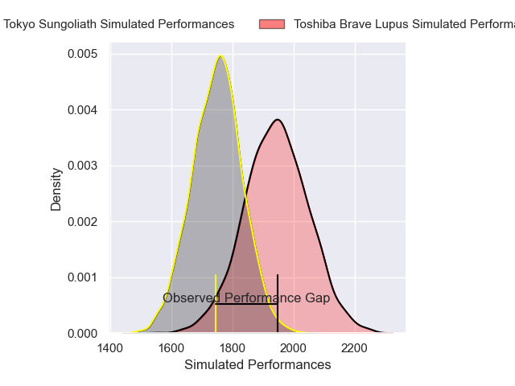
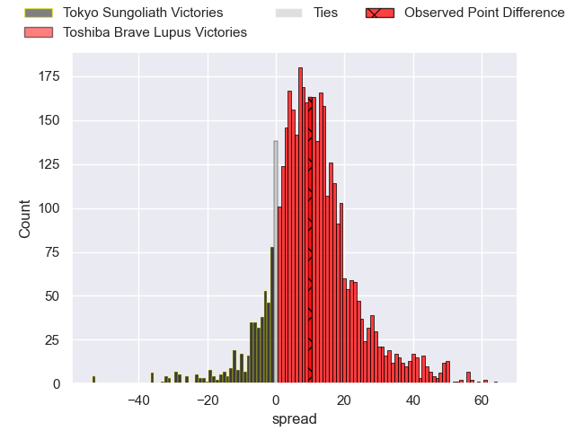
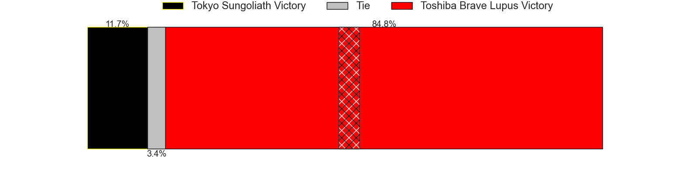
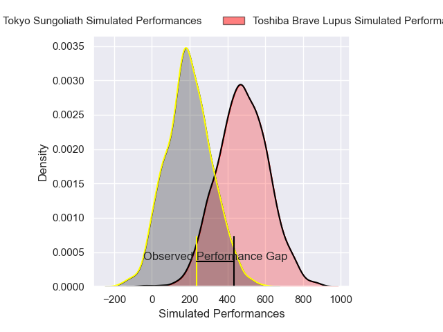
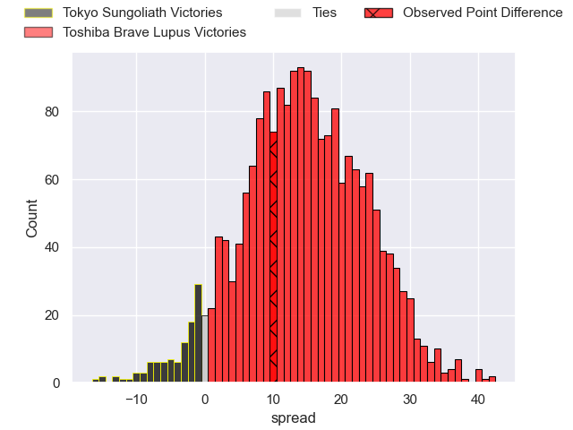
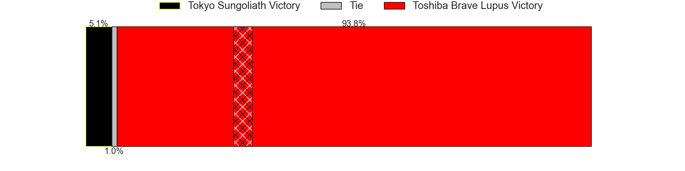

---  
layout: page  
title: Tokyo Sungoliath at Toshiba Brave Lupus; 33-43  
date: 2025-02-15 18:00:00 -0500  
categories: "Japan Rugby League One 24/25" match review  
---
# Tokyo Sungoliath at Toshiba Brave Lupus; 33-43

# Club Level Predictions

The first set of predictions treats a club as the smallest object, as the club develops its members, organizes a gameplan, and deploys its players as needed for each match. This club model has a prediction of 0.753, which translates to predicting Toshiba Brave Lupus to win by 10.0.

Our Over/Under is 56.5 - and combined with the spread above, we have a predicted scoreline of 23 to 33

Each club has a rating and a rating deviation (similar to a Glicko rating), and expected performances can be generated. This allows for simulated matches and spreads like the ones below.
## Projected Performances - Club Model

## Projected Spreads - Club Model

## Projected Results - Club Model

# Player Level Predictions

Treating teams instead as an entity made up of the currently active players, I have ratings for each player in an altogether different system. These can be combined to form team ratings once teamsheets are announced, weighting starters a bit higher than the reserves. After the match is played, players can be weighted by their minutes on the field, allowing for an accurate measure of the team's composition. With these compiled team ratings, we can make predictions, measure inaccuracy, and update the individual player ratings.
## Prediction without Player Minutes: Toshiba Brave Lupus by 15.6

Toshiba Brave Lupus by 11.4 on a neutral pitch

## Projected Performances - Player Model

## Projected Spreads - Player Model

## Projected Results - Player Model

|   Away Minutes | Away Player         |   Away Percentile |   Number |   Home Percentile | Home Player        |   Home Minutes |
|---------------:|:--------------------|------------------:|---------:|------------------:|:-------------------|---------------:|
|             80 | Kenta Kobayashi     |             73.82 |        1 |             87.55 | Sena Kimura        |             80 |
|             71 | Alex Mafi           |             60.37 |        2 |             93.03 | Mamoru Harada      |             76 |
|             26 | Shinnosuke Kakinaga |             93.33 |        3 |             90.04 | Yuta Kokaji        |             16 |
|             26 | Sam Jeffries        |             93.79 |        4 |             60.83 | Shohei Ito         |             80 |
|              1 | Harry Hockings      |             98.31 |        5 |             98.87 | Jacob Pierce       |             67 |
|             80 | Kanji Shimokawa     |             80.41 |        6 |             93.72 | Shannon Frizell    |             71 |
|             80 | Sam Cane            |             99.16 |        7 |             92.13 | Takeshi Sasaki     |             57 |
|             26 | Ryuga Hashimoto     |             74.32 |        8 |             96.45 | Michael Leitch     |             64 |
|             13 | Yutaka Nagare       |             73.54 |        9 |             81.96 | Yuhei Sugiyama     |             80 |
|             80 | Mikiya Takamoto     |             73.33 |       10 |            100    | Richie Mo'unga     |              2 |
|             40 | Taiga Ozaki         |             84.14 |       11 |             71.99 | Yuto Mori          |             62 |
|             55 | Shogo Nakano        |             18.08 |       12 |             54.65 | Rob Thompson       |             80 |
|             52 | Isaiah Punivai      |             37.08 |       13 |             95.61 | Seta Tamanivalu    |             35 |
|             80 | Seiya Ozaki         |             95.55 |       14 |             72.45 | Jone Naikabula     |              2 |
|              9 | Ryosuke Kawase      |             44.04 |       15 |             91.72 | Takuro Matsunaga   |             62 |
|             19 | Hideto Niguma       |            nan    |       16 |             85.3  | Teruo Makabe       |             26 |
|             13 | Kan Nakano          |             13.65 |       17 |            nan    | Latu Taufa         |             80 |
|              9 | Yukio Morikawa      |             84.74 |       18 |             77.72 | Daigo Hashimoto    |             80 |
|             80 | Tatsuya Miyazaki    |             20.58 |       19 |             38.89 | Samuela Anise      |             64 |
|             80 | Kenta Fukuda        |             71.31 |       20 |             80.18 | Taichi Mano        |             80 |
|             61 | Kai Yamamoto        |             24.93 |       21 |             91.92 | Michael Collins    |             67 |
|             80 | Trevor Hosea        |             20.9  |       22 |             28.21 | Yoshitaka Tokunaga |             80 |
|             28 | Keisuke Moriya      |            nan    |       23 |             63.92 | Kohei Takahashi    |             77 |

