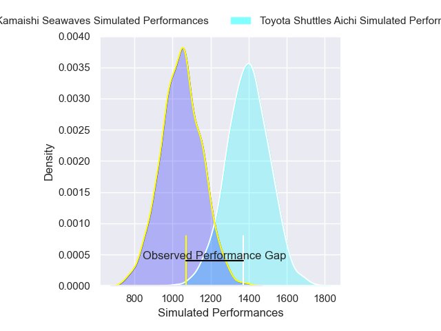
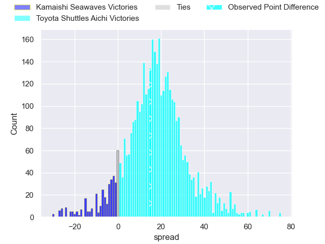
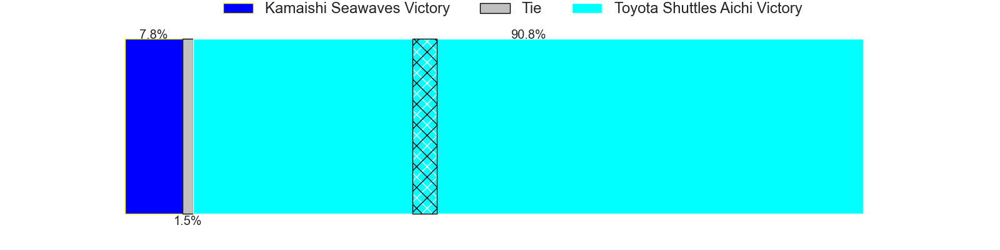
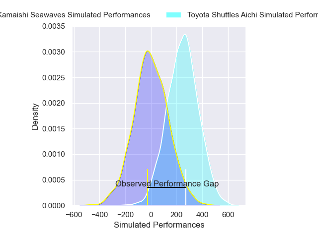
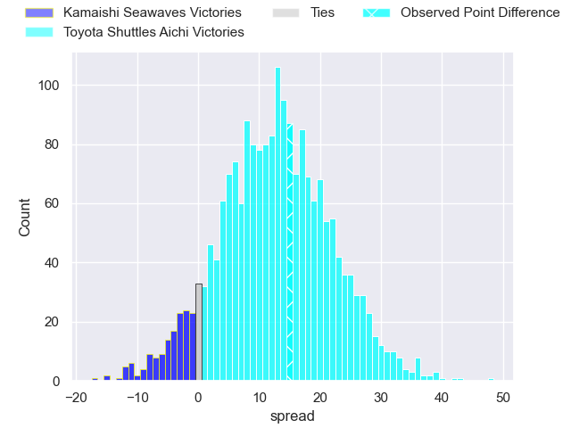
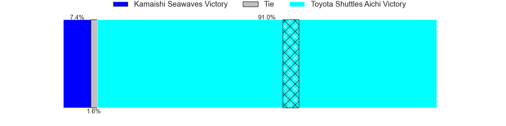

---  
layout: page  
title: Kamaishi Seawaves at Toyota Shuttles Aichi; 14-29  
date: 2025-02-15 18:00:00 -0500  
categories: "Japan Rugby League One D2 24/25" match review  
---
# Kamaishi Seawaves at Toyota Shuttles Aichi; 14-29

# Club Level Predictions

The first set of predictions treats a club as the smallest object, as the club develops its members, organizes a gameplan, and deploys its players as needed for each match. This club model has a prediction of 0.87, which translates to predicting Toyota Shuttles Aichi to win by 17.5.

Our Over/Under is 61.5 - and combined with the spread above, we have a predicted scoreline of 22 to 39

Each club has a rating and a rating deviation (similar to a Glicko rating), and expected performances can be generated. This allows for simulated matches and spreads like the ones below.
## Projected Performances - Club Model

## Projected Spreads - Club Model

## Projected Results - Club Model

# Player Level Predictions

Treating teams instead as an entity made up of the currently active players, I have ratings for each player in an altogether different system. These can be combined to form team ratings once teamsheets are announced, weighting starters a bit higher than the reserves. After the match is played, players can be weighted by their minutes on the field, allowing for an accurate measure of the team's composition. With these compiled team ratings, we can make predictions, measure inaccuracy, and update the individual player ratings.
## Prediction without Player Minutes: Toyota Shuttles Aichi by 15.2

Toyota Shuttles Aichi by 11.5 on a neutral pitch

## Projected Performances - Player Model

## Projected Spreads - Player Model

## Projected Results - Player Model

|   Away Minutes | Away Player         |   Away Percentile |   Number |   Home Percentile | Home Player        |   Home Minutes |
|---------------:|:--------------------|------------------:|---------:|------------------:|:-------------------|---------------:|
|             60 | Yusuke Yamada       |             22.17 |        1 |             63.94 | Tomoki Yamaguchi   |             26 |
|             80 | Daiki Ito           |              3.06 |        2 |             85.03 | Takuma Oyama       |             80 |
|             80 | Taiki Noguchi       |             10.84 |        3 |             75.18 | Nobuyuki Takahashi |              2 |
|             71 | Satoshi Hatazawa    |             42.75 |        4 |             85.12 | Taishi Nakamura    |             80 |
|             80 | Hamish Dalzell      |              8.29 |        5 |             67.8  | James Gaskell      |             80 |
|             64 | Ben Nee Nee         |              6.75 |        6 |             88.19 | Tama Kapene        |             80 |
|             19 | Ryota Kono          |             24.27 |        7 |             81.44 | Chang Chao Yi      |             47 |
|             60 | Sam Henwood         |              4.8  |        8 |             93.74 | Taleni Seu         |             22 |
|             10 | Youhei Murakami     |              3.26 |        9 |             77.15 | Atsushi Yumoto     |             80 |
|             60 | Mitch Hunt          |             61.46 |       10 |             94.17 | Freddie Burns      |             21 |
|             16 | Jamie Henry         |             84.69 |       11 |             56.03 | Chance Peni        |             61 |
|             78 | Gerdus van der Walt |             14.2  |       12 |             29.11 | James Mollentze    |             80 |
|             80 | Katsuto Hatanaka    |             34.42 |       13 |             19.71 | Keita Ichikawa     |             10 |
|             19 | Gousuke Kawakami    |             14.56 |       14 |             16.42 | Hiroaki Saito      |              2 |
|             45 | Kazuki Ochi         |             25.66 |       15 |             84.85 | Josua Kerevi       |             54 |
|             80 | Syou Kataoka        |            nan    |       16 |            nan    | Takuya Tsushida    |             80 |
|             35 | Satoshi Ueda        |             70.52 |       17 |             92.78 | Keita Fujiwara     |             33 |
|             80 | Hayato Nishibayashi |            nan    |       18 |             73.98 | Akito Fujinami     |             61 |
|             12 | Mosese Tonga        |             10.93 |       19 |             26.27 | Ryota Fukamura     |             80 |
|             65 | Angus Fletcher      |            nan    |       20 |             31.21 | Seta Naivaluwaga   |             80 |
|             73 | Suguru Aoyaki       |            nan    |       21 |              4.97 | Isi Manu           |             16 |
|             71 | Atsushi Minami      |             22.16 |       22 |            nan    | Taiga Matsuoka     |             80 |
|             29 | Kohei Ishigaki      |              9.6  |       23 |            nan    | Daigo Doi          |             19 |

