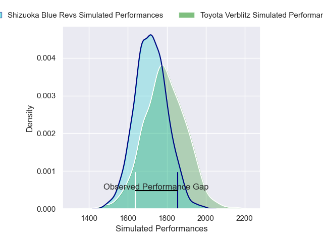
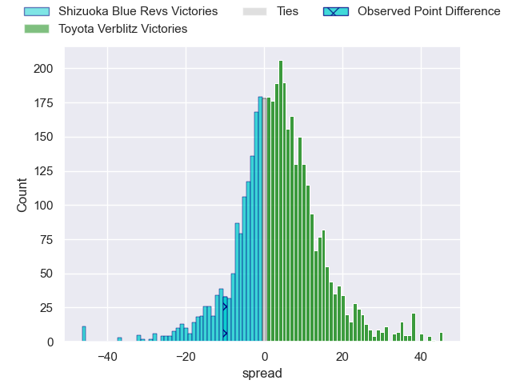
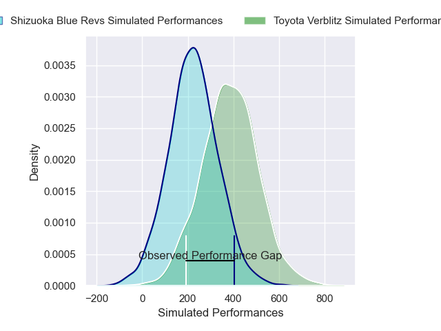
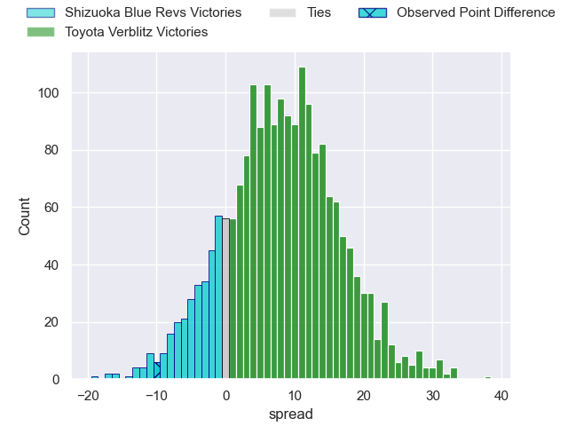
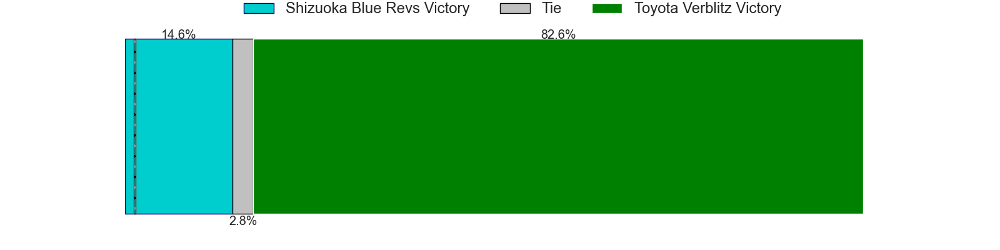

---  
layout: page  
title: Shizuoka Blue Revs at Toyota Verblitz; 33-23  
date: 2025-02-15 18:00:00 -0500  
categories: "Japan Rugby League One 24/25" match review  
---
# Shizuoka Blue Revs at Toyota Verblitz; 33-23

# Club Level Predictions

The first set of predictions treats a club as the smallest object, as the club develops its members, organizes a gameplan, and deploys its players as needed for each match. This club model has a prediction of 0.597, which translates to predicting Toyota Verblitz to win by 3.5.

Our Over/Under is 48.5 - and combined with the spread above, we have a predicted scoreline of 22 to 26

Each club has a rating and a rating deviation (similar to a Glicko rating), and expected performances can be generated. This allows for simulated matches and spreads like the ones below.
## Projected Performances - Club Model

## Projected Spreads - Club Model

## Projected Results - Club Model

# Player Level Predictions

Treating teams instead as an entity made up of the currently active players, I have ratings for each player in an altogether different system. These can be combined to form team ratings once teamsheets are announced, weighting starters a bit higher than the reserves. After the match is played, players can be weighted by their minutes on the field, allowing for an accurate measure of the team's composition. With these compiled team ratings, we can make predictions, measure inaccuracy, and update the individual player ratings.
## Prediction without Player Minutes: Toyota Verblitz by 2.6

Shizuoka Blue Revs by 1.9 on a neutral pitch

## Projected Performances - Player Model

## Projected Spreads - Player Model

## Projected Results - Player Model

|   Away Minutes | Away Player             |   Away Percentile |   Number |   Home Percentile | Home Player         |   Home Minutes |
|---------------:|:------------------------|------------------:|---------:|------------------:|:--------------------|---------------:|
|              4 | Kenta Yamashita         |             52.24 |        1 |             23.19 | Ryunosuke Momoji    |             19 |
|              9 | Takeshi Hino            |             97.28 |        2 |             69.22 | Ryusei Kato         |             26 |
|             16 | Heiichiro Ito           |             93.17 |        3 |             34.83 | Shunsuke Asaoka     |             69 |
|             19 | Jack Wright             |             39.96 |        4 |             60.04 | Richie Gray         |             74 |
|             59 | Murray Douglas          |             92.93 |        5 |             53.72 | Josh Dickson        |             56 |
|             19 | Vueti Tupou             |             53.2  |        6 |             46.9  | Adre Smith          |             82 |
|             82 | Kwagga Smith            |             96.66 |        7 |             20.34 | Akito Okui          |             41 |
|             73 | Malgene Ilaua           |             43.71 |        8 |             82.47 | Isaiah Mapusua      |             82 |
|             48 | Shuntaro Kitamura       |             60    |        9 |             37.59 | Ryang Jong Chu      |             56 |
|             34 | Sam Greene              |             10.32 |       10 |             96.21 | Rikiya Matsuda      |             82 |
|             26 | Malo Tuitama            |             85.14 |       11 |              0.28 | Siosaia Fifita      |             56 |
|             82 | Viliami Tahitu'a        |             80    |       12 |             78.77 | Nicholas McCurran   |             63 |
|             21 | Sylvian Mahuza          |             52.72 |       13 |             15.18 | Joseph Manu         |             56 |
|             45 | Valynce Te Whare-Crosby |             70    |       14 |             24.77 | Shuhei Yamaguchi    |             82 |
|             16 | Futo Yamaguchi          |             38.59 |       15 |             75.31 | Matt McGahan        |             47 |
|             26 | Kenta Iemura            |             29.68 |       16 |             77.66 | Daichi Akiyama      |             13 |
|             82 | Kazuhiro Kawata         |            nan    |       17 |             96.21 | Aaron Smith         |             82 |
|             59 | Shunsuke Sakuta         |            nan    |       18 |             90.56 | Shogo Miura         |             82 |
|             82 | Yuya Odo                |             94.16 |       19 |             94.39 | Yoshikatsu Hikosaka |             35 |
|             32 | Sione Vuna              |             57.32 |       20 |             74.29 | Yusuke Kizu         |             65 |
|             63 | Kodai Okazaki           |             53.62 |       21 |            nan    | Lautaimi Fetuani    |             34 |
|             69 | Soma Okazaki            |            nan    |       22 |             23.03 | Dick Wilson         |             82 |
|            nan | nan                     |            nan    |       23 |             90.77 | Yuki Okada          |              0 |

