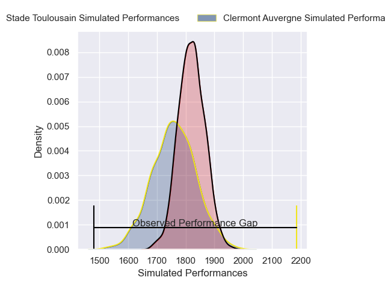
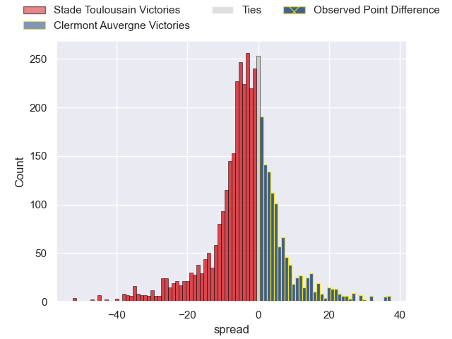
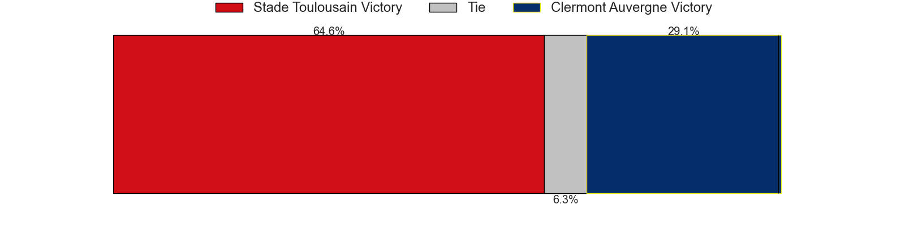
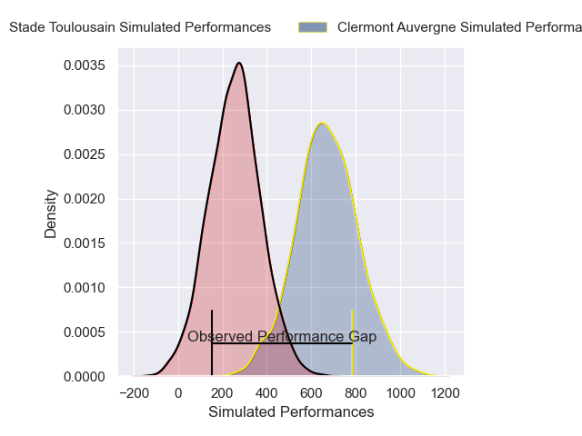
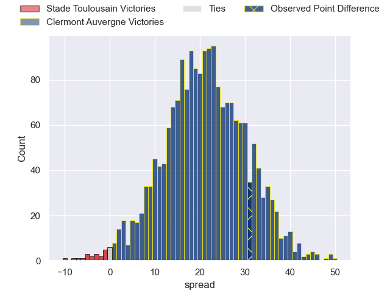
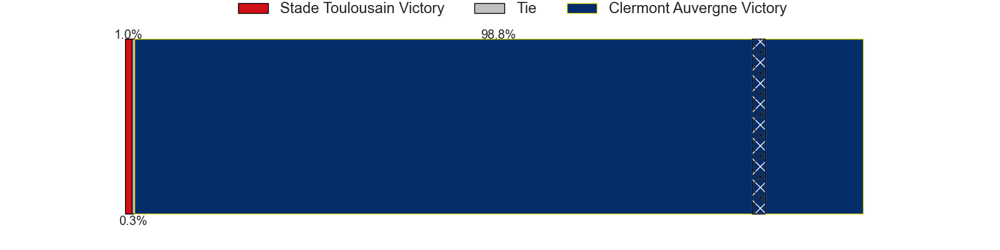

---  
layout: page  
title: Stade Toulousain at Clermont Auvergne; 12-43  
date: 2025-02-16 18:00:00 -0500  
categories: "Top 14 Orange 24/25" match review  
---
# Stade Toulousain at Clermont Auvergne; 12-43

# Club Level Predictions

The first set of predictions treats a club as the smallest object, as the club develops its members, organizes a gameplan, and deploys its players as needed for each match. This club model has a prediction of 0.412, which translates to predicting Stade Toulousain to win by 3.1.

Our Over/Under is 47.5 - and combined with the spread above, we have a predicted scoreline of 26 to 22

Each club has a rating and a rating deviation (similar to a Glicko rating), and expected performances can be generated. This allows for simulated matches and spreads like the ones below.
## Projected Performances - Club Model

## Projected Spreads - Club Model

## Projected Results - Club Model

# Player Level Predictions

Treating teams instead as an entity made up of the currently active players, I have ratings for each player in an altogether different system. These can be combined to form team ratings once teamsheets are announced, weighting starters a bit higher than the reserves. After the match is played, players can be weighted by their minutes on the field, allowing for an accurate measure of the team's composition. With these compiled team ratings, we can make predictions, measure inaccuracy, and update the individual player ratings.
## Prediction without Player Minutes: Clermont Auvergne by 4.0

Stade Toulousain by 9.0 on a neutral pitch

## Projected Performances - Player Model

## Projected Spreads - Player Model

## Projected Results - Player Model

|   Away Minutes | Away Player            |   Away Percentile |   Number |   Home Percentile | Home Player          |   Home Minutes |
|---------------:|:-----------------------|------------------:|---------:|------------------:|:---------------------|---------------:|
|           68   | David Ainu'u           |             84.85 |        1 |             19.95 | Giorgi Akhaladze     |           80   |
|           18   | Thomas Lacombre        |             68.61 |        2 |             84.91 | Folau Fainga'a       |           25   |
|           12   | Dorian Aldegheri       |             91.94 |        3 |             36.48 | Cristian Ojovan      |           16   |
|            9   | Richie Arnold          |             76.7  |        4 |             68.09 | Peceli Yato          |           60   |
|           18   | Clement Verge          |             75    |        5 |             68.94 | Thomas Ceyte         |           80   |
|           27   | Jack Willis            |             95.71 |        6 |             81.12 | Killian Tixeront     |           68   |
|           41   | Joshua Brennan         |             90.09 |        7 |             91.42 | Marcos Kremer        |           16   |
|           22   | Anthony Jelonch        |             98.72 |        8 |             89.13 | Fritz Lee            |           29   |
|           80   | Paul Graou             |             36.93 |        9 |             88.68 | Baptiste Jauneau     |           80   |
|           80   | Valentin Delpy         |             86.4  |       10 |             96.03 | Anthony Belleau      |           80   |
|           80   | Matthis Lebel          |             98.69 |       11 |              8.68 | Alivereti Raka       |           51   |
|           53   | Santiago Chocobares    |             25.83 |       12 |             20.54 | Pierre Fouyssac      |           80   |
|           51   | Paul Costes            |             73.34 |       13 |             86.83 | Lucas Tauzin         |           16   |
|            9   | Dimitri Delibes        |             85.45 |       14 |             74.44 | Bautista Delguy      |           68   |
|           15.5 | Juan Cruz Mallia       |             99.79 |       15 |             71.4  | Alex Newsome         |           65   |
|           29   | Guillaume Cramont      |             76.67 |       16 |             89.37 | Etienne Fourcade     |           12   |
|           80   | Rodrigue Neti          |             26.22 |       17 |             90.64 | Etienne Falgoux      |           62   |
|           46   | Thibaud Flament        |             91.57 |       18 |             90.06 | Thibaud Lanen        |           64   |
|           46   | Thibaud Flament        |             91.57 |       18 |             90.06 | Thibaud Lanen        |           45   |
|           46   | Thibaud Flament        |             91.57 |       18 |             90.06 | Thibaud Lanen        |           62   |
|           46   | Thibaud Flament        |             91.57 |       18 |             90.06 | Thibaud Lanen        |            0   |
|           20   | Leo Banos              |             88.56 |       19 |             84.08 | Alexandre Fischer    |           62   |
|           53   | Mathis Castro-Ferreira |             48.81 |       20 |             91.46 | Sebastien Bezy       |           15   |
|           80   | Naoto Saito            |              0.52 |       21 |             89.96 | Benjamin Urdapilleta |           80   |
|           80   | Nelson Epee            |            nan    |       22 |             89    | George Moala         |           15.5 |
|           80   | Malachi Hawkes         |            nan    |       23 |             83.88 | Regis Montagne       |           66   |

