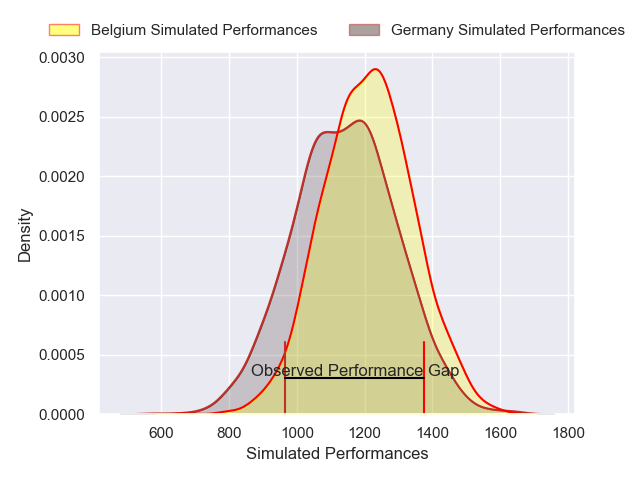
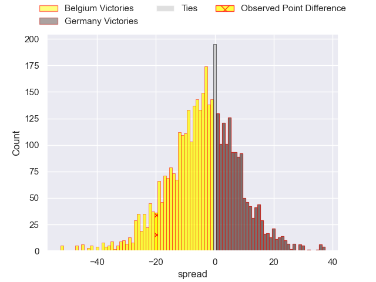
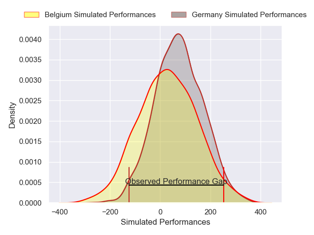
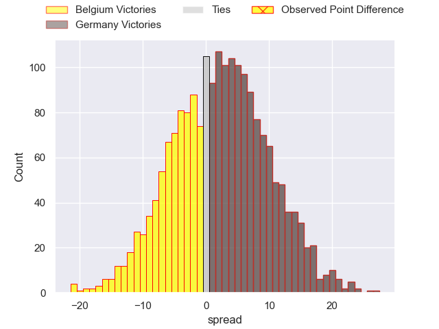
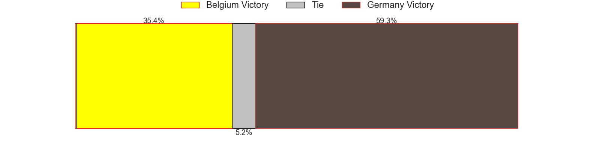

---  
layout: page  
title: Belgium at Germany; 39-19  
date: 2025-02-16 18:00:00 -0500  
categories: "Rugby Europe Championship 2025" match review  
---
# Belgium at Germany; 39-19

# Club Level Predictions

The first set of predictions treats a club as the smallest object, as the club develops its members, organizes a gameplan, and deploys its players as needed for each match. This club model has a prediction of 0.415, which translates to predicting Belgium to win by 3.2.

Our Over/Under is 41.5 - and combined with the spread above, we have a predicted scoreline of 23 to 19

Each club has a rating and a rating deviation (similar to a Glicko rating), and expected performances can be generated. This allows for simulated matches and spreads like the ones below.
## Projected Performances - Club Model

## Projected Spreads - Club Model

## Projected Results - Club Model

# Player Level Predictions

Treating teams instead as an entity made up of the currently active players, I have ratings for each player in an altogether different system. These can be combined to form team ratings once teamsheets are announced, weighting starters a bit higher than the reserves. After the match is played, players can be weighted by their minutes on the field, allowing for an accurate measure of the team's composition. With these compiled team ratings, we can make predictions, measure inaccuracy, and update the individual player ratings.
## Prediction without Player Minutes: Germany by 1.6

Belgium by 1.2 on a neutral pitch

## Projected Performances - Player Model

## Projected Spreads - Player Model

## Projected Results - Player Model

|   Away Minutes | Away Player           |   Away Percentile |   Number |   Home Percentile | Home Player            |   Home Minutes |
|---------------:|:----------------------|------------------:|---------:|------------------:|:-----------------------|---------------:|
|             80 | Charlesty Berguet     |             71.81 |        1 |              6.43 | Jörn Schröder          |             62 |
|             80 | Alexandre Raynier     |             78.23 |        2 |             10.54 | Mika Tyumenev          |             15 |
|             80 | Maxime Jadot          |             78.96 |        3 |              5.94 | Markus Bachofer        |             80 |
|             46 | Gillian Benoy         |             18.36 |        4 |             28.53 | Luis Ball              |             80 |
|             40 | Maximilien Hendrickx  |              8.57 |        5 |             10.08 | Michel Himmer          |             80 |
|             25 | Jean-Maurice Decubber |              8.9  |        6 |              7.4  | Sione Havili Talitui   |             80 |
|             18 | Jeremie Brasseur      |             53.98 |        7 |             20.52 | Shawn Ingle            |             25 |
|              8 | Felipe Geraghty       |             46.14 |        8 |             30.69 | Oliver Stein           |             34 |
|             55 | Isaac Montoisy        |             60.82 |        9 |             18.56 | Mike Mcdonald          |             10 |
|             77 | Hugo de Francq        |             17.08 |       10 |             29.38 | Bader-Werner Pretorius |             30 |
|             73 | Dazzy Cornez          |             72.73 |       11 |             12.99 | Felix Lammers          |             25 |
|             25 | Maxime Vacquier       |             54.44 |       12 |              7.25 | Leo Wolf               |             31 |
|             72 | Florian Remue         |             13.69 |       13 |             33.71 | Tim Biniak             |             31 |
|             47 | Thomas Wallraf        |             78.57 |       14 |             10.39 | Zinzan Hees            |             22 |
|             18 | Siméon Soenen         |             41.82 |       15 |             16.57 | Cameron Mcdonald       |             28 |
|             80 | Seppe Verelst         |            nan    |       16 |              9.35 | Andrew Reintges        |             29 |
|             59 | Alexis Cuffolo        |             36.73 |       17 |             42.41 | Daniel Wolf            |             22 |
|             80 | Bruno Vliegen         |             29.16 |       18 |            nan    | Henry Pearson          |             40 |
|             47 | Jens Torfs            |              6.95 |       19 |             16.67 | Hassan Rayan           |             30 |
|             33 | Jordan Gott           |            nan    |       20 |            nan    | Nico Windemuth         |             34 |
|             22 | Hugues Bastin         |             35.8  |       21 |             25.6  | Jan Piosik             |             34 |
|             30 | Lucas Rassinfosse     |             19.03 |       22 |             34.12 | Robin PlüMpe           |             40 |
|             15 | Maurice Fromont       |            nan    |       23 |            nan    | Bastian Van Der Bosch  |             11 |

