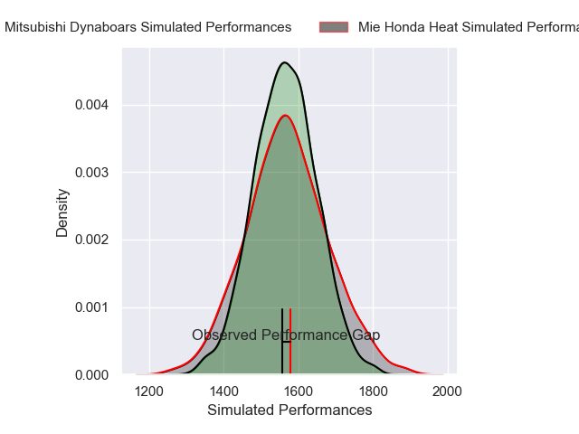
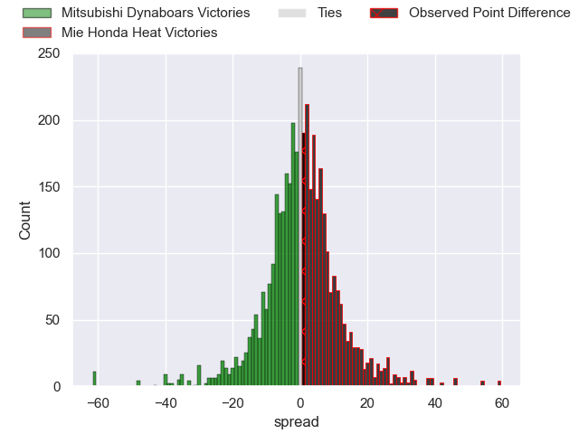
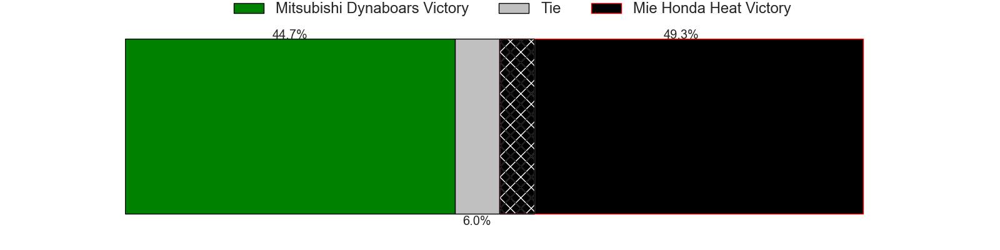
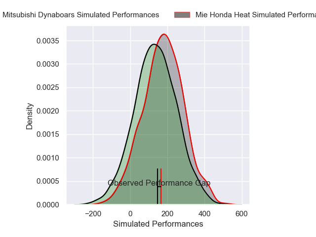
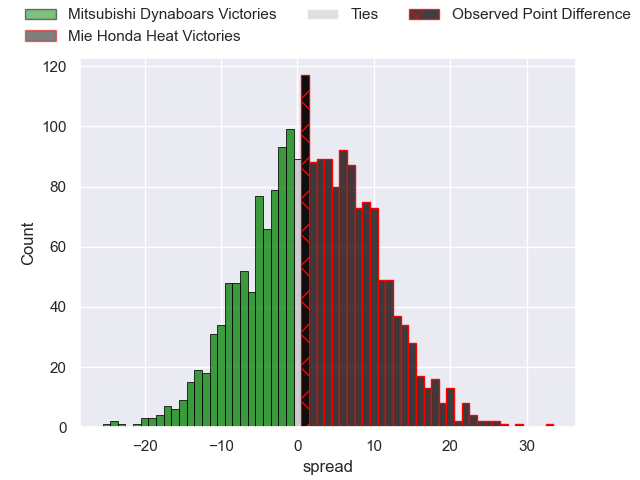
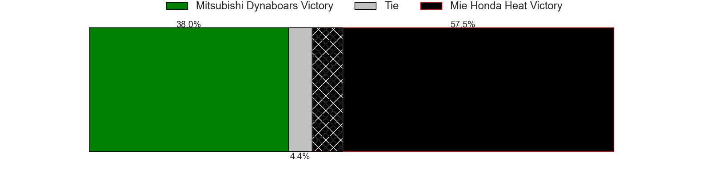

---  
layout: page  
title: Mitsubishi Dynaboars at Mie Honda Heat; 37-38  
date: 2025-02-16 18:00:00 -0500  
categories: "Japan Rugby League One 24/25" match review  
---
# Mitsubishi Dynaboars at Mie Honda Heat; 37-38

# Club Level Predictions

The first set of predictions treats a club as the smallest object, as the club develops its members, organizes a gameplan, and deploys its players as needed for each match. This club model has a prediction of 0.506, which translates to predicting Mie Honda Heat to win by 0.2.

Our Over/Under is 67.5 - and combined with the spread above, we have a predicted scoreline of 34 to 34

Each club has a rating and a rating deviation (similar to a Glicko rating), and expected performances can be generated. This allows for simulated matches and spreads like the ones below.
## Projected Performances - Club Model

## Projected Spreads - Club Model

## Projected Results - Club Model

# Player Level Predictions

Treating teams instead as an entity made up of the currently active players, I have ratings for each player in an altogether different system. These can be combined to form team ratings once teamsheets are announced, weighting starters a bit higher than the reserves. After the match is played, players can be weighted by their minutes on the field, allowing for an accurate measure of the team's composition. With these compiled team ratings, we can make predictions, measure inaccuracy, and update the individual player ratings.
## Prediction without Player Minutes: Mie Honda Heat by 1.7

Mitsubishi Dynaboars by 1.8 on a neutral pitch

## Projected Performances - Player Model

## Projected Spreads - Player Model

## Projected Results - Player Model

|   Away Minutes | Away Player         |   Away Percentile |   Number |   Home Percentile | Home Player            |   Home Minutes |
|---------------:|:--------------------|------------------:|---------:|------------------:|:-----------------------|---------------:|
|             55 | Hayato Hosoda       |             10.41 |        1 |              1.95 | Tatsuhiko Tsurukawa    |             50 |
|             70 | Lee Seung Hyok      |              6.29 |        2 |             46.43 | Koki Hida              |             84 |
|             50 | Kanzo Schinckel     |             21.48 |        3 |              2.03 | Feinga Kihe Lotu Fakai |             50 |
|             84 | Walt Steenkamp      |             72.95 |        4 |             32.14 | Mark Abbott            |             84 |
|             84 | Epineri Uluiviti    |              6.31 |        5 |             83.22 | Janko Swanepoel        |             62 |
|             84 | Kyo Yoshida         |             75.45 |        6 |             94.08 | Franco Mostert         |             34 |
|             27 | Masataka Tsuruya    |             92.93 |        7 |              5.25 | Ryota Kobayashi        |             84 |
|             34 | Jackson Hemopo      |             57.94 |        8 |             99.59 | Pablo Matera           |             80 |
|             22 | Kota Iwamura        |             76.72 |        9 |             46.72 | Azuma Doei             |             22 |
|             34 | James Grayson       |             58.32 |       10 |             73.89 | Hayata Nakao           |             58 |
|             15 | Honeti Taumoha'apai |             77.29 |       11 |             28.5  | Naoki Motomura         |             50 |
|             34 | Charlie Lawrence    |             92.92 |       12 |              3.38 | Fraser Quirk           |             50 |
|             43 | Matt Vaega          |             30.46 |       13 |             34.87 | Kyogo Okano            |             34 |
|             84 | Ben Paltridge       |             45.89 |       14 |             70.19 | Larry Steven Sulunga   |             22 |
|             84 | Kurt-Lee Arendse    |             98.55 |       15 |             79.67 | Tom Banks              |             22 |
|             32 | Lewis Chessum       |             39.4  |       16 |             78.89 | Tevita Tupou           |             22 |
|             21 | Chang Ho Ahn        |             53.21 |       17 |              6.88 | Tony Ray Hunt          |             50 |
|             34 | Chinen Yu           |             41.25 |       18 |             22.53 | Gwangtee Oh            |             69 |
|             24 | Jack Stratton       |             92.07 |       19 |             64.29 | Ikuma Yamada           |             28 |
|             84 | Marino Mikaele-Tu'u |             15.67 |       20 |             19.14 | Taichi Takenaka        |             56 |
|             84 | Kohki Sato          |             52.53 |       21 |             14.24 | Takumi Fuji            |             50 |
|            nan | nan                 |            nan    |       22 |             10.98 | Katsuyuki Hoshino      |             57 |
|            nan | nan                 |            nan    |       23 |             23.78 | Waimana Kapa           |             84 |

