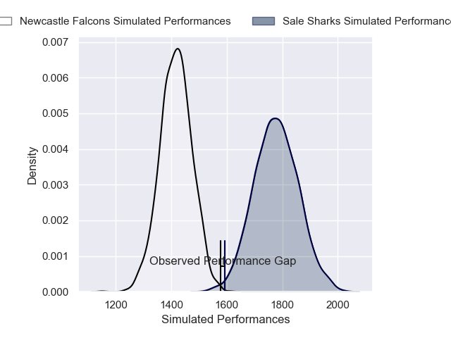
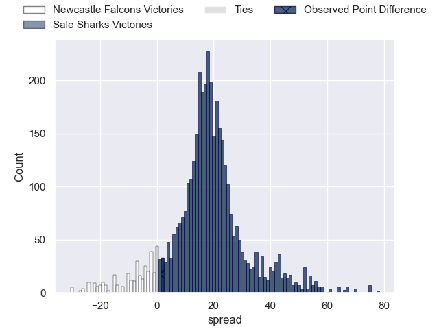
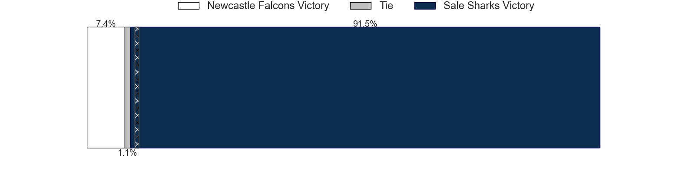
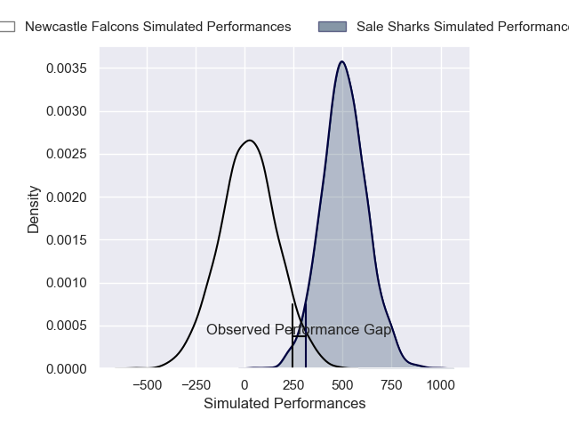
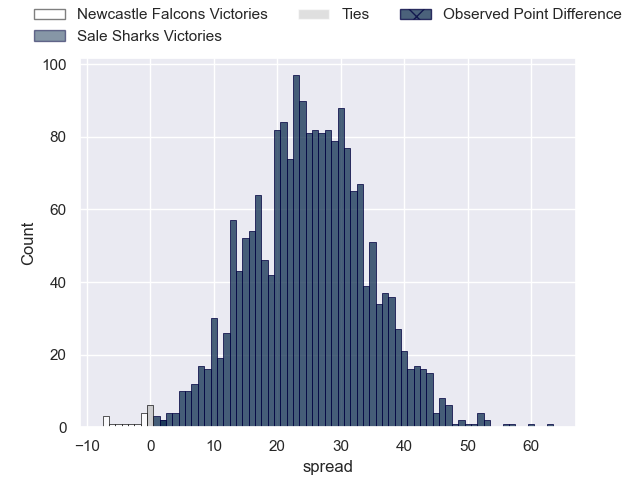
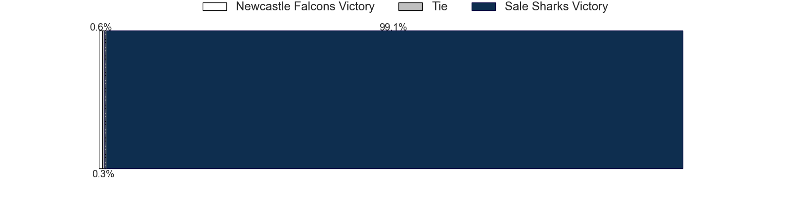

---  
layout: page  
title: Newcastle Falcons at Sale Sharks; 17-19  
date: 2025-02-16 18:00:00 -0500  
categories: "Premiership Rugby Cup 24/25" match review  
---
# Newcastle Falcons at Sale Sharks; 17-19

# Club Level Predictions

The first set of predictions treats a club as the smallest object, as the club develops its members, organizes a gameplan, and deploys its players as needed for each match. This club model has a prediction of 0.882, which translates to predicting Sale Sharks to win by 17.7.

Our Over/Under is 53.5 - and combined with the spread above, we have a predicted scoreline of 18 to 35

Each club has a rating and a rating deviation (similar to a Glicko rating), and expected performances can be generated. This allows for simulated matches and spreads like the ones below.
## Projected Performances - Club Model

## Projected Spreads - Club Model

## Projected Results - Club Model

# Player Level Predictions

Treating teams instead as an entity made up of the currently active players, I have ratings for each player in an altogether different system. These can be combined to form team ratings once teamsheets are announced, weighting starters a bit higher than the reserves. After the match is played, players can be weighted by their minutes on the field, allowing for an accurate measure of the team's composition. With these compiled team ratings, we can make predictions, measure inaccuracy, and update the individual player ratings.
## Prediction without Player Minutes: Sale Sharks by 31.9

Sale Sharks by 18.3 on a neutral pitch

## Projected Performances - Player Model

## Projected Spreads - Player Model

## Projected Results - Player Model

|   Away Minutes | Away Player         |   Away Percentile |   Number |   Home Percentile | Home Player                    |   Home Minutes |
|---------------:|:--------------------|------------------:|---------:|------------------:|:-------------------------------|---------------:|
|             51 | Adam Brocklebank    |              1.93 |        1 |             89.72 | Ross Harrison                  |             72 |
|             51 | Jamie Blamire       |              0.68 |        2 |              8.84 | Tadgh McElroy                  |             80 |
|             80 | Murray McCallum     |             17.83 |        3 |             43.21 | Patreece Bell                  |             50 |
|             61 | Philip van der Walt |              4.24 |        4 |             15.16 | Ben Bamber                     |             53 |
|             51 | Kiran McDonald      |             17.23 |        5 |              2.35 | Jonny Hill                     |             60 |
|             56 | Freddie Lockwood    |             58.01 |        6 |             26.8  | Jos Gilmore                    |             86 |
|             60 | Ollie Leatherbarrow |             23.71 |        7 |              8.72 | Sam Dugdale                    |             86 |
|             58 | Callum Chick        |              1.67 |        8 |            100    | Jean-Luc du Preez              |             86 |
|             80 | Sam Stuart          |              0.34 |        9 |              5.67 | Anerin (Nye) Thomas            |             86 |
|             80 | Brett Connon        |             12.92 |       10 |             20.62 | Tom Curtis                     |             29 |
|              7 | Ben Stevenson       |             68.18 |       11 |             21.34 | Alex Wills                     |             80 |
|             80 | Max Clark           |            100    |       12 |             66.29 | Sam Bedlow                     |             24 |
|             24 | Max Clark           |            100    |       12 |             66.29 | Sam Bedlow                     |             24 |
|             65 | Max Clark           |            100    |       12 |             66.29 | Sam Bedlow                     |             24 |
|             80 | Alex Hearle         |             73.65 |       13 |             93.87 | Waisea Nayacalevu Vuidravuwalu |             80 |
|             22 | Nathan Greenwood    |             50.56 |       14 |             95.45 | Arron Reed                     |             29 |
|             19 | Elliott Obatoyinbo  |             12.73 |       15 |             29.29 | Ollie Davies                   |             51 |
|             73 | Cameron Neild       |            nan    |       16 |             93.09 | Bevan Rodd                     |             51 |
|             80 | Ollie Fletcher      |             21.6  |       17 |             89.32 | Asher Opoku-Fordjour           |             24 |
|             65 | Joe Davis           |            nan    |       18 |            nan    | Dom Hanson                     |             67 |
|             80 | John Hawkins        |              4.52 |       19 |             90.3  | Will Addison                   |             62 |
|            nan | nan                 |            nan    |       20 |            nan    | Alfie Longstaff                |             29 |
|            nan | nan                 |            nan    |       21 |              8.08 | Joe Carpenter                  |             26 |
|            nan | nan                 |            nan    |       22 |             21    | Hyron Andrews                  |             29 |
|            nan | nan                 |            nan    |       23 |             18.58 | Rouban Birch                   |             80 |

