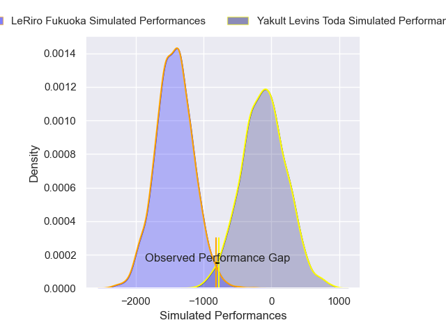
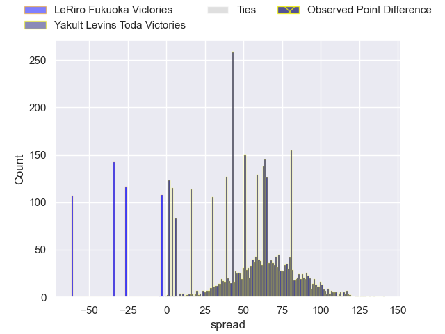
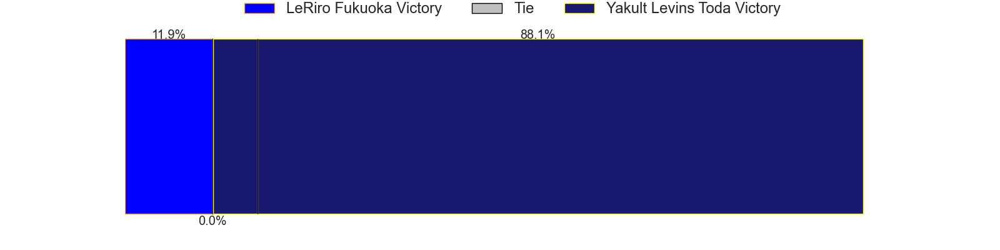
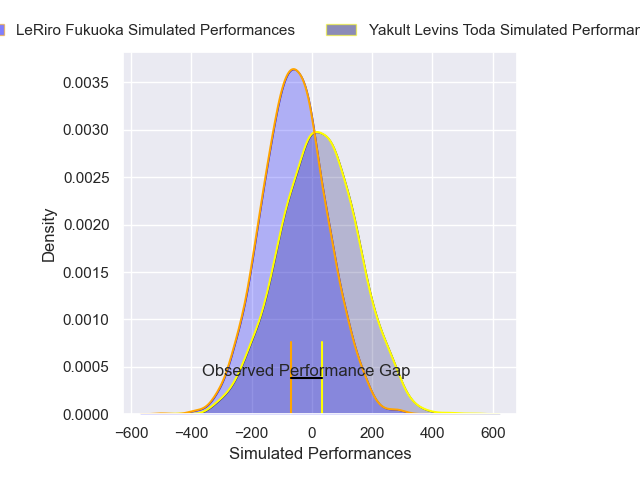
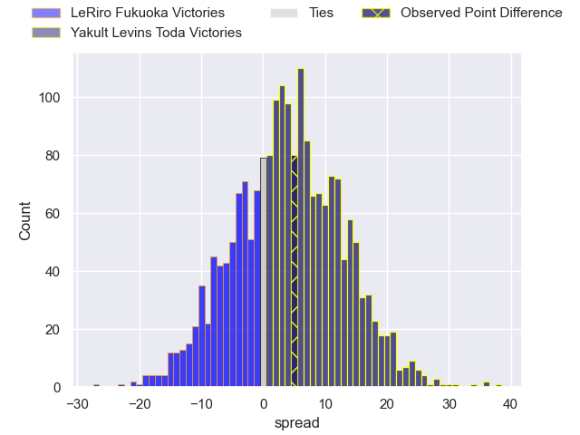
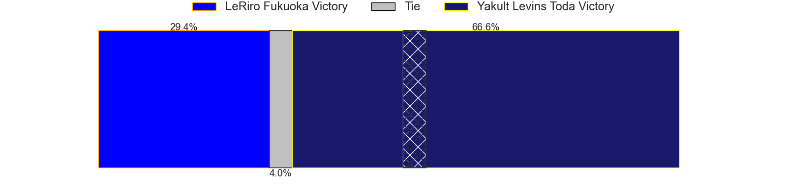

---  
layout: page  
title: LeRiro Fukuoka at Yakult Levins Toda; 34-39  
date: 2025-02-16 18:00:00 -0500  
categories: "Japan Rugby League One D3 24/25" match review  
---
# LeRiro Fukuoka at Yakult Levins Toda; 34-39

# Club Level Predictions

The first set of predictions treats a club as the smallest object, as the club develops its members, organizes a gameplan, and deploys its players as needed for each match. This club model has a prediction of 0.997, which translates to predicting Yakult Levins Toda to win by 66.1.

Our Over/Under is 86.5 - and combined with the spread above, we have a predicted scoreline of 10 to 76

Each club has a rating and a rating deviation (similar to a Glicko rating), and expected performances can be generated. This allows for simulated matches and spreads like the ones below.
## Projected Performances - Club Model

## Projected Spreads - Club Model

## Projected Results - Club Model

# Player Level Predictions

Treating teams instead as an entity made up of the currently active players, I have ratings for each player in an altogether different system. These can be combined to form team ratings once teamsheets are announced, weighting starters a bit higher than the reserves. After the match is played, players can be weighted by their minutes on the field, allowing for an accurate measure of the team's composition. With these compiled team ratings, we can make predictions, measure inaccuracy, and update the individual player ratings.
## Prediction without Player Minutes: Yakult Levins Toda by 3.8

Yakult Levins Toda by 1.6 on a neutral pitch

## Projected Performances - Player Model

## Projected Spreads - Player Model

## Projected Results - Player Model

|   Away Minutes | Away Player         |   Away Percentile |   Number |   Home Percentile | Home Player          |   Home Minutes |
|---------------:|:--------------------|------------------:|---------:|------------------:|:---------------------|---------------:|
|             84 | Keita Kimura        |              5.53 |        1 |             15.62 | Iori Nozaki          |             67 |
|             26 | Yoshiaki Takeuchi   |             25.68 |        2 |             21.94 | Shunsuke Tani        |             41 |
|             41 | Rintarou Noda       |             22.54 |        3 |             19.93 | Atsushi Furuya       |             80 |
|             80 | Keita Terada        |              7.07 |        4 |             26.86 | Yuto Usuda           |             80 |
|             57 | Syuuta Takami       |             44.96 |        5 |             90.01 | James Tucker         |             30 |
|             22 | Kennta Ueda         |             13.66 |        6 |             34.38 | Masaya Makino        |             80 |
|             49 | Chikamasa Yana      |             44.03 |        7 |             17.48 | Kosuke Urabe         |             80 |
|             62 | Finau Makavaha      |             10.93 |        8 |              4.95 | Jaycob Matiu         |             80 |
|             39 | Hisanori Mimata     |             55.17 |        9 |             15.52 | Ippei Oshima         |             80 |
|             58 | Shotaro Matsuo      |             24.84 |       10 |              8.42 | Nick Evemy           |             50 |
|             25 | Tsuyoshi Hasegawa   |             19.91 |       11 |             27.94 | Kagechika Ota        |             50 |
|             31 | Rinto Kagawa        |             37.23 |       12 |             22.67 | Takumi Hurukawa      |             57 |
|             30 | Masakazu Yatsumonji |             47.79 |       13 |              3.49 | Antonio Mikaele-Tu'u |             80 |
|             23 | Amanaki Lisala      |              8.04 |       14 |             30.19 | Hikaru Ishikawa      |             13 |
|             80 | Hibiki Nakazawa     |             27.59 |       15 |             17.43 | Masatoshi Doi        |             80 |
|             14 | Benjamin Ray Yagi   |              0.62 |       16 |            nan    | Rikiya Oishi         |             34 |
|             84 | Tomoki Nobeta       |             18.96 |       17 |            nan    | Daisuke Yokoyama     |             26 |
|             38 | Iosefatu Mareko     |            nan    |       18 |            nan    | Daichi Kono          |             41 |
|             60 | Karne Hesketh       |              2.77 |       19 |              7.76 | Junpei Tada          |             65 |
|             80 | Issei Shige         |             14.67 |       20 |             22.26 | Atomu Shirai         |             80 |
|             84 | Syuuhei Harada      |            nan    |       21 |             10.19 | Shun Sawamura        |             80 |
|             18 | Taiyou Minami       |            nan    |       22 |            nan    | Masahiro Shimozawa   |             52 |
|            nan | nan                 |            nan    |       23 |            nan    | Genki Tokushige      |             23 |

