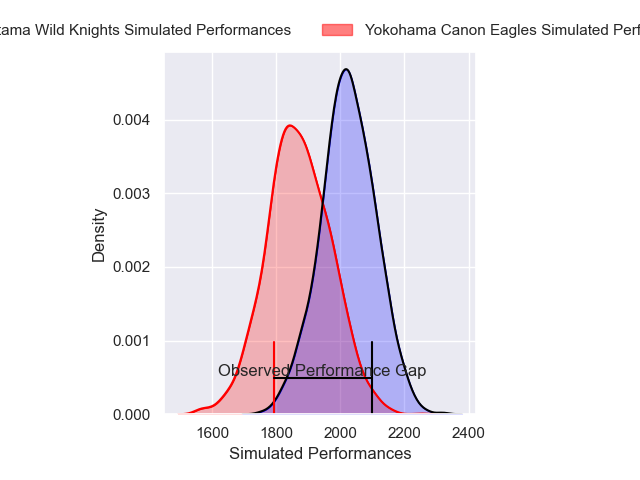
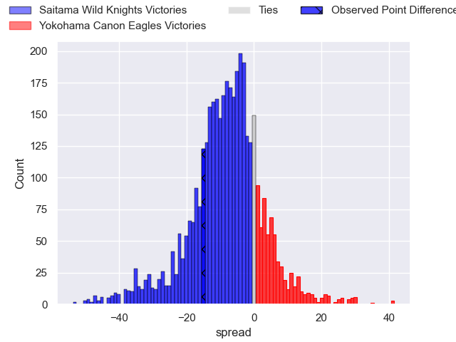
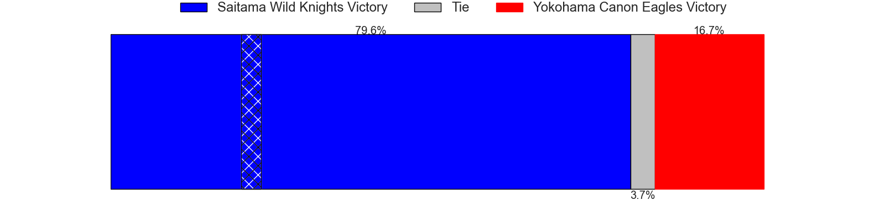
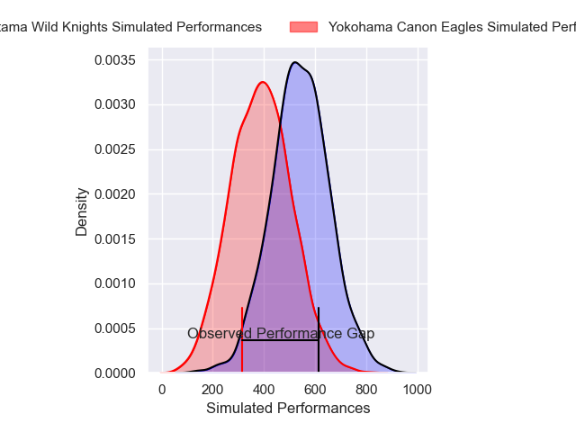
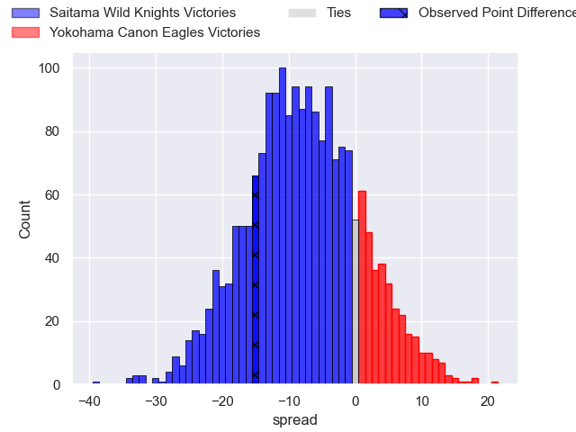
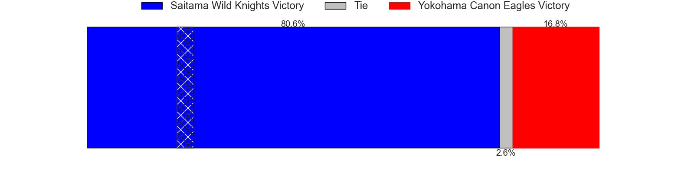

---  
layout: page  
title: Saitama Wild Knights at Yokohama Canon Eagles; 51-36  
date: 2025-02-16 18:00:00 -0500  
categories: "Japan Rugby League One 24/25" match review  
---
# Saitama Wild Knights at Yokohama Canon Eagles; 51-36

# Club Level Predictions

The first set of predictions treats a club as the smallest object, as the club develops its members, organizes a gameplan, and deploys its players as needed for each match. This club model has a prediction of 0.306, which translates to predicting Saitama Wild Knights to win by 7.4.

Our Over/Under is 47.5 - and combined with the spread above, we have a predicted scoreline of 28 to 20

Each club has a rating and a rating deviation (similar to a Glicko rating), and expected performances can be generated. This allows for simulated matches and spreads like the ones below.
## Projected Performances - Club Model

## Projected Spreads - Club Model

## Projected Results - Club Model

# Player Level Predictions

Treating teams instead as an entity made up of the currently active players, I have ratings for each player in an altogether different system. These can be combined to form team ratings once teamsheets are announced, weighting starters a bit higher than the reserves. After the match is played, players can be weighted by their minutes on the field, allowing for an accurate measure of the team's composition. With these compiled team ratings, we can make predictions, measure inaccuracy, and update the individual player ratings.
## Prediction without Player Minutes: Saitama Wild Knights by 14.7

Saitama Wild Knights by 18.9 on a neutral pitch

## Projected Performances - Player Model

## Projected Spreads - Player Model

## Projected Results - Player Model

|   Away Minutes | Away Player       |   Away Percentile |   Number |   Home Percentile | Home Player      |   Home Minutes |
|---------------:|:------------------|------------------:|---------:|------------------:|:-----------------|---------------:|
|             80 | Yusaku Kihara     |             58.96 |        1 |             95.82 | Takato Okabe     |             44 |
|             80 | Atsushi Sakate    |             91.16 |        2 |             63.61 | Yusuke Niwai     |             40 |
|             41 | Taiki Fujii       |             87.79 |        3 |             70.92 | Ryosuke Iwaihara |             61 |
|             36 | Esei Ha'angana    |             83.05 |        4 |              7.06 | Liaki Moli       |             80 |
|             61 | Lood de Jager     |             97.18 |        5 |             41.34 | Matt Philip      |             19 |
|             36 | Ryota Hasegawa    |             99.34 |        6 |             40.02 | Billy Harmon     |             19 |
|             26 | Lachlan Boshier   |             99.44 |        7 |             66.35 | Masato Furukawa  |             19 |
|             26 | Jack Cornelsen    |             96.87 |        8 |             96.24 | Amanaki Mafi     |             40 |
|             12 | Taiki Koyama      |             94.67 |        9 |             93.3  | Faf de Klerk     |             19 |
|              2 | Kyohei Yamasawa   |             82.71 |       10 |             18.96 | Yuragi Muto      |             17 |
|             40 | Tomoki Osada      |             51.39 |       11 |             94.81 | Viliame Takayawa |             79 |
|             49 | Damian de Allende |             99.28 |       12 |             96.22 | Yusuke Kajimura  |             54 |
|             80 | Dylan Riley       |             97.65 |       13 |             32.18 | Ryo Tabata       |             80 |
|             80 | Koki Takeyama     |             98.7  |       14 |             29.41 | Chihito Matsui   |             78 |
|             36 | Ryuji Noguchi     |             97.78 |       15 |             86.67 | Brendan Owen     |             80 |
|             80 | Shota Fukui       |             75.16 |       16 |             54.99 | Cormac Daly      |             23 |
|             50 | Craig Millar      |             70.44 |       17 |             74.23 | Toshiki Amano    |             63 |
|             80 | Vince Aso         |             70.17 |       18 |             86.88 | Yu Tamura        |             68 |
|             58 | Asaeli Ai Valu    |             98.55 |       19 |             20.15 | Lekima Nasamila  |             80 |
|             23 | Kenji Sato        |            nan    |       20 |             92.69 | Shunta Nakamura  |             80 |
|             18 | Tom Parton        |             89.9  |       21 |            nan    | Shouta Matsuoka  |             80 |
|             31 | Liam Mitchell     |             84.27 |       22 |             98.38 | Jumpei Ogura     |             54 |
|             30 | Yuta Takagi       |            nan    |       23 |            nan    | Tomoki Minami    |             17 |

