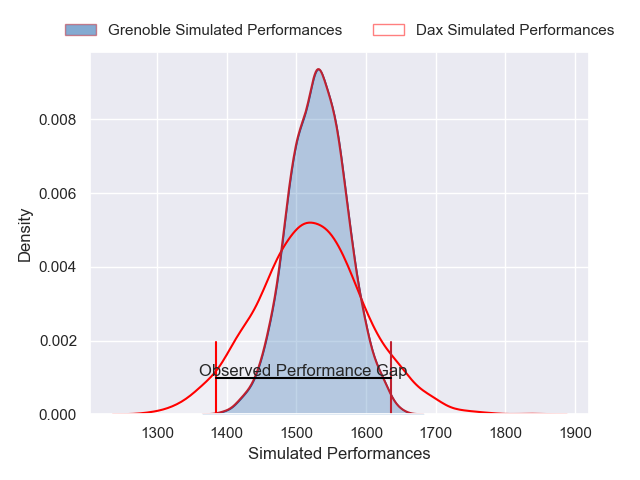
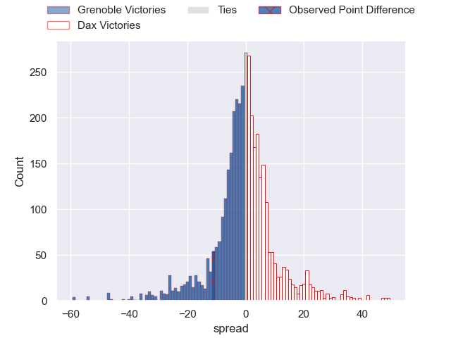
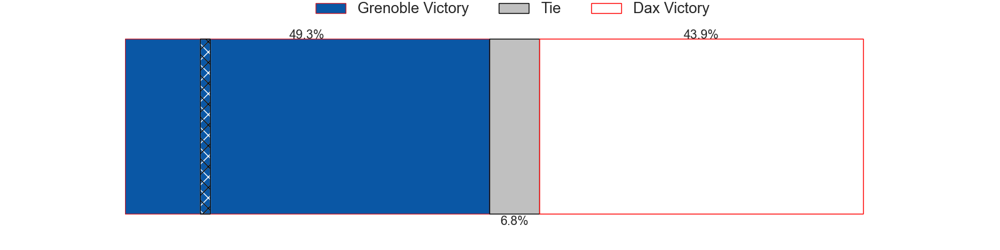
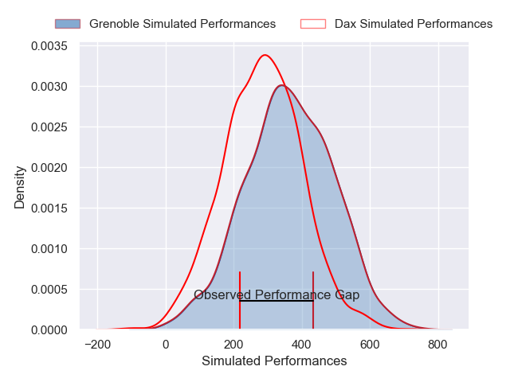
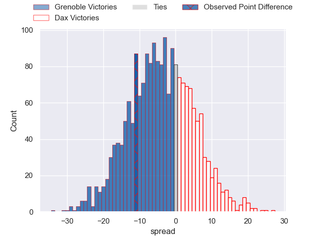
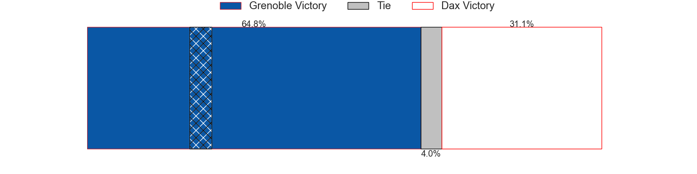

---  
layout: page  
title: Grenoble at Dax; 29-18  
date: 2025-02-20 18:00:00 -0500  
categories: "Pro D2 24/25" match review  
---
# Grenoble at Dax; 29-18

# Club Level Predictions

The first set of predictions treats a club as the smallest object, as the club develops its members, organizes a gameplan, and deploys its players as needed for each match. This club model has a prediction of 0.485, which translates to predicting Grenoble to win by 0.5.

Our Over/Under is 49.5 - and combined with the spread above, we have a predicted scoreline of 25 to 24

Each club has a rating and a rating deviation (similar to a Glicko rating), and expected performances can be generated. This allows for simulated matches and spreads like the ones below.
## Projected Performances - Club Model

## Projected Spreads - Club Model

## Projected Results - Club Model

# Player Level Predictions

Treating teams instead as an entity made up of the currently active players, I have ratings for each player in an altogether different system. These can be combined to form team ratings once teamsheets are announced, weighting starters a bit higher than the reserves. After the match is played, players can be weighted by their minutes on the field, allowing for an accurate measure of the team's composition. With these compiled team ratings, we can make predictions, measure inaccuracy, and update the individual player ratings.
## Prediction without Player Minutes: Dax by 0.4

Grenoble by 11.6 on a neutral pitch

## Projected Performances - Player Model

## Projected Spreads - Player Model

## Projected Results - Player Model

|   Away Minutes | Away Player       |   Away Percentile |   Number |   Home Percentile | Home Player          |   Home Minutes |
|---------------:|:------------------|------------------:|---------:|------------------:|:---------------------|---------------:|
|             80 | Eli Eglaine       |             60.96 |        1 |             25.54 | Raphaël Laboille     |             29 |
|             69 | Bastien Soury     |             81.97 |        2 |             32.65 | Iban Hiriart-Urruty  |             80 |
|             33 | Johannes Jonker   |             28.76 |        3 |             49.96 | David Lolohea        |             51 |
|             11 | Thomas Ployet     |             78.81 |        4 |             21.19 | Alexandre Manukula   |             80 |
|             80 | Pio Muarua        |             63.75 |        5 |              6.59 | Jean-Baptiste Singer |             46 |
|             41 | Antonin Berruyer  |             90.35 |        6 |             62.98 | Arnaud Aletti        |             29 |
|             29 | Thibaut Martel    |             80.32 |        7 |             77.23 | Paul Arnaud Ausset   |             28 |
|             27 | Hanru Sirgel      |             88.94 |        8 |             70.15 | Genesis Mamea Lemalu |             23 |
|             80 | Eric Escande      |             90.72 |        9 |             66.32 | Sylvère Reteau       |             21 |
|             14 | Max Clement       |             89.58 |       10 |             52.92 | Hugo Cerisier        |             72 |
|             40 | Wilfried Hulleu   |             86.83 |       11 |              2.04 | Maxime Oltmann       |             51 |
|              8 | Romain Trouilloud |             76.81 |       12 |             64.25 | Noah Nene            |             68 |
|             67 | Romain Fusier     |             69.77 |       13 |             33.09 | Bastien Daguerre     |             69 |
|             81 | Kaminieli Rasaku  |             87.94 |       14 |             72.26 | Théo Gatelier        |             33 |
|             54 | Hugo Trouilloud   |             57.98 |       15 |             28.28 | Théo Duprat          |             52 |
|             81 | Tommy Raynaud     |             83.05 |       16 |              0.31 | Jale Vatubua         |             73 |
|             80 | Julien Farnoux    |             97.17 |       17 |             46.52 | Étienne Loiret       |             33 |
|             80 | Giorgi Pertaia    |             92.05 |       18 |              2.41 | Nephi Leatigaga      |             61 |
|              8 | Sam Davies        |             91.25 |       19 |             17.18 | Louis Barrere        |             55 |
|             41 | Jose Madeira      |             93.69 |       20 |             71.33 | Louis Mary           |             80 |
|             80 | Yan Lestrade      |             90.09 |       21 |             31.25 | Romuald Séguy        |             80 |
|             80 | Brandon Nansen    |             49.53 |       22 |             84.88 | Paul Ravier          |             51 |
|             60 | Zack Gauthier     |             87.15 |       23 |             19.96 | Jean Despiau         |             59 |

