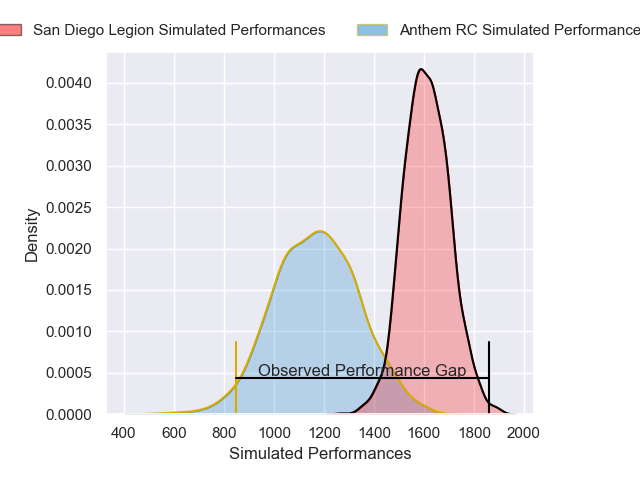
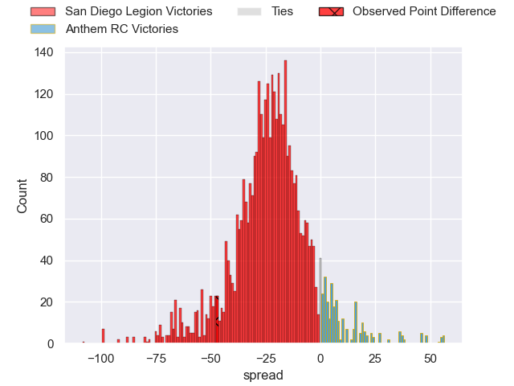
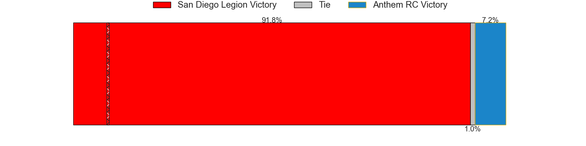
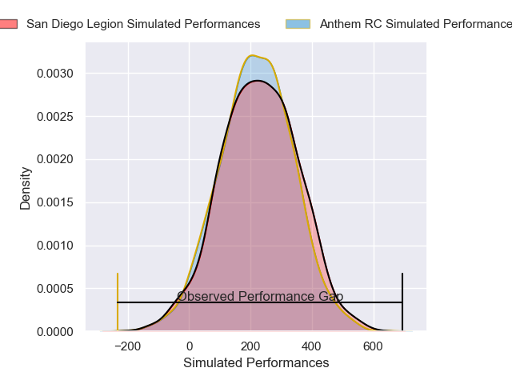
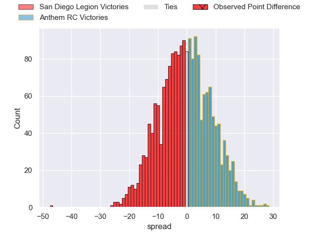

---  
layout: page  
title: San Diego Legion at Anthem RC; 52-5  
date: 2025-02-21 18:00:00 -0500  
categories: "Major League Rugby 2025" match review  
---
# San Diego Legion at Anthem RC; 52-5

# Club Level Predictions

The first set of predictions treats a club as the smallest object, as the club develops its members, organizes a gameplan, and deploys its players as needed for each match. This club model has a prediction of 0.082, which translates to predicting San Diego Legion to win by 21.9.

Our Over/Under is 68.5 - and combined with the spread above, we have a predicted scoreline of 45 to 23

Each club has a rating and a rating deviation (similar to a Glicko rating), and expected performances can be generated. This allows for simulated matches and spreads like the ones below.
## Projected Performances - Club Model

## Projected Spreads - Club Model

## Projected Results - Club Model

# Player Level Predictions

Treating teams instead as an entity made up of the currently active players, I have ratings for each player in an altogether different system. These can be combined to form team ratings once teamsheets are announced, weighting starters a bit higher than the reserves. After the match is played, players can be weighted by their minutes on the field, allowing for an accurate measure of the team's composition. With these compiled team ratings, we can make predictions, measure inaccuracy, and update the individual player ratings.
## Prediction without Player Minutes: San Diego Legion by 1.7

San Diego Legion by 4.0 on a neutral pitch

## Projected Performances - Player Model

## Projected Spreads - Player Model

## Projected Results - Player Model

|   Away Minutes | Away Player         |   Away Percentile |   Number |   Home Percentile | Home Player        |   Home Minutes |
|---------------:|:--------------------|------------------:|---------:|------------------:|:-------------------|---------------:|
|             21 | Djustice Sears-Duru |              0.96 |        1 |              5.62 | Jake Turnbull      |             61 |
|             15 | Shilo Klein         |             94.15 |        2 |             28.26 | Connor Robinson    |             52 |
|             82 | Darcy Breen         |             65.17 |        3 |             77.05 | Joe Apikotoa       |             51 |
|             82 | Jed Holloway        |             18.71 |        4 |             35.82 | Viliami Vuli       |             30 |
|             30 | Vili Helu           |             73.72 |        5 |             38.75 | Mikey Grandy       |             20 |
|             82 | Christian Poidevin  |             73.91 |        6 |             53.78 | Sam Golla          |             41 |
|             21 | Paddy Ryan          |             98.87 |        7 |             17.3  | Makeen Alikhan     |             82 |
|             71 | Paddy Ryan          |             98.87 |        7 |             17.3  | Makeen Alikhan     |             82 |
|              5 | David Tameilau      |             58.98 |        8 |             16.41 | Dylan Fortune      |             82 |
|             52 | Richard Judd        |             96.73 |        9 |             32.01 | Karl Keane         |             38 |
|             30 | Lincoln McClutchie  |             71.94 |       10 |             18.99 | Line Latu          |             80 |
|             25 | Ryan James          |             23.81 |       11 |             29.5  | Jason Tidwell      |             42 |
|             39 | Tavite Lopeti       |             91.61 |       12 |             25.07 | Junior Gafa        |             21 |
|             50 | Marcel Brache       |             87.66 |       13 |             58.74 | Erich Storti       |              8 |
|             34 | Tomas Aoake         |             84.83 |       14 |             81.71 | Conner Mooneyham   |             80 |
|             80 | Ethan Grayson       |             77.64 |       15 |             84.96 | Mitch Wilson       |             82 |
|             55 | Liki Chan-Tung      |            nan    |       16 |             36.62 | Ethan Howard       |             61 |
|             34 | Nathan Sylvia       |            nan    |       17 |            nan    | Dan Hanson         |             82 |
|             34 | Brook Toomalatai    |            nan    |       18 |             72.71 | Alex Maughan       |             27 |
|             46 | Charlie Hewitt      |            nan    |       19 |            nan    | Colin Turner       |             82 |
|             80 | Brad Wilkin         |             33.36 |       20 |             30.25 | Shawn Clark        |             82 |
|             80 | Connor Tupai        |             34.08 |       21 |            nan    | Graeme Pedegana    |             55 |
|             80 | Tiaan Loots         |             53.9  |       22 |            nan    | Watson Filikitonga |             26 |
|             80 | Alesana Pohla       |            nan    |       23 |            nan    | Carlo De Nysschen  |             41 |

