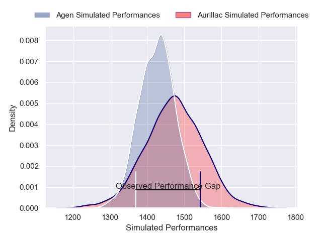
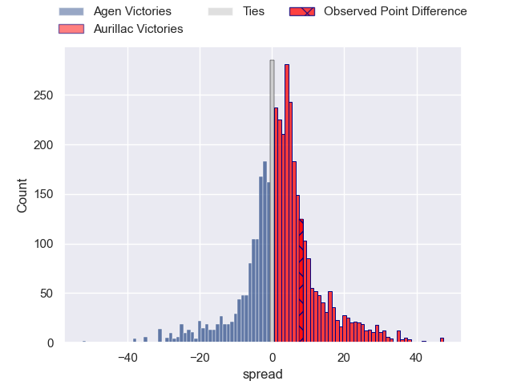
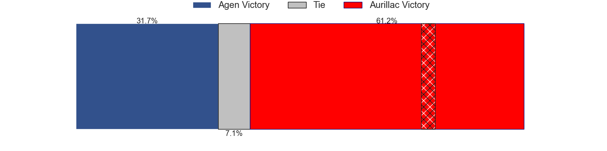
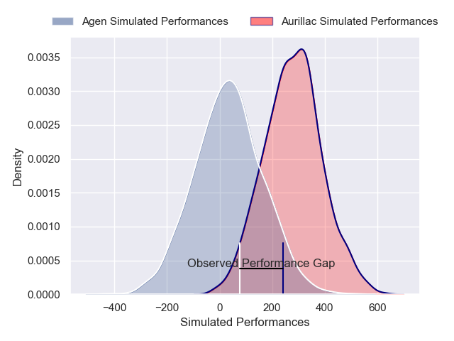
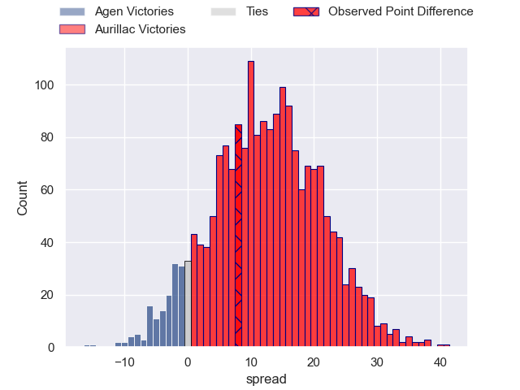
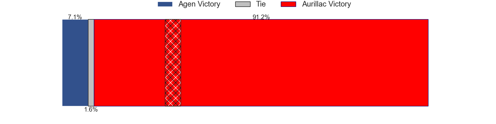

---  
layout: page  
title: Agen at Aurillac; 26-34  
date: 2025-02-21 18:00:00 -0500  
categories: "Pro D2 24/25" match review  
---
# Agen at Aurillac; 26-34

# Club Level Predictions

The first set of predictions treats a club as the smallest object, as the club develops its members, organizes a gameplan, and deploys its players as needed for each match. This club model has a prediction of 0.561, which translates to predicting Aurillac to win by 2.1.

Our Over/Under is 51.5 - and combined with the spread above, we have a predicted scoreline of 25 to 27

Each club has a rating and a rating deviation (similar to a Glicko rating), and expected performances can be generated. This allows for simulated matches and spreads like the ones below.
## Projected Performances - Club Model

## Projected Spreads - Club Model

## Projected Results - Club Model

# Player Level Predictions

Treating teams instead as an entity made up of the currently active players, I have ratings for each player in an altogether different system. These can be combined to form team ratings once teamsheets are announced, weighting starters a bit higher than the reserves. After the match is played, players can be weighted by their minutes on the field, allowing for an accurate measure of the team's composition. With these compiled team ratings, we can make predictions, measure inaccuracy, and update the individual player ratings.
## Prediction without Player Minutes: Aurillac by 9.4

Agen by 3.6 on a neutral pitch

## Projected Performances - Player Model

## Projected Spreads - Player Model

## Projected Results - Player Model

|   Away Minutes | Away Player         |   Away Percentile |   Number |   Home Percentile | Home Player             |   Home Minutes |
|---------------:|:--------------------|------------------:|---------:|------------------:|:------------------------|---------------:|
|             63 | Florent Guion       |              5.7  |        1 |             14.53 | Irakli Mtchedlidze      |             31 |
|             26 | Santiago Socino     |             83.78 |        2 |              0.84 | Luka Nioradze           |             59 |
|             65 | Beau Farrance       |             50.4  |        3 |              3.29 | Giorgi Kartvelishvili   |             34 |
|             65 | William Demotte     |             79.11 |        4 |             13.89 | Louis Bruinsma          |             80 |
|             80 | John Madigan        |             12.1  |        5 |             31    | Mael Perrin             |             61 |
|             80 | Matthieu Bonnet     |             17.86 |        6 |             72.68 | Heath Backhouse         |             80 |
|             29 | Evan Olmstead       |              0.38 |        7 |             17.58 | Lucas Oudard            |             41 |
|             80 | Valentin Gayraud    |             47.66 |        8 |             28.52 | Aleksandre Burduli      |             21 |
|             80 | Jack Maunder        |             78.31 |        9 |             31.33 | Boris Hadinegoro        |             26 |
|             74 | Billy Searle        |              1.27 |       10 |             66.46 | Ugo Seunes              |             30 |
|             29 | Iban Etcheverry     |             14.34 |       11 |              2.39 | AJ Coertzen             |             34 |
|             77 | Kolinio Ramoka      |             50.54 |       12 |             13.72 | Karsen Talalua          |             62 |
|             80 | Peyo Muscarditz     |             76.51 |       13 |             50.64 | Karl Martin             |             41 |
|             29 | Lucas Martins       |             85.29 |       14 |             22.24 | Axel Bevia              |             80 |
|             46 | Franck Pourteau     |             87.8  |       15 |             51.22 | Dachi Papunashvili      |             80 |
|             15 | Tomasi Fineanganofo |             43.19 |       16 |              0.57 | Abongile Nonkontwana    |             25 |
|             31 | Mathieu de Giovanni |             44.23 |       17 |             23.72 | Tim De Jong             |             21 |
|             26 | Pierre Jouvin       |             18.9  |       18 |             47.16 | Hugo Huurman            |             21 |
|             80 | Alex Burin          |             24.24 |       19 |             24.61 | Mikheil Alania          |             25 |
|              3 | Theo Idjellidaine   |              9.64 |       20 |             58.67 | Gymael Jean-Jacques     |             51 |
|             39 | Emile Dayral        |            nan    |       21 |             62.21 | Basa Khonelidze         |             51 |
|             80 | Loris Tolot         |              1.42 |       22 |             47.67 | Dominic Robertson-McCoy |             80 |
|             80 | Mamuka Mstoiani     |             34.91 |       23 |             65.45 | Hugo Bastard            |             80 |

