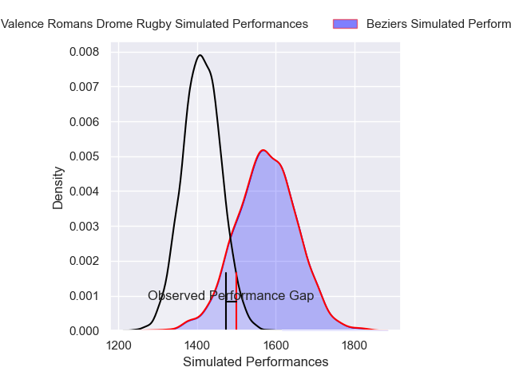
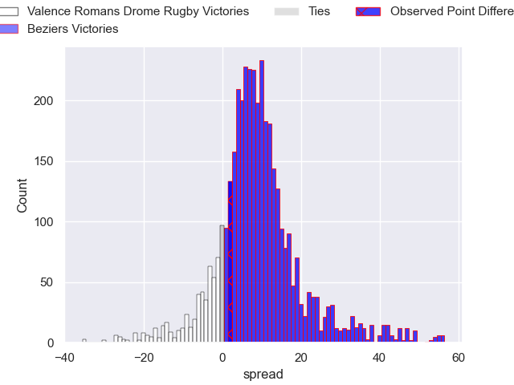
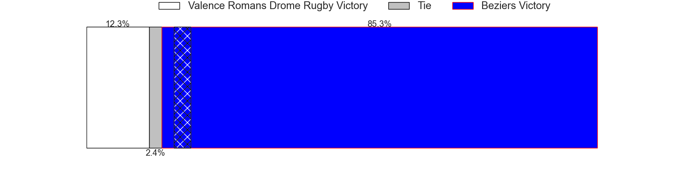
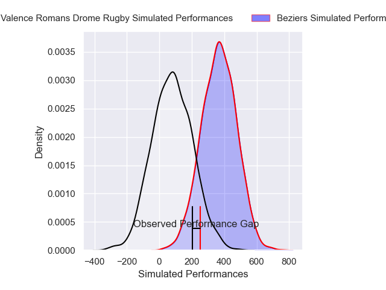
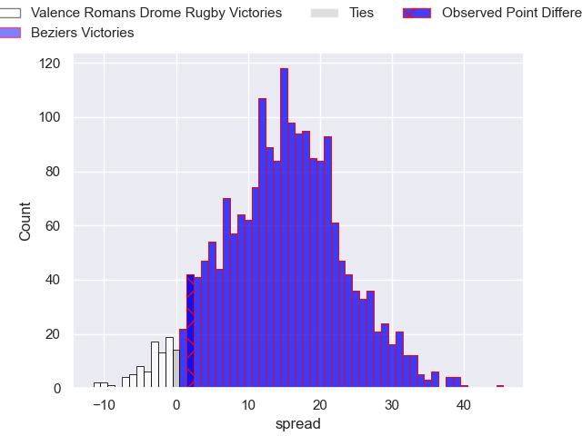
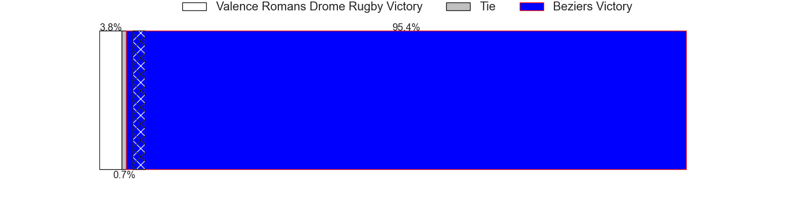

---  
layout: page  
title: Valence Romans Drome Rugby at Beziers; 26-28  
date: 2025-02-21 18:00:00 -0500  
categories: "Pro D2 24/25" match review  
---
# Valence Romans Drome Rugby at Beziers; 26-28

# Club Level Predictions

The first set of predictions treats a club as the smallest object, as the club develops its members, organizes a gameplan, and deploys its players as needed for each match. This club model has a prediction of 0.714, which translates to predicting Beziers to win by 8.0.

Our Over/Under is 53.5 - and combined with the spread above, we have a predicted scoreline of 23 to 31

Each club has a rating and a rating deviation (similar to a Glicko rating), and expected performances can be generated. This allows for simulated matches and spreads like the ones below.
## Projected Performances - Club Model

## Projected Spreads - Club Model

## Projected Results - Club Model

# Player Level Predictions

Treating teams instead as an entity made up of the currently active players, I have ratings for each player in an altogether different system. These can be combined to form team ratings once teamsheets are announced, weighting starters a bit higher than the reserves. After the match is played, players can be weighted by their minutes on the field, allowing for an accurate measure of the team's composition. With these compiled team ratings, we can make predictions, measure inaccuracy, and update the individual player ratings.
## Prediction without Player Minutes: Beziers by 19.9

Beziers by 5.6 on a neutral pitch

## Projected Performances - Player Model

## Projected Spreads - Player Model

## Projected Results - Player Model

|   Away Minutes | Away Player          |   Away Percentile |   Number |   Home Percentile | Home Player             |   Home Minutes |
|---------------:|:---------------------|------------------:|---------:|------------------:|:------------------------|---------------:|
|              0 | Esteban Chouteau     |             58.76 |        1 |             33.33 | Marco Trauth            |             60 |
|             21 | Dorian Marco Pena    |             66    |        2 |             49.75 | Wilmar Arnoldi          |              6 |
|             51 | Vincent Vial         |             75.82 |        3 |             68    | Yannick Arroyo          |             32 |
|             21 | Éloi Massot          |              7.32 |        4 |             62.83 | Cam Dodson              |             30 |
|             80 | Yassine Maamry       |             73.19 |        5 |              0.48 | Shahn Eru               |             80 |
|             80 | Adrien Roux          |             58.34 |        6 |             46.33 | Baptiste Abescat-Leroy  |             46 |
|             26 | Loan Real            |             70.73 |        7 |             12.3  | Gillian Benoy           |             80 |
|             80 | Sven Bernat Girlando |             83.85 |        8 |             67.29 | Otonuku Jr Pauta        |             24 |
|             80 | Mattéo Rodor         |             56.9  |        9 |             88.28 | Samuel Marques          |             61 |
|              0 | Lucas Meret          |             49.68 |       10 |             90.32 | Tim Nanai-Williams      |             78 |
|              0 | Thomas Roziere       |             35.16 |       11 |             66.98 | Watisoni Votu           |             20 |
|             25 | Mathieu Guillomot    |              7.59 |       12 |             78.6  | Taylor Gontineac        |             80 |
|             58 | Esteban Tercq        |             62.84 |       13 |             43.09 | Paul Recor              |             24 |
|             21 | Owen Lane            |              1.3  |       14 |              9.65 | Pierre Courtaud         |             80 |
|             51 | George Worth         |             56.43 |       15 |             81.33 | Gabin Lorre             |              1 |
|             80 | Ilia Spanderashvili  |             25.83 |       16 |             19.45 | William van Bost        |              0 |
|             79 | Brice Humbert        |            nan    |       17 |             22.07 | Damien Añon             |             17 |
|             40 | Otar Giorgadze       |             75.16 |       18 |            nan    | Yvann Lalevee           |              0 |
|             19 | Enzo Bailly          |            nan    |       19 |            nan    | John Henry Fincham      |             50 |
|             80 | Nathan Huguen        |            nan    |       20 |             46.48 | Yahnis El Maslouhi      |             80 |
|             80 | Julien Royer         |             10.8  |       21 |             40.49 | Petero Taviraki Mailulu |             80 |
|             80 | Paul Dumas           |            nan    |       22 |             23.79 | Victor Dreuille         |              0 |
|            nan | nan                  |            nan    |       23 |            nan    | Theo Vassallo           |             80 |

