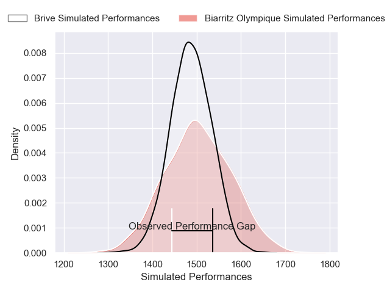
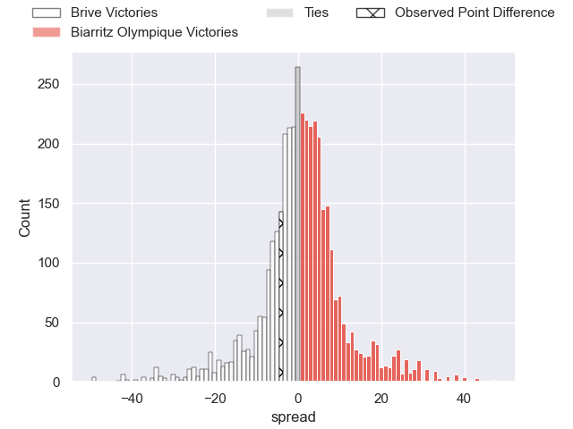
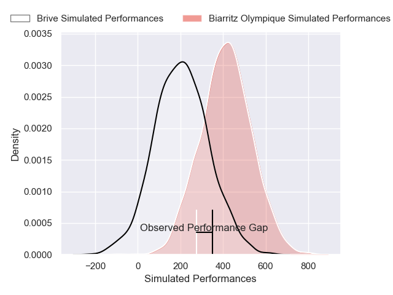
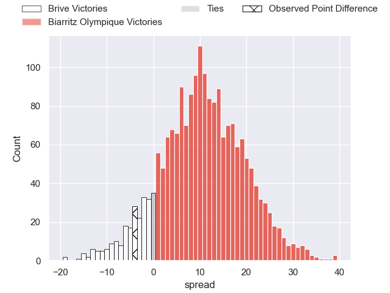
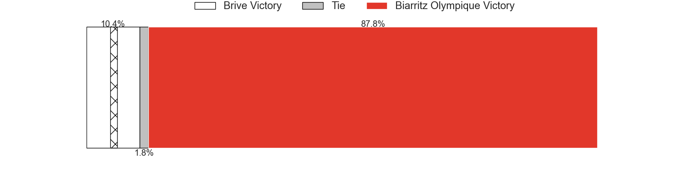

---  
layout: page  
title: Brive at Biarritz Olympique; 24-20  
date: 2025-02-21 18:00:00 -0500  
categories: "Pro D2 24/25" match review  
---
# Brive at Biarritz Olympique; 24-20

# Club Level Predictions

The first set of predictions treats a club as the smallest object, as the club develops its members, organizes a gameplan, and deploys its players as needed for each match. This club model has a prediction of 0.527, which translates to predicting Biarritz Olympique to win by 1.0.

Our Over/Under is 36.5 - and combined with the spread above, we have a predicted scoreline of 18 to 19

Each club has a rating and a rating deviation (similar to a Glicko rating), and expected performances can be generated. This allows for simulated matches and spreads like the ones below.
## Projected Performances - Club Model

## Projected Spreads - Club Model

## Projected Results - Club Model

# Player Level Predictions

Treating teams instead as an entity made up of the currently active players, I have ratings for each player in an altogether different system. These can be combined to form team ratings once teamsheets are announced, weighting starters a bit higher than the reserves. After the match is played, players can be weighted by their minutes on the field, allowing for an accurate measure of the team's composition. With these compiled team ratings, we can make predictions, measure inaccuracy, and update the individual player ratings.
## Prediction without Player Minutes: Biarritz Olympique by 5.1

Brive by 10.3 on a neutral pitch

## Projected Performances - Player Model

## Projected Spreads - Player Model

## Projected Results - Player Model

|   Away Minutes | Away Player               |   Away Percentile |   Number |   Home Percentile | Home Player         |   Home Minutes |
|---------------:|:--------------------------|------------------:|---------:|------------------:|:--------------------|---------------:|
|              5 | Vakh Abdaladze            |             82.91 |        1 |              1.06 | Zakaria El Fakir    |             80 |
|             80 | Benjamin Boudou           |             72.91 |        2 |             12.1  | Yohan Beheregaray   |             24 |
|             80 | Marcel van der Merwe      |             19.87 |        3 |             27.31 | Giorgi Dzmanashvili |             80 |
|             80 | Asier Usarraga            |             91.99 |        4 |              1.04 | Aitor Hourcade      |             80 |
|             69 | Hendre Stassen            |             26.2  |        5 |             24.6  | Piula Faasalele     |             34 |
|             50 | Geoffrey Malaterre        |             80.75 |        6 |             23.94 | Thomas Hebert       |              6 |
|             50 | Courtney Lawes            |             97.56 |        7 |              1.69 | Jessy Jegerlehner   |             31 |
|             80 | Retief Marais             |             88.03 |        8 |             57.4  | Cornell du Preez    |             80 |
|             11 | Mathis Ferté              |             54.22 |        9 |             42.86 | Kerman Aurrekoetxea |             11 |
|             50 | Curwin Bosch              |             83.61 |       10 |             16.18 | Thomas Dolhagaray   |             65 |
|             63 | Erwan Dridi               |             92.75 |       11 |             93.66 | Mathieu Acebes      |             80 |
|             74 | Georges Shvelidze         |             69.44 |       12 |             65.08 | Carlo Mignot        |             21 |
|             51 | Matias Moroni             |             96.65 |       13 |             11.98 | Tyler Morgan        |             51 |
|             24 | Asaeli Tuivuaka           |             85.12 |       14 |              2.3  | Zach Kibirige       |             56 |
|             17 | Stuart Olding             |             90.55 |       15 |             84.6  | Kylian Jaminet      |             56 |
|             24 | Issam Hamel               |             75.3  |       16 |             51.28 | Luteru Tolai        |             29 |
|             80 | Nathan Fraissenon         |            nan    |       17 |             25.35 | Nafi Ma'afu         |             80 |
|             80 | Francisco Coria Marchetti |             58.14 |       18 |             79.56 | Nikoloz Narmania    |             59 |
|             15 | Rahboni Warren-Vosayaco   |             65.92 |       19 |            nan    | François Mur        |             11 |
|             68 | Konstantin Mikautadze     |              5.75 |       20 |            nan    | Anoa Laurent        |             80 |
|             80 | Hugo Verdu                |              7.23 |       21 |             55.74 | Yohan Tapie         |             80 |
|             57 | Samuel Maximin            |             58.69 |       22 |             77.06 | Ilian Perraux       |             30 |
|            nan | nan                       |            nan    |       23 |            nan    | Eliande Sanderson   |             46 |

