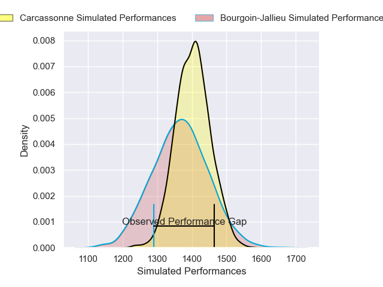
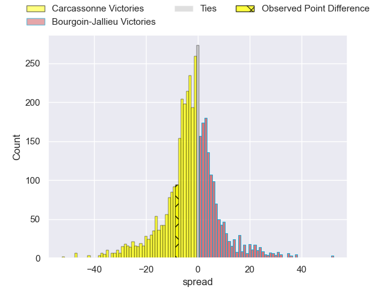
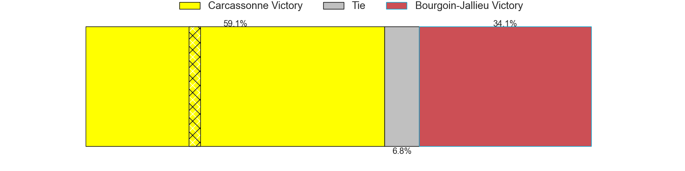
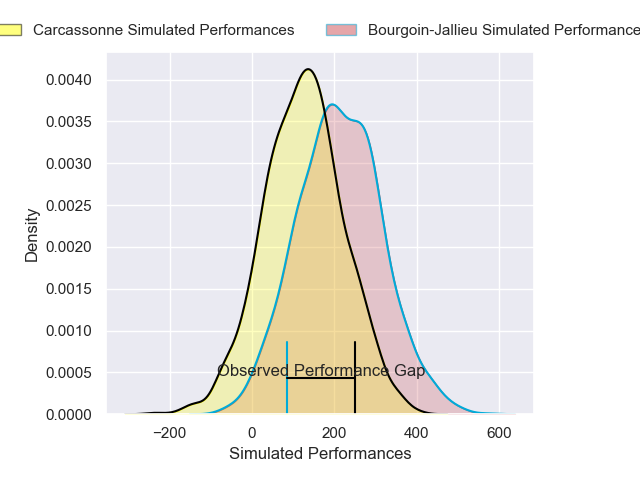
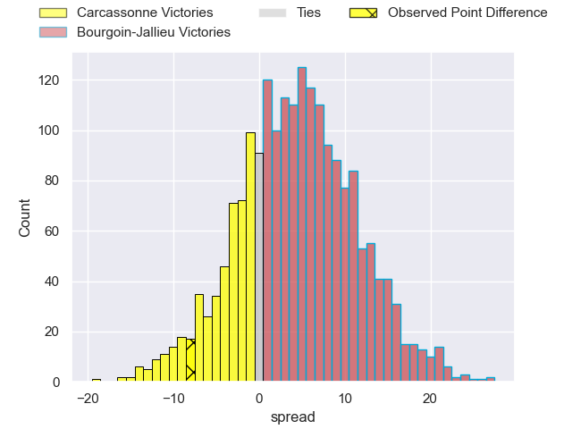
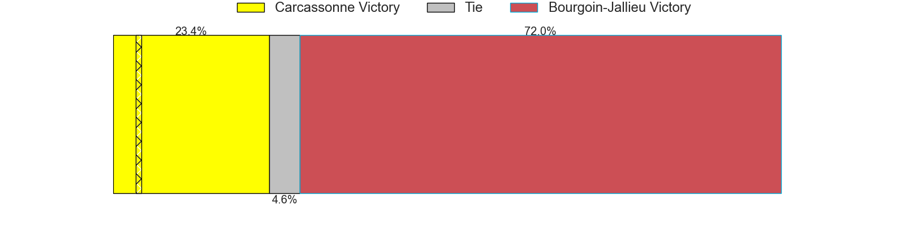

---  
layout: page  
title: Carcassonne at Bourgoin-Jallieu; 27-19  
date: 2025-02-21 18:00:00 -0500  
categories: "Nationale 24/25" match review  
---
# Carcassonne at Bourgoin-Jallieu; 27-19

# Club Level Predictions

The first set of predictions treats a club as the smallest object, as the club develops its members, organizes a gameplan, and deploys its players as needed for each match. This club model has a prediction of 0.447, which translates to predicting Carcassonne to win by 1.9.

Our Over/Under is 38.5 - and combined with the spread above, we have a predicted scoreline of 20 to 18

Each club has a rating and a rating deviation (similar to a Glicko rating), and expected performances can be generated. This allows for simulated matches and spreads like the ones below.
## Projected Performances - Club Model

## Projected Spreads - Club Model

## Projected Results - Club Model

# Player Level Predictions

Treating teams instead as an entity made up of the currently active players, I have ratings for each player in an altogether different system. These can be combined to form team ratings once teamsheets are announced, weighting starters a bit higher than the reserves. After the match is played, players can be weighted by their minutes on the field, allowing for an accurate measure of the team's composition. With these compiled team ratings, we can make predictions, measure inaccuracy, and update the individual player ratings.
## Prediction without Player Minutes: Carcassonne by 1.1

Carcassonne by 14.4 on a neutral pitch

## Projected Performances - Player Model

## Projected Spreads - Player Model

## Projected Results - Player Model

|   Away Minutes | Away Player       |   Away Percentile |   Number |   Home Percentile | Home Player      |   Home Minutes |
|---------------:|:------------------|------------------:|---------:|------------------:|:-----------------|---------------:|
|             51 | Yan Arnold        |             79.5  |        1 |             14.01 | Romain Favaretto |             69 |
|             12 | Raphael Carbou    |             60.03 |        2 |              6.97 | Julien Ratajczak |             80 |
|             21 | Siua Halanukonuka |             78.79 |        3 |              6.81 | Keynan Knox      |             46 |
|             21 | Romain Guyot      |             80.89 |        4 |             22.05 | Thomas Adélaïde  |             80 |
|             21 | Clément Fontaine  |             63.59 |        5 |              0.67 | Morgan Eames     |             46 |
|             30 | Maxime Millan     |             64.92 |        6 |              8.96 | Kevin Chaudouard |             38 |
|             34 | Etienne Herjean   |             91.13 |        7 |              9.53 | Matteo Broeders  |             49 |
|             29 | Thomas Hoarau     |             30.43 |        8 |              5.59 | Sam Daly         |             22 |
|             29 | Gaetan Pichon     |             24.31 |        9 |             31.38 | Louis Giamarchi  |             49 |
|             51 | Johnny McPhillips |             70.11 |       10 |              9.47 | Nicolas Cachet   |             25 |
|              1 | Clement Egiziano  |             91.47 |       11 |             15.12 | Adrian Fugit     |             31 |
|             34 | Jordan Puletua    |             23.44 |       12 |             69.07 | Isaiah Leota     |             31 |
|             51 | Lukas Doyhenard   |             84.53 |       13 |             14.69 | Pierre Mignot    |             34 |
|              4 | Paul Gadea        |             51.86 |       14 |              9.37 | Paul-Hugo Champ  |             34 |
|             17 | Maxime Gianet     |             88.59 |       15 |              2.7  | Remi Bouet       |             80 |
|             15 | Florent Lorenzon  |             42.33 |       16 |             28.17 | Rémy Gaborit     |             80 |
|             80 | Baptiste Moreno   |            nan    |       17 |             33.17 | Maxime Castant   |             24 |
|             80 | Marius Iftimiciuc |             13.4  |       18 |             43.19 | Dimitri Tchapnga |             15 |
|             80 | Noe Bedou         |             33.08 |       19 |             43.89 | Tala Gray        |             24 |
|             80 | Yvan David        |             49.48 |       20 |             12.17 | Robin Gascou     |              5 |
|             69 | Gabin Michet      |             92.84 |       21 |             22.24 | Theophile Cotte  |             59 |
|             29 | Naim Ben Alla     |             26.16 |       22 |             68.28 | Yoan Cottin      |             55 |
|            nan | nan               |            nan    |       23 |              4.09 | Aviata Silago    |             63 |

