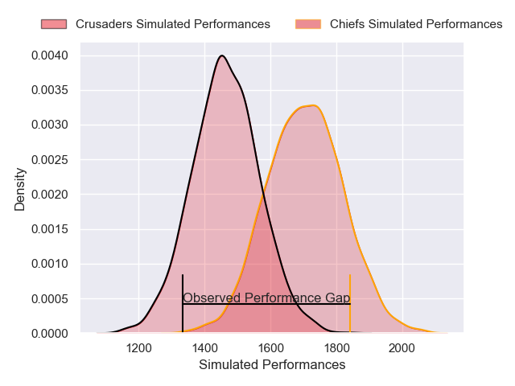
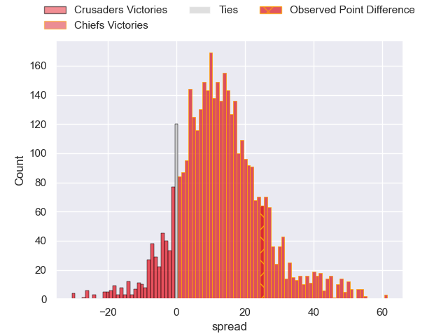
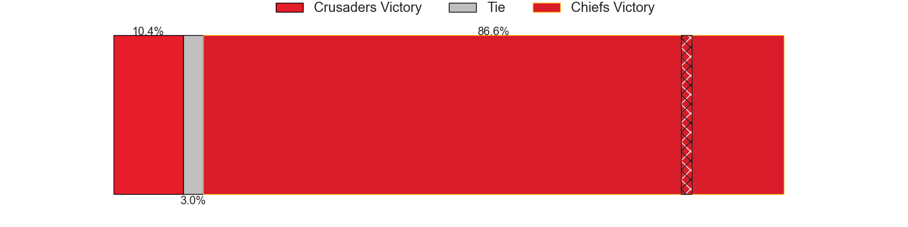
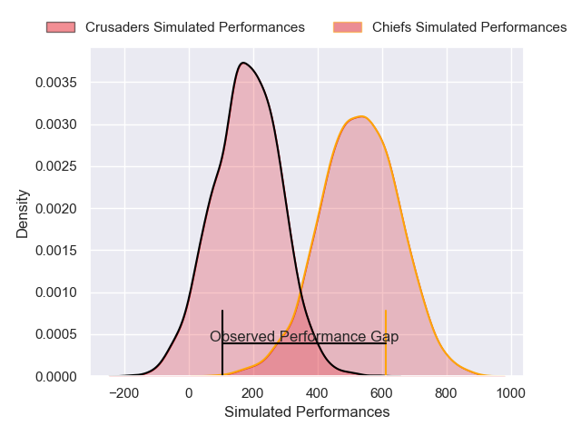
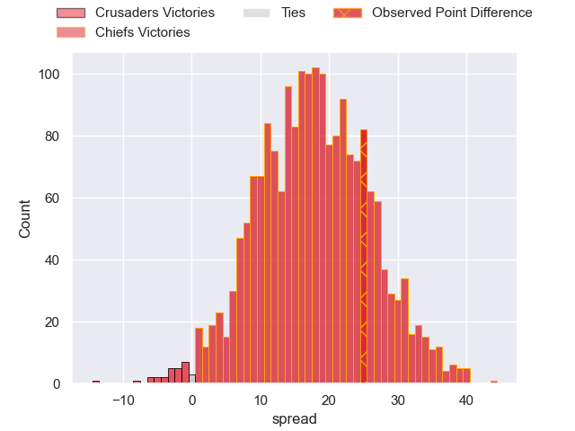

---  
layout: page  
title: Crusaders at Chiefs; 24-49  
date: 2025-02-21 18:00:00 -0500  
categories: "Super Rugby Pacific 2025" match review  
---
# Crusaders at Chiefs; 24-49

# Club Level Predictions

The first set of predictions treats a club as the smallest object, as the club develops its members, organizes a gameplan, and deploys its players as needed for each match. This club model has a prediction of 0.79, which translates to predicting Chiefs to win by 12.1.

Our Over/Under is 52.5 - and combined with the spread above, we have a predicted scoreline of 20 to 33

Each club has a rating and a rating deviation (similar to a Glicko rating), and expected performances can be generated. This allows for simulated matches and spreads like the ones below.
## Projected Performances - Club Model

## Projected Spreads - Club Model

## Projected Results - Club Model

# Player Level Predictions

Treating teams instead as an entity made up of the currently active players, I have ratings for each player in an altogether different system. These can be combined to form team ratings once teamsheets are announced, weighting starters a bit higher than the reserves. After the match is played, players can be weighted by their minutes on the field, allowing for an accurate measure of the team's composition. With these compiled team ratings, we can make predictions, measure inaccuracy, and update the individual player ratings.
## Prediction without Player Minutes: Chiefs by 18.7

Chiefs by 10.5 on a neutral pitch

## Projected Performances - Player Model

## Projected Spreads - Player Model

## Projected Results - Player Model

|   Away Minutes | Away Player          |   Away Percentile |   Number |   Home Percentile | Home Player          |   Home Minutes |
|---------------:|:---------------------|------------------:|---------:|------------------:|:---------------------|---------------:|
|             35 | Tamaiti Williams     |             87.87 |        1 |             97.03 | Aidan Ross           |             29 |
|             54 | Ioane Moananu        |             33.83 |        2 |             94.2  | Bradley Slater       |             72 |
|             29 | Fletcher Newell      |              0.23 |        3 |             87.4  | George Dyer          |             81 |
|             50 | Scott Barrett        |             94.87 |        4 |             71.2  | Josh Lord            |             81 |
|             55 | Antonio Shalfoon     |             16.92 |        5 |             86.69 | Tupou Vaa'i          |             81 |
|              9 | Cullen Grace         |             75.31 |        6 |             84.75 | Simon Parker         |             81 |
|             14 | Ethan Blackadder     |             97.52 |        7 |             84.37 | Jahrome Brown        |              8 |
|             81 | Christian Lio-Willie |             71.01 |        8 |             89.23 | Luke Jacobson        |             46 |
|             13 | Kyle Preston         |             35.52 |        9 |             57.59 | Xavier Roe           |             73 |
|             27 | Taha Kemara          |              9.26 |       10 |             76.63 | Josh Jacomb          |             16 |
|             40 | Sevu Reece           |             82    |       11 |             49.54 | Leroy Carter         |             56 |
|             52 | David Havili         |             95.14 |       12 |             89.11 | Rameka Poihipi       |             81 |
|             72 | Levi Aumua           |             80.54 |       13 |             94.16 | Anton Lienert-Brown  |             26 |
|             29 | Chay Fihaki          |              5.57 |       14 |             93.69 | Emoni Narawa         |             29 |
|             16 | Will Jordan          |             94.61 |       15 |             94.4  | Damian McKenzie      |             26 |
|             69 | Manumaua Letiu       |            nan    |       16 |             84.91 | Brodie McAlister     |             25 |
|             51 | George Bower         |              6.34 |       17 |             57.12 | Jared Proffit        |             68 |
|             41 | Sam Matenga          |             50.63 |       18 |             19.25 | Reuben O'Neill       |             55 |
|             51 | Tahlor Cahill        |             13.88 |       19 |             30.7  | Manaaki Selby-Rickit |             73 |
|             55 | Corey Kellow         |             17.45 |       20 |             96.47 | Samipeni Finau       |             41 |
|             26 | Mitchell Drummond    |             84.83 |       21 |             86.03 | Cortez Ratima        |             81 |
|             81 | James O'Connor       |            nan    |       22 |             95.33 | Quinn Tupaea         |             81 |
|              8 | Dallas McLeod        |             33.66 |       23 |            nan    | Gideon Wrampling     |             67 |

