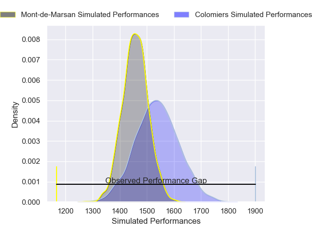
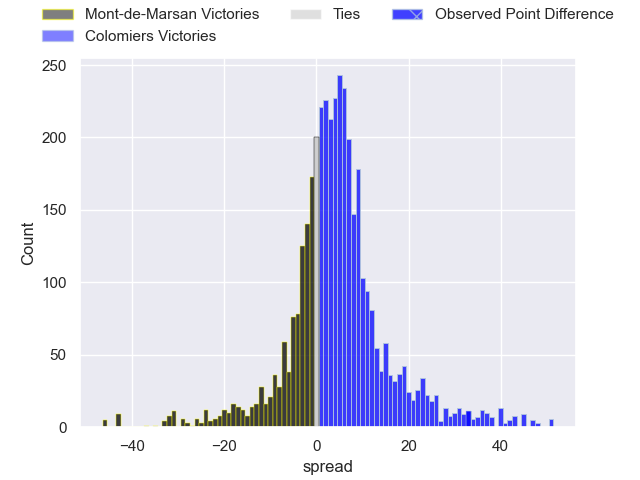
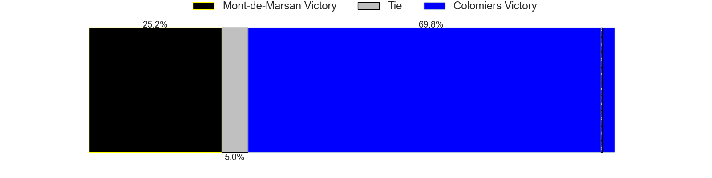
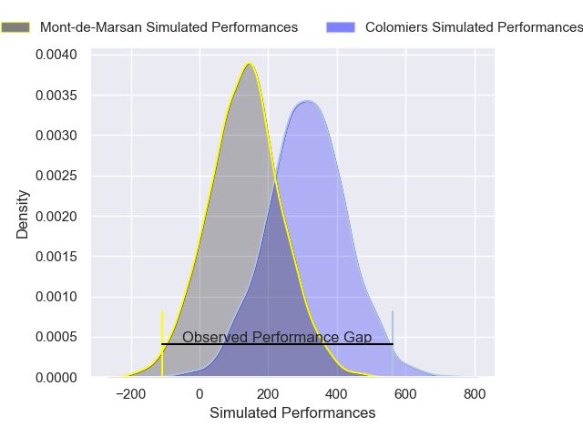
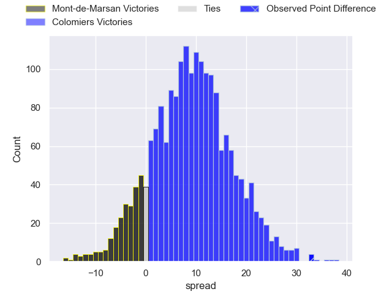
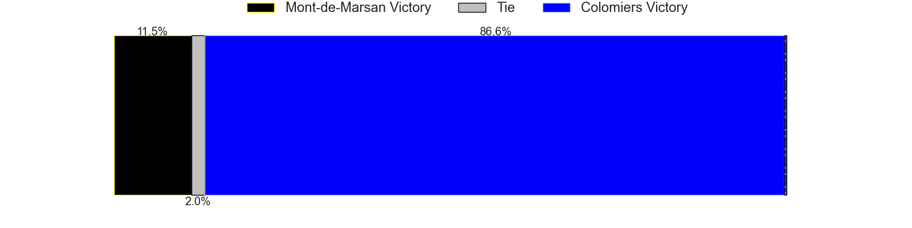

---  
layout: page  
title: Mont-de-Marsan at Colomiers; 20-53  
date: 2025-02-21 18:00:00 -0500  
categories: "Pro D2 24/25" match review  
---
# Mont-de-Marsan at Colomiers; 20-53

# Club Level Predictions

The first set of predictions treats a club as the smallest object, as the club develops its members, organizes a gameplan, and deploys its players as needed for each match. This club model has a prediction of 0.613, which translates to predicting Colomiers to win by 4.0.

Our Over/Under is 56.5 - and combined with the spread above, we have a predicted scoreline of 26 to 30

Each club has a rating and a rating deviation (similar to a Glicko rating), and expected performances can be generated. This allows for simulated matches and spreads like the ones below.
## Projected Performances - Club Model

## Projected Spreads - Club Model

## Projected Results - Club Model

# Player Level Predictions

Treating teams instead as an entity made up of the currently active players, I have ratings for each player in an altogether different system. These can be combined to form team ratings once teamsheets are announced, weighting starters a bit higher than the reserves. After the match is played, players can be weighted by their minutes on the field, allowing for an accurate measure of the team's composition. With these compiled team ratings, we can make predictions, measure inaccuracy, and update the individual player ratings.
## Prediction without Player Minutes: Colomiers by 5.6

Mont-de-Marsan by 6.7 on a neutral pitch

## Projected Performances - Player Model

## Projected Spreads - Player Model

## Projected Results - Player Model

|   Away Minutes | Away Player         |   Away Percentile |   Number |   Home Percentile | Home Player         |   Home Minutes |
|---------------:|:--------------------|------------------:|---------:|------------------:|:--------------------|---------------:|
|             57 | Thomas Bultel       |             32.66 |        1 |              8.59 | Elias El Ansari     |             21 |
|             46 | Florian Dufour      |             16.39 |        2 |              4.01 | Theo Lachaud        |             24 |
|             22 | Martin Villar       |             80.98 |        3 |             61.88 | Robin Bellemand     |             76 |
|             23 | Aston Fortuin       |              8.88 |        4 |             57.47 | Jean Thomas         |             80 |
|             29 | Myles Edwards       |              6.52 |        5 |              6.9  | Jack Whetton        |             80 |
|             29 | Waël Ponpon         |             10.68 |        6 |             63.52 | Aldric Lescure      |              6 |
|             29 | Nicolas Garrault    |             13.42 |        7 |             25.9  | Gregoire Bazin      |             55 |
|             23 | Ioane Iashagashvili |             96.09 |        8 |             22.46 | Caleb Timu          |             80 |
|             80 | Nicolas Darquier    |             36.32 |        9 |             49.57 | Mathis Galthié      |             80 |
|             24 | Willie du Plessis   |             54.64 |       10 |             50    | Ugo Pacome          |             80 |
|             51 | Pierre Sayerse      |             80.61 |       11 |             95.5  | Rodrigo Marta       |             40 |
|             80 | Gatien Masse        |             23.1  |       12 |             35.74 | Baptiste Serrano    |             80 |
|             15 | Mosese Dawai        |             74.23 |       13 |              6.42 | Martin Dulon        |             51 |
|             80 | Alexandre de Nardi  |             19.76 |       14 |              8.55 | Martin Alonso Munoz |             17 |
|             15 | Théo Cortes         |             70.93 |       15 |             64.43 | Vincent Pinto       |             21 |
|             12 | Patricio Fernandez  |             44.09 |       16 |             56.66 | Hugo Pirlet         |             16 |
|             57 | Baptiste Canut      |            nan    |       17 |             54.52 | Pablo Dimcheff      |             21 |
|             46 | Luka Goginava       |             63.24 |       18 |             46.31 | Marco Fepulea'i     |             25 |
|             46 | Samuel Lagrange     |             64.21 |       19 |             26.37 | Janse Roux          |             25 |
|             46 | Anthony Alves       |             41.73 |       20 |             80.36 | Dorian Laborde      |             80 |
|             80 | Aurélien Laforgue   |             39.41 |       21 |             23.53 | Jeremy Bechu        |             80 |
|             80 | Jules Dussutour     |             52.17 |       22 |            nan    | Arthur Diaz         |             80 |
|             21 | Raphaël Robic       |             58.2  |       23 |            nan    | Eliott Arandiga     |             46 |

