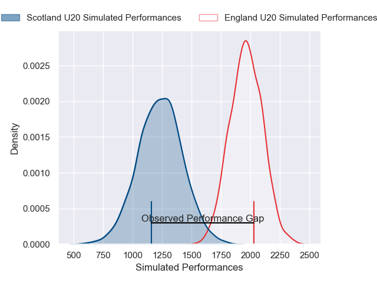
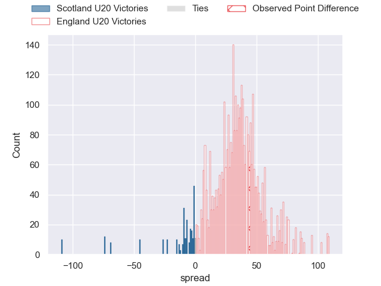

---  
layout: page  
title: Scotland U20 at England U20; 13-57  
date: 2025-02-21 18:00:00 -0500  
categories: "U20 Six Nations Championship 2025" match review  
---
# Scotland U20 at England U20; 13-57

# Club Level Predictions

The first set of predictions treats a club as the smallest object, as the club develops its members, organizes a gameplan, and deploys its players as needed for each match. This club model has a prediction of 0.975, which translates to predicting England U20 to win by 36.9.

Our Over/Under is 69.5 - and combined with the spread above, we have a predicted scoreline of 16 to 53

Each club has a rating and a rating deviation (similar to a Glicko rating), and expected performances can be generated. This allows for simulated matches and spreads like the ones below.
## Projected Performances - Club Model

## Projected Spreads - Club Model

## Projected Results - Club Model

