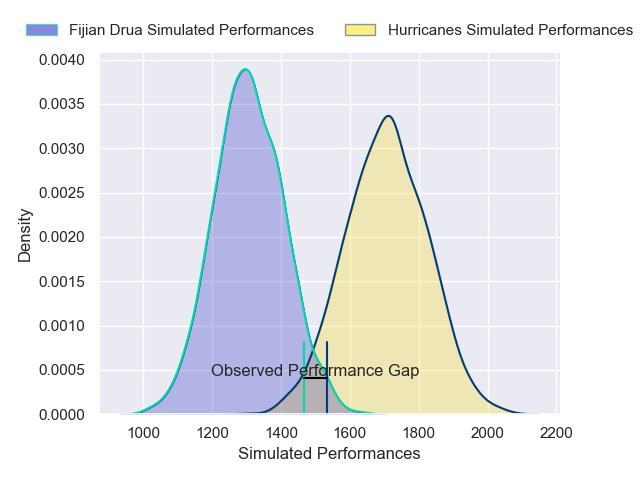
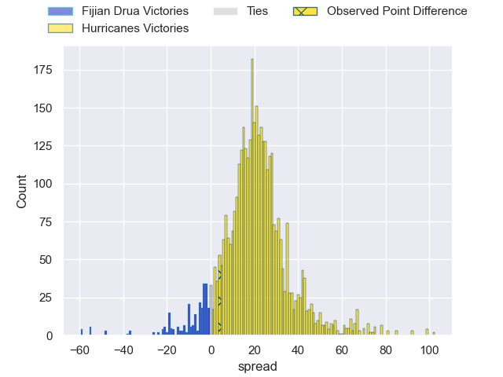
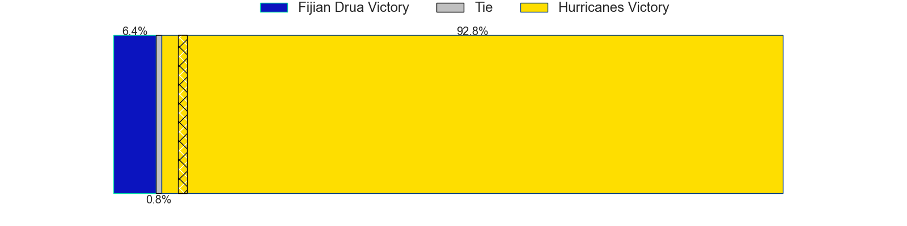
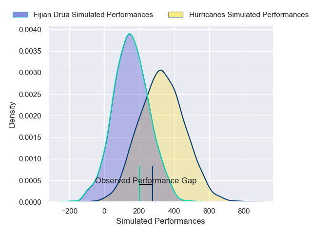
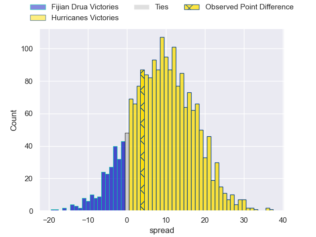
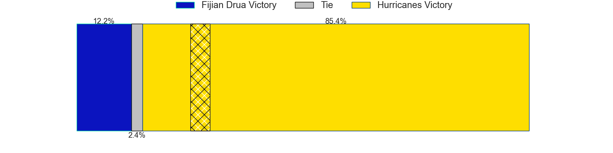

---  
layout: page  
title: Fijian Drua at Hurricanes; 34-38  
date: 2025-02-21 18:00:00 -0500  
categories: "Super Rugby Pacific 2025" match review  
---
# Fijian Drua at Hurricanes; 34-38

# Club Level Predictions

The first set of predictions treats a club as the smallest object, as the club develops its members, organizes a gameplan, and deploys its players as needed for each match. This club model has a prediction of 0.898, which translates to predicting Hurricanes to win by 19.8.

Our Over/Under is 71.5 - and combined with the spread above, we have a predicted scoreline of 26 to 46

Each club has a rating and a rating deviation (similar to a Glicko rating), and expected performances can be generated. This allows for simulated matches and spreads like the ones below.
## Projected Performances - Club Model

## Projected Spreads - Club Model

## Projected Results - Club Model

# Player Level Predictions

Treating teams instead as an entity made up of the currently active players, I have ratings for each player in an altogether different system. These can be combined to form team ratings once teamsheets are announced, weighting starters a bit higher than the reserves. After the match is played, players can be weighted by their minutes on the field, allowing for an accurate measure of the team's composition. With these compiled team ratings, we can make predictions, measure inaccuracy, and update the individual player ratings.
## Prediction without Player Minutes: Hurricanes by 10.2

Hurricanes by 2.6 on a neutral pitch

## Projected Performances - Player Model

## Projected Spreads - Player Model

## Projected Results - Player Model

|   Away Minutes | Away Player             |   Away Percentile |   Number |   Home Percentile | Home Player         |   Home Minutes |
|---------------:|:------------------------|------------------:|---------:|------------------:|:--------------------|---------------:|
|             20 | Emosi Tuqiri            |             62.44 |        1 |             95.54 | Xavier Numia        |             80 |
|             80 | Zuriel Togiatama        |             71.31 |        2 |             80.76 | Jacob Devery        |             80 |
|             24 | Mesake Doge             |             17.68 |        3 |             37.17 | Tevita Mafile'o     |             80 |
|             18 | Mesake Vocevoce         |             78.33 |        4 |             64.64 | Caleb Delany        |             63 |
|             46 | Isoa Nasilasila         |             73.48 |        5 |             81.08 | Hugo Plummer        |             54 |
|             34 | Meli Derenalagi         |             58.15 |        6 |             84.56 | Brad Shields        |              5 |
|             29 | Motikiai Murray         |             49.67 |        7 |             92.85 | Du'Plessis Kirifi   |             60 |
|             24 | Elia Canakaivata        |             76.6  |        8 |              0.62 | Brayden Iose        |             75 |
|             17 | Frank Lomani            |             79.83 |        9 |             55    | Cam Roigard         |             80 |
|             11 | Isaiah Armstrong-Ravula |              7.37 |       10 |              8.63 | Harry Godfrey       |             20 |
|             23 | Isaiah Armstrong-Ravula |              7.37 |       10 |              8.63 | Harry Godfrey       |             20 |
|             80 | Taniela Rakuro          |             38.5  |       11 |             97.4  | Kini Naholo         |             53 |
|             57 | Inia Tabuavou           |             83.46 |       12 |             66.34 | Peter Umaga-Jensen  |             34 |
|             80 | Tuidraki Samusamuvodre  |             22.18 |       13 |             31.71 | Bailyn Sullivan     |             80 |
|             30 | Iliesa Junior Ratuva    |             53.25 |       14 |             52.69 | Fehi Fineanganofo   |             56 |
|             24 | Ilaisa Droasese         |             83.2  |       15 |             22.61 | Callum Harkin       |              6 |
|             80 | Tevita Ikanivere        |             90.22 |       16 |             11.61 | Raymond Tuputupu    |             74 |
|             21 | Peni Ravai Kovekalou    |             39.12 |       17 |             84.9  | Pouri Rakete-Stones |             17 |
|             18 | Meli Tuni               |            nan    |       18 |             74.73 | Pasilio Tosi        |             80 |
|             43 | Ratu Rotuisolia         |             69.77 |       19 |             15.4  | Will Tucker         |             80 |
|             71 | Kitione Salawa          |             21.07 |       20 |             94.38 | Peter Lakai         |             26 |
|             51 | Peni Matawalu           |             72.59 |       21 |              6.38 | Ere Enari           |             69 |
|              9 | Caleb Muntz             |             77.47 |       22 |             13.72 | Riley Hohepa        |             50 |
|             59 | Iosefo Masi             |             87.16 |       23 |             74.77 | Ngatungane Punivai  |             63 |

