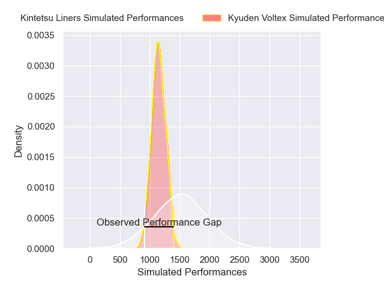
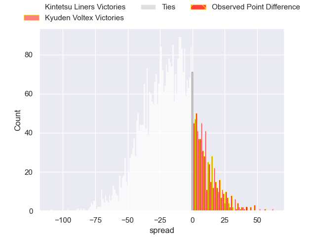
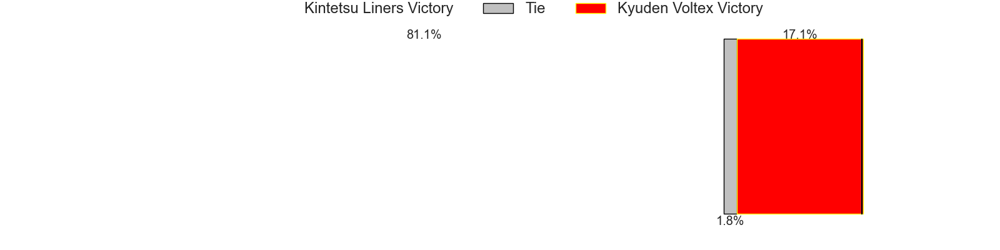
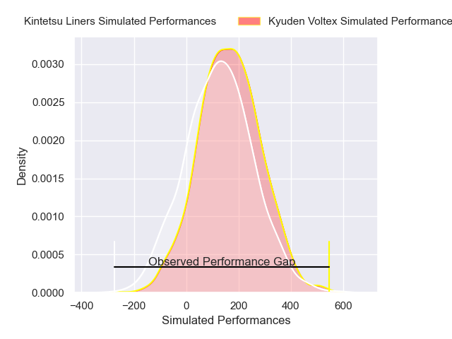
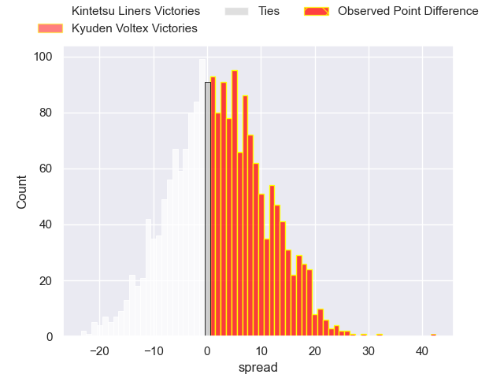

---  
layout: page  
title: Kintetsu Liners at Kyuden Voltex; 21-63  
date: 2025-02-21 18:00:00 -0500  
categories: "Japan Rugby League One - Division 2 2025" match review  
---
# Kintetsu Liners at Kyuden Voltex; 21-63

# Club Level Predictions

The first set of predictions treats a club as the smallest object, as the club develops its members, organizes a gameplan, and deploys its players as needed for each match. This club model has a prediction of 0.233, which translates to predicting Kintetsu Liners to win by 17.8.

Our Over/Under is 69.5 - and combined with the spread above, we have a predicted scoreline of 44 to 26

Each club has a rating and a rating deviation (similar to a Glicko rating), and expected performances can be generated. This allows for simulated matches and spreads like the ones below.
## Projected Performances - Club Model

## Projected Spreads - Club Model

## Projected Results - Club Model

# Player Level Predictions

Treating teams instead as an entity made up of the currently active players, I have ratings for each player in an altogether different system. These can be combined to form team ratings once teamsheets are announced, weighting starters a bit higher than the reserves. After the match is played, players can be weighted by their minutes on the field, allowing for an accurate measure of the team's composition. With these compiled team ratings, we can make predictions, measure inaccuracy, and update the individual player ratings.
## Prediction without Player Minutes: Kyuden Voltex by 2.3

Kintetsu Liners by 0.7 on a neutral pitch

## Projected Performances - Player Model

## Projected Spreads - Player Model

## Projected Results - Player Model

|   Away Minutes | Away Player       |   Away Percentile |   Number |   Home Percentile | Home Player            |   Home Minutes |
|---------------:|:------------------|------------------:|---------:|------------------:|:-----------------------|---------------:|
|             80 | Kenta Tanaka      |             21.44 |        1 |             58.37 | Samuel Nozomu Faialaga |           40   |
|             80 | Keiichi Kaneko    |             23.71 |        2 |             56.55 | Kyungmun Wang          |           33   |
|             56 | Yuchol Mun        |             27.93 |        3 |             53.29 | Taro Uesugi            |           24   |
|             33 | Mitchell Brown    |             36.03 |        4 |             52.66 | Masahiro Eriguchi      |           17   |
|             34 | Sanaila Waqa      |             41.16 |        5 |             67.11 | Ray Tatafu             |           80   |
|             61 | Patrick Tafa      |             28.79 |        6 |             67.73 | Colby Fainga'A         |           80   |
|              9 | Shohei Nonaka     |             43.28 |        7 |             67.73 | Keisuke Yamazoe        |           80   |
|             51 | Akira Ioane       |             95.45 |        8 |             60.66 | Alex Takuya Walker     |           73   |
|             51 | Will Genia        |             32.07 |        9 |             66.03 | Spencer Jeans          |           80   |
|             51 | Will Harrison     |              2.32 |       10 |             47.79 | Tom Taylor             |           20   |
|             80 | Ryosuke Kataoka   |             24.95 |       11 |             55.1  | Ren Hagiwara           |           27   |
|             74 | Koji Okamura      |             28.5  |       12 |             54.47 | Hayato Kojo            |           27   |
|             31 | Timo Sufia        |             37.74 |       13 |             54.96 | Sione Likuata Teaupa   |           28   |
|             60 | Tomoya Kimura     |             29.04 |       14 |             55.47 | Goki Saito             |           28   |
|             51 | Hiroki Kumoyama   |             28.22 |       15 |             56.02 | Yusuke Aramaki         |           47   |
|             80 | Kazuma Matsuda    |            nan    |       16 |            nan    | Hiroki Murakawa        |           80   |
|             80 | Yushi Inoue       |            nan    |       17 |            nan    | Ryosuke Kagosima       |           80   |
|             62 | Ryo Iwakami       |            nan    |       18 |            nan    | Kosuke Oike            |           52   |
|             57 | Takahito Sugahara |            nan    |       19 |            nan    | Yoshihiro Sononaka     |           80   |
|             57 | Jose Seru         |            nan    |       20 |            nan    | Ken Nakashima          |           60   |
|             57 | Keitaro Hitora    |            nan    |       21 |            nan    | Shunta Takenouchi      |           80   |
|             20 | Quade Cooper      |             97.68 |       22 |            nan    | Noriaki Nakazuru       |           21   |
|             50 | Semisi Masirewa   |              5.19 |       23 |            nan    | Charlie Worthington    |           32.5 |

