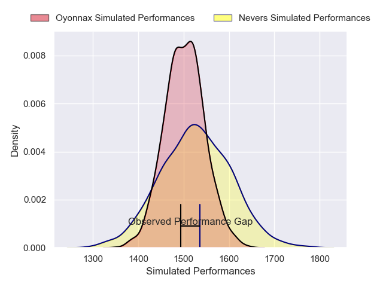
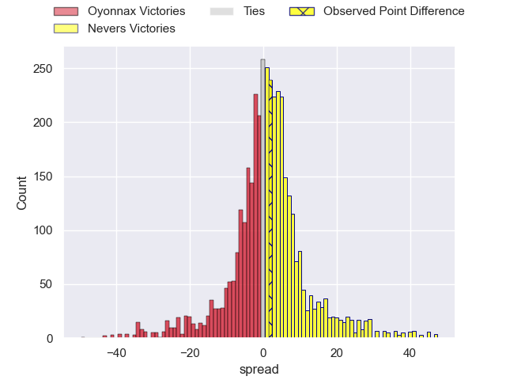
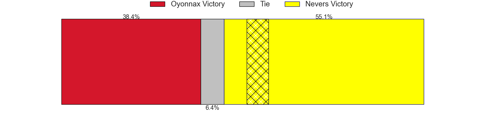
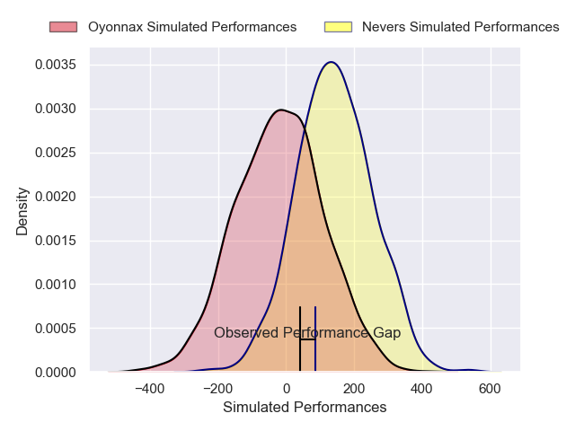
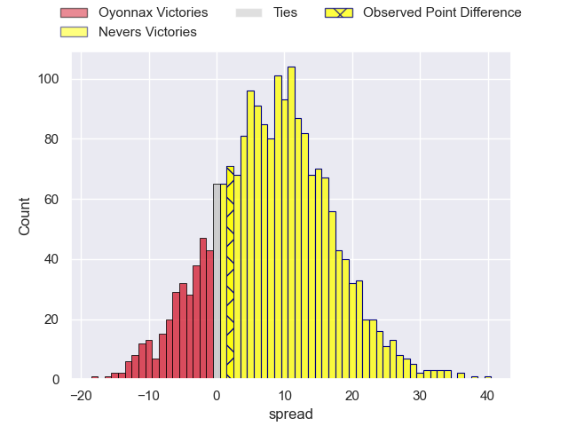
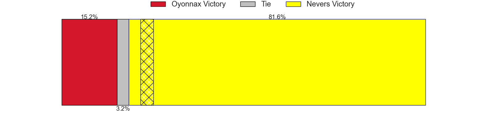

---  
layout: page  
title: Oyonnax at Nevers; 19-21  
date: 2025-02-21 18:00:00 -0500  
categories: "Pro D2 24/25" match review  
---
# Oyonnax at Nevers; 19-21

# Club Level Predictions

The first set of predictions treats a club as the smallest object, as the club develops its members, organizes a gameplan, and deploys its players as needed for each match. This club model has a prediction of 0.531, which translates to predicting Nevers to win by 1.1.

Our Over/Under is 48.5 - and combined with the spread above, we have a predicted scoreline of 24 to 25

Each club has a rating and a rating deviation (similar to a Glicko rating), and expected performances can be generated. This allows for simulated matches and spreads like the ones below.
## Projected Performances - Club Model

## Projected Spreads - Club Model

## Projected Results - Club Model

# Player Level Predictions

Treating teams instead as an entity made up of the currently active players, I have ratings for each player in an altogether different system. These can be combined to form team ratings once teamsheets are announced, weighting starters a bit higher than the reserves. After the match is played, players can be weighted by their minutes on the field, allowing for an accurate measure of the team's composition. With these compiled team ratings, we can make predictions, measure inaccuracy, and update the individual player ratings.
## Prediction without Player Minutes: Nevers by 6.8

Nevers by 1.8 on a neutral pitch

## Projected Performances - Player Model

## Projected Spreads - Player Model

## Projected Results - Player Model

|   Away Minutes | Away Player       |   Away Percentile |   Number |   Home Percentile | Home Player                |   Home Minutes |
|---------------:|:------------------|------------------:|---------:|------------------:|:---------------------------|---------------:|
|             17 | Adrien Bordenave  |              5.4  |        1 |             36.15 | Aitor Kitutu               |             34 |
|             50 | Benjamin Geledan  |             18.41 |        2 |             14.59 | Efi Ma'afu                 |             80 |
|             80 | Paulo Tafili      |             61.19 |        3 |              3.13 | Cleopas Kundiona           |             80 |
|             80 | Manuel Leindekar  |              1.43 |        4 |             28.9  | Ugo Vignolles              |             42 |
|             80 | Hugo Fabregue     |             27.76 |        5 |             12.55 | Chris Gabriel              |             32 |
|             80 | Wandrille Picault |             84.84 |        6 |             72.16 | Luka Plataret              |             10 |
|             49 | Hugo Hermet       |              8.87 |        7 |             27.84 | Steven David               |             56 |
|             80 | Loic Godener      |              2.48 |        8 |             87.16 | Jason-Colin Fraser         |             48 |
|             16 | Jonathan Ruru     |             92.24 |        9 |              0.69 | Hugo Bouyssou              |             65 |
|             39 | Chris Smith       |             80.63 |       10 |              4.21 | Shaun Reynolds             |             77 |
|             18 | Karim Qadiri      |             59    |       11 |              8.53 | Arthur Mathiron            |             23 |
|             19 | Lucas Mensa       |             11.77 |       12 |             36.48 | Noa Pommelet               |             29 |
|             65 | Kevin Lebreton    |             22.76 |       13 |             68.19 | Rudy Derrieux              |             29 |
|             80 | Gavin Stark       |              1.58 |       14 |             37.2  | Johan Georg Wasserman      |             80 |
|             80 | Darren Sweetnam   |             69.29 |       15 |             21.37 | Perry Mayo                 |             29 |
|             25 | Teddy Durand      |              2.16 |       16 |             57.88 | Alifereti Loaloa           |             55 |
|             18 | Oli Kebble        |             92.33 |       17 |             22.14 | Lasha Pkhakadze            |             68 |
|             80 | Thibault Berthaud |             62.6  |       18 |             35.13 | Louis Chanet               |             80 |
|             30 | Victor Lebas      |            nan    |       19 |             10.78 | Jean-Maxence Jules-Rosette |             65 |
|             50 | Kevin Kornath     |             37.64 |       20 |             73.59 | Julien Kazubek             |             65 |
|             50 | Maxime Salles     |             47.4  |       21 |            nan    | Wesley Lindor              |             80 |
|             80 | Vasil Lobzhanidze |              7.07 |       22 |             83.79 | Yohan Le Bourhis           |             26 |
|             25 | Justin Bouraux    |              3.37 |       23 |            nan    | nan                        |            nan |

