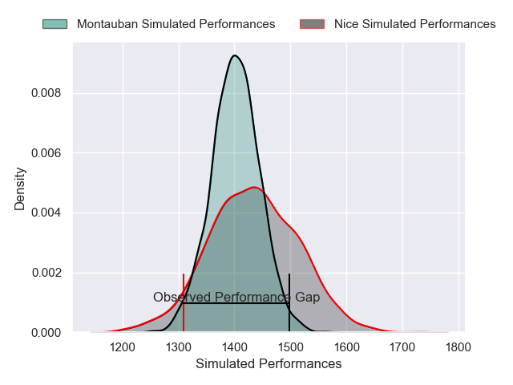
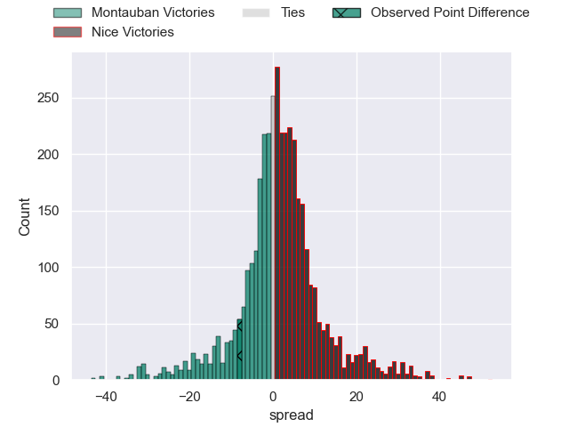
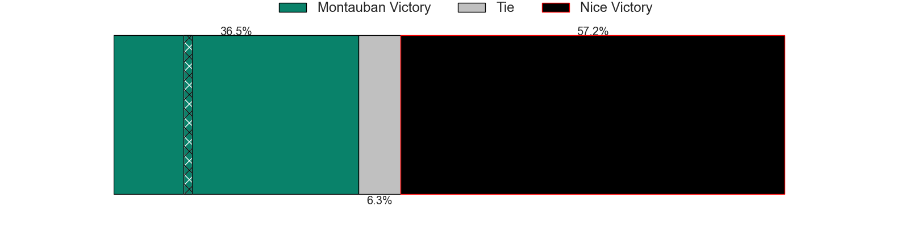
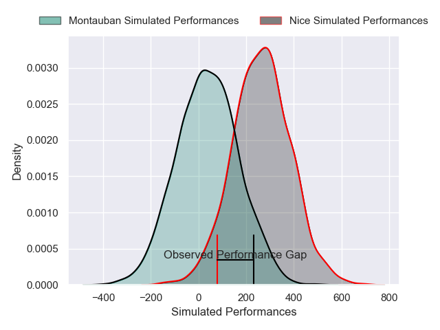
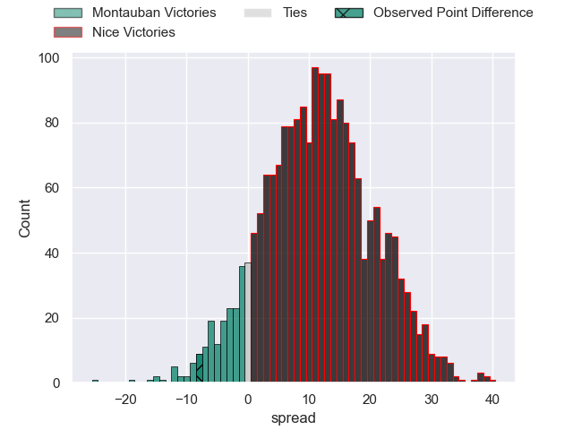
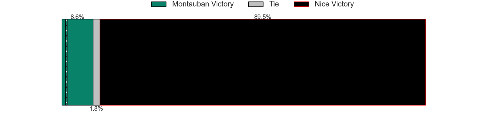

---  
layout: page  
title: Montauban at Nice; 15-7  
date: 2025-02-21 18:00:00 -0500  
categories: "Pro D2 24/25" match review  
---
# Montauban at Nice; 15-7

# Club Level Predictions

The first set of predictions treats a club as the smallest object, as the club develops its members, organizes a gameplan, and deploys its players as needed for each match. This club model has a prediction of 0.547, which translates to predicting Nice to win by 1.6.

Our Over/Under is 52.5 - and combined with the spread above, we have a predicted scoreline of 25 to 27

Each club has a rating and a rating deviation (similar to a Glicko rating), and expected performances can be generated. This allows for simulated matches and spreads like the ones below.
## Projected Performances - Club Model

## Projected Spreads - Club Model

## Projected Results - Club Model

# Player Level Predictions

Treating teams instead as an entity made up of the currently active players, I have ratings for each player in an altogether different system. These can be combined to form team ratings once teamsheets are announced, weighting starters a bit higher than the reserves. After the match is played, players can be weighted by their minutes on the field, allowing for an accurate measure of the team's composition. With these compiled team ratings, we can make predictions, measure inaccuracy, and update the individual player ratings.
## Prediction without Player Minutes: Nice by 4.0

Nice by 0.7 on a neutral pitch

## Projected Performances - Player Model

## Projected Spreads - Player Model

## Projected Results - Player Model

|   Away Minutes | Away Player           |   Away Percentile |   Number |   Home Percentile | Home Player              |   Home Minutes |
|---------------:|:----------------------|------------------:|---------:|------------------:|:-------------------------|---------------:|
|             80 | Leo Aouf              |             71.22 |        1 |              2.37 | Jules Martinez           |             68 |
|             30 | Vakhtang Jintcharadze |             45.49 |        2 |             10.73 | Sacha Idoumi             |             52 |
|             80 | Facundo Pomponio      |             74.73 |        3 |              0.49 | Tom Ross                 |             82 |
|             80 | Clément Bitz          |             83.32 |        4 |             98.02 | Tom Murday               |             80 |
|             60 | Noa Kanika            |             70.03 |        5 |             23.47 | Martin Freytes           |             82 |
|             31 | Corentin Coularis     |             40.66 |        6 |             81.13 | Jordan Taufua            |             82 |
|             31 | Kyllian Ringuet       |             74.18 |        7 |              8.92 | Hugo Sarrasin            |             80 |
|             46 | Tyrone Viiga          |             21.1  |        8 |             11.97 | Ramiha Tarrel Tia Smiler |             29 |
|             46 | Joe Powell            |             81.07 |        9 |              3.44 | Jules Gimbert            |             29 |
|             20 | Jérôme Bosviel        |             80.67 |       10 |              1.26 | Paul Auradou             |             23 |
|             20 | Josua Vici            |             28.74 |       11 |             59.41 | Andrzej Charlat          |             41 |
|             34 | Simon Renda           |             76.55 |       12 |              0.91 | Christa Powell           |             30 |
|             49 | Maxime Espeut         |             57.56 |       13 |             33.71 | Nathan Courtade          |             80 |
|             46 | Paul Vallee           |             81.08 |       14 |             78.05 | Christian Erasmus        |             72 |
|             59 | Baptiste Mouchous     |             88.5  |       15 |             20.74 | Flavio Asquini           |             80 |
|             80 | Thomas Bue            |             18.15 |       16 |             60.07 | Jules Solinas            |              4 |
|             59 | Luka Azariashvili     |              3.19 |       17 |             33.06 | Kylian Laurans           |             80 |
|             59 | Kevin Firmin          |              6.3  |       18 |             67.21 | Nicolas Ciancio          |             12 |
|             80 | Victor Moreaux        |              2.73 |       19 |             90.99 | Louis Suaud              |             75 |
|             80 | Sikhumbuzo Notshe     |             75.46 |       20 |             39.69 | Pierre Strippoli         |             30 |
|             80 | Tjuee Uanivi          |              4.32 |       21 |             47.01 | Tom Daly                 |             80 |
|             26 | Hugo Zabalza          |             34.25 |       22 |             62.14 | Julien Beaufils          |             46 |
|             76 | Maxime Mathy          |              4.57 |       23 |            nan    | Adrien Vigne             |             21 |

