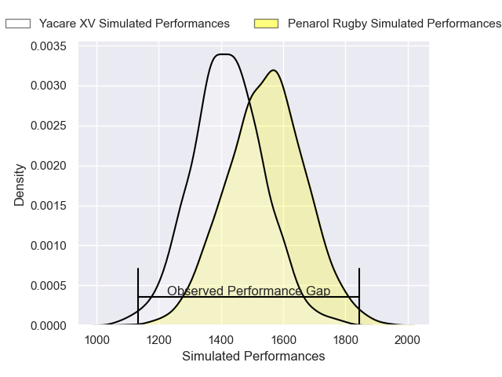
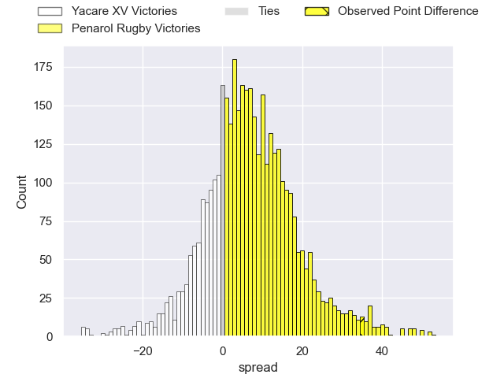
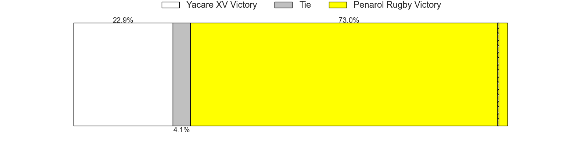
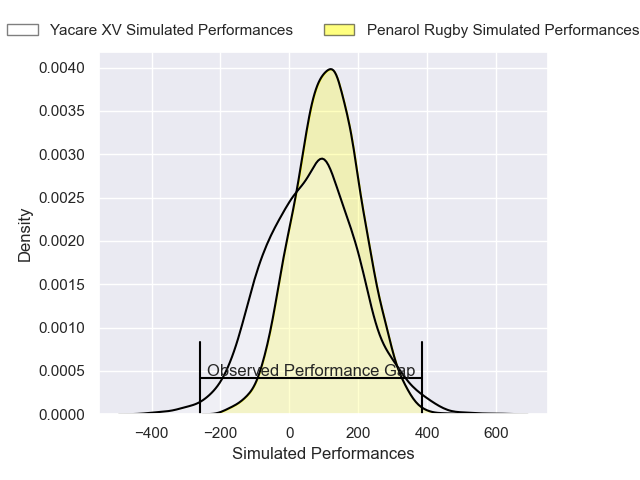
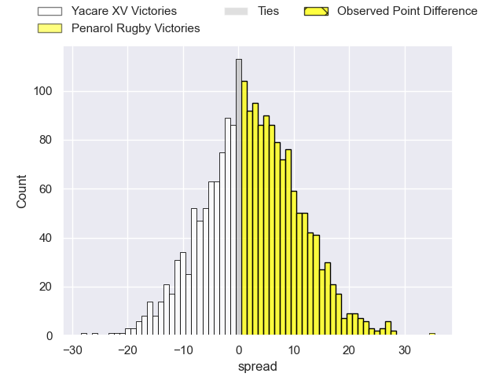
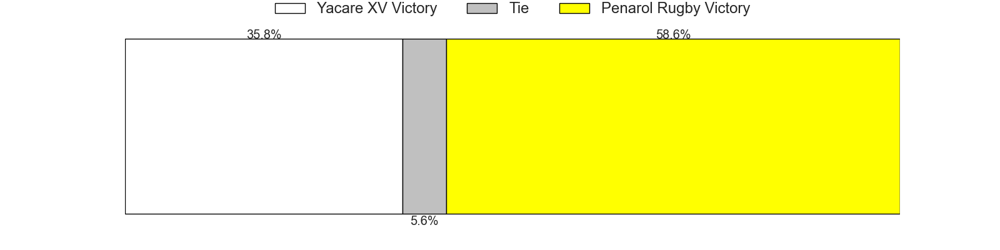

---  
layout: page  
title: Yacare XV at Penarol Rugby; 15-50  
date: 2025-02-21 18:00:00 -0500  
categories: "Super Rugby Americas 2025" match review  
---
# Yacare XV at Penarol Rugby; 15-50

# Club Level Predictions

The first set of predictions treats a club as the smallest object, as the club develops its members, organizes a gameplan, and deploys its players as needed for each match. This club model has a prediction of 0.66, which translates to predicting Penarol Rugby to win by 6.1.

Our Over/Under is 48.5 - and combined with the spread above, we have a predicted scoreline of 21 to 28

Each club has a rating and a rating deviation (similar to a Glicko rating), and expected performances can be generated. This allows for simulated matches and spreads like the ones below.
## Projected Performances - Club Model

## Projected Spreads - Club Model

## Projected Results - Club Model

# Player Level Predictions

Treating teams instead as an entity made up of the currently active players, I have ratings for each player in an altogether different system. These can be combined to form team ratings once teamsheets are announced, weighting starters a bit higher than the reserves. After the match is played, players can be weighted by their minutes on the field, allowing for an accurate measure of the team's composition. With these compiled team ratings, we can make predictions, measure inaccuracy, and update the individual player ratings.
## Prediction without Player Minutes: Penarol Rugby by 3.0

Penarol Rugby by 0.2 on a neutral pitch

## Projected Performances - Player Model

## Projected Spreads - Player Model

## Projected Results - Player Model

|   Away Minutes | Away Player                 |   Away Percentile |   Number |   Home Percentile | Home Player                |   Home Minutes |
|---------------:|:----------------------------|------------------:|---------:|------------------:|:---------------------------|---------------:|
|              8 | Cesar Perez                 |             41.63 |        1 |              9.15 | Mateo Sanguinetti          |             80 |
|             51 | Axel Zapata                 |              7.46 |        2 |             91.04 | Guillermo Pujadas          |             38 |
|             80 | Enzo Egea Bordon            |             21.52 |        3 |             75.12 | Bautista Vidal             |             29 |
|             51 | Lucas Sommer                |             98.48 |        4 |             72.05 | Juan Manuel Rodriguez      |             29 |
|             80 | Mariano Garcete Elli        |              8.27 |        5 |             77.95 | Felipe Aliaga              |             80 |
|             65 | Felipe Puertas              |              2.76 |        6 |             42.33 | Santiago Civetta           |             24 |
|             80 | Ariel Nunez Lesme           |              3.34 |        7 |             69.49 | Lucas Bianchi              |             11 |
|             29 | Santiago Ruiz               |             89.03 |        8 |              8.49 | Manuel Diana               |             64 |
|             62 | Juan Cruz Strada            |              6.55 |        9 |             70.69 | Santiago Alvarez           |             27 |
|             51 | Joaquin Lamas               |             90.53 |       10 |             36    | Felipe Etcheverry          |             19 |
|             42 | Juan Gonzalez               |              3.62 |       11 |             73.47 | Ignacio Facciolo           |             80 |
|             16 | Sebastian Urbieta Liegard   |              9.53 |       12 |             71.5  | Bautista Farisé            |             40 |
|             80 | Francisco Diez              |             13.52 |       13 |             59.24 | Felipe Arcos Perez         |             19 |
|             80 | Julian Quetglas             |              6.96 |       14 |             25.79 | Bautista Basso             |             19 |
|             15 | Valentino DI Capua          |             50.62 |       15 |             19.92 | Manuel Cardoso Pinto       |             23 |
|             56 | Facundo Paiva               |            nan    |       16 |            nan    | Mateo Perillo              |             23 |
|             80 | Mariano Muntaner            |            nan    |       17 |            nan    | Joaquin Myszka             |             27 |
|             62 | Luis Enrique Quinteros      |             22.54 |       18 |             73.62 | Tomas Di Biase             |             27 |
|             80 | Ramiro Nicolas Parada       |              6.83 |       19 |             21.69 | Juan Manuel Alonso Dieguez |             80 |
|             80 | Jordi Chavez                |            nan    |       20 |            nan    | Bautista Bottino           |             56 |
|             56 | Juan-Jose Heisecke Schauman |            nan    |       21 |            nan    | Alfonso Perillo Albarracin |             80 |
|             46 | Joaquin Mussi               |            nan    |       22 |             33.17 | Manuel Rosmarino           |             27 |
|             80 | Gonzalo Bareiro Ochipinti   |            nan    |       23 |             71.5  | Carlos Deus                |             37 |

