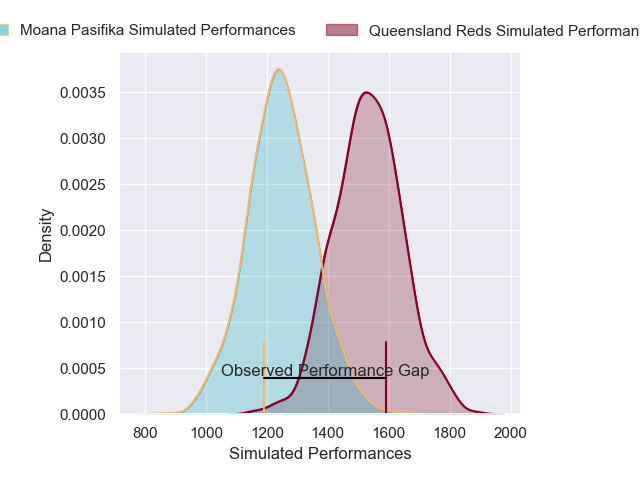
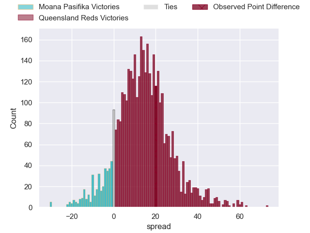
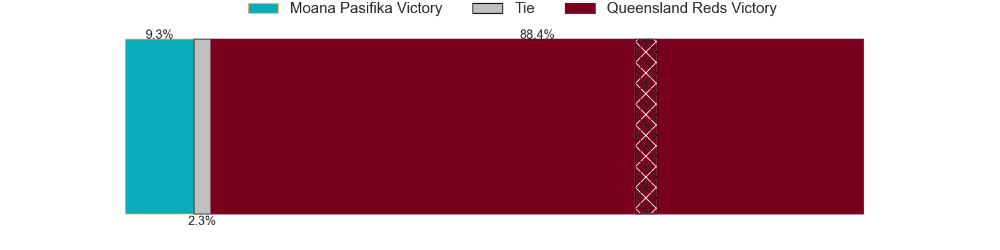
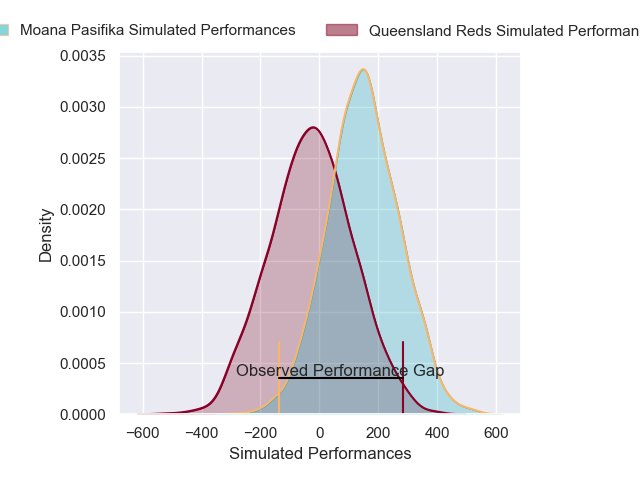
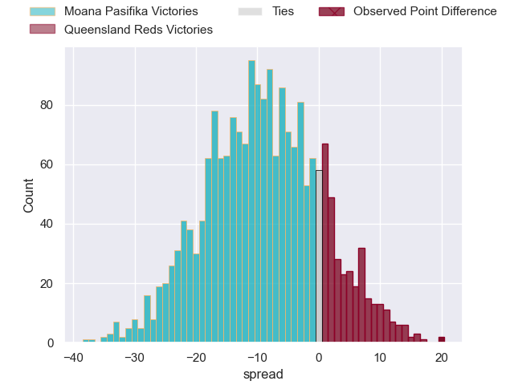
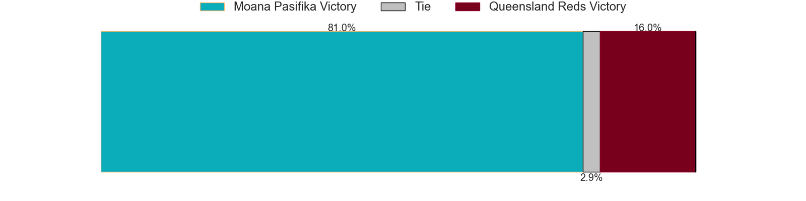

---  
layout: page  
title: Moana Pasifika at Queensland Reds; 36-56  
date: 2025-02-21 18:00:00 -0500  
categories: "Super Rugby Pacific 2025" match review  
---
# Moana Pasifika at Queensland Reds; 36-56

# Club Level Predictions

The first set of predictions treats a club as the smallest object, as the club develops its members, organizes a gameplan, and deploys its players as needed for each match. This club model has a prediction of 0.827, which translates to predicting Queensland Reds to win by 14.3.

Our Over/Under is 50.5 - and combined with the spread above, we have a predicted scoreline of 18 to 32

Each club has a rating and a rating deviation (similar to a Glicko rating), and expected performances can be generated. This allows for simulated matches and spreads like the ones below.
## Projected Performances - Club Model

## Projected Spreads - Club Model

## Projected Results - Club Model

# Player Level Predictions

Treating teams instead as an entity made up of the currently active players, I have ratings for each player in an altogether different system. These can be combined to form team ratings once teamsheets are announced, weighting starters a bit higher than the reserves. After the match is played, players can be weighted by their minutes on the field, allowing for an accurate measure of the team's composition. With these compiled team ratings, we can make predictions, measure inaccuracy, and update the individual player ratings.
## Prediction without Player Minutes: Queensland Reds by 3.7

Moana Pasifika by 4.5 on a neutral pitch

## Projected Performances - Player Model

## Projected Spreads - Player Model

## Projected Results - Player Model

|   Away Minutes | Away Player           |   Away Percentile |   Number |   Home Percentile | Home Player               |   Home Minutes |
|---------------:|:----------------------|------------------:|---------:|------------------:|:--------------------------|---------------:|
|             26 | James Lay             |             34.67 |        1 |             69.26 | Sef Fa'agase              |             26 |
|             32 | Mills Sanerivi        |              7.02 |        2 |             88.8  | Richie Asiata             |             11 |
|             31 | Feleti Sae-Ta'ufo'ou  |             16.53 |        3 |             70.14 | Massimo De Lutiis         |             51 |
|             49 | Sam Slade             |             19.38 |        4 |             24.86 | Josh Canham               |             50 |
|             80 | Allan Craig           |              3.31 |        5 |             22.31 | Ryan Smith                |             25 |
|             80 | Miracle Faiilagi      |             60.78 |        6 |             76.37 | Seru Uru                  |             56 |
|             32 | Ardie Savea           |             98.2  |        7 |             96.22 | Fraser McReight           |             81 |
|             31 | Semisi Tupou Ta'eiloa |             22.66 |        8 |             97.66 | Harry Wilson              |             65 |
|             31 | Semisi Tupou Ta'eiloa |             22.66 |        8 |             97.66 | Harry Wilson              |             59 |
|             31 | Semisi Tupou Ta'eiloa |             22.66 |        8 |             97.66 | Harry Wilson              |              9 |
|             31 | Semisi Tupou Ta'eiloa |             22.66 |        8 |             97.66 | Harry Wilson              |             81 |
|             81 | Jonathan Taumateine   |             25.99 |        9 |             81.41 | Tate McDermott            |             30 |
|              4 | Jackson Garden-Bachop |              4.85 |       10 |             83.54 | Tom Lynagh                |             30 |
|             16 | Kyren Taumoefolau     |             67    |       11 |             97.89 | Filipo Daugunu            |             81 |
|             51 | Lalomilo Lalomilo     |             38.6  |       12 |             81.74 | Hunter Paisami            |             22 |
|             40 | Pepesana Patafilo     |             80.95 |       13 |             58.24 | Josh Flook                |             30 |
|             81 | Solomon Alaimalo      |             70.13 |       14 |             25.55 | Tim Ryan                  |             30 |
|             81 | William Havili        |              8.54 |       15 |             67.89 | Jock Campbell             |             12 |
|             32 | Sama Malolo           |             74.58 |       16 |             81.27 | Matt Faessler             |             55 |
|             32 | Tito Tuipulotu        |             16.29 |       17 |             44.78 | George Blake              |             81 |
|             52 | Chris Apoua           |              4.25 |       18 |             82.18 | Zane Nonggorr             |             81 |
|             80 | Tom Savage            |             72.5  |       19 |             93.95 | Angus Blyth               |             81 |
|             80 | Ola Tauelangi         |             37.62 |       20 |             31.25 | Joe Brial                 |             77 |
|             48 | Melani Matavao        |             50.77 |       21 |             80.55 | Kalani Thomas             |             36 |
|             81 | Losilosivale Filipo   |             82.81 |       22 |             60.97 | Harry McLaughlin-Phillips |             30 |
|             51 | Danny Toala           |              3.55 |       23 |             74.82 | Lachie Anderson           |             48 |

