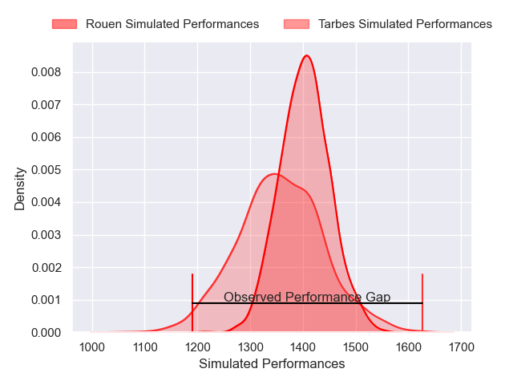
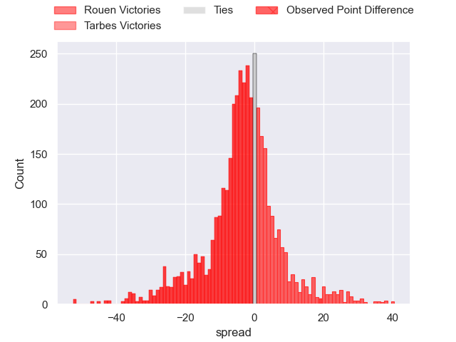
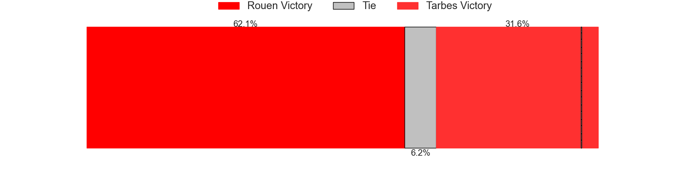
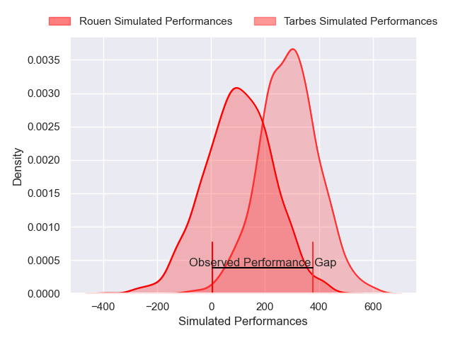
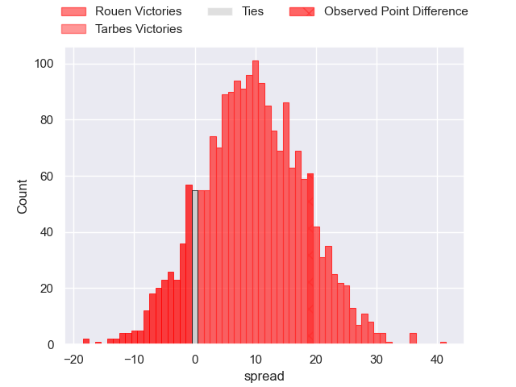
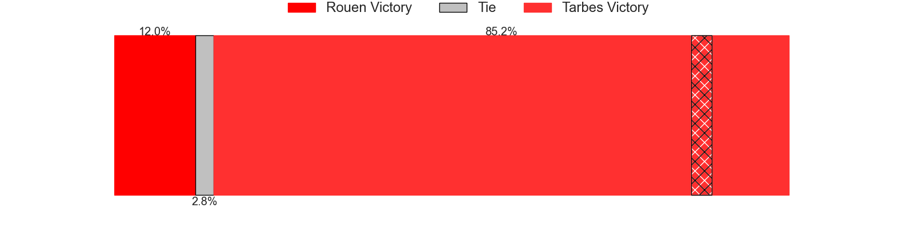

---  
layout: page  
title: Rouen at Tarbes; 7-26  
date: 2025-02-21 18:00:00 -0500  
categories: "Nationale 24/25" match review  
---
# Rouen at Tarbes; 7-26

# Club Level Predictions

The first set of predictions treats a club as the smallest object, as the club develops its members, organizes a gameplan, and deploys its players as needed for each match. This club model has a prediction of 0.432, which translates to predicting Rouen to win by 2.4.

Our Over/Under is 39.5 - and combined with the spread above, we have a predicted scoreline of 21 to 19

Each club has a rating and a rating deviation (similar to a Glicko rating), and expected performances can be generated. This allows for simulated matches and spreads like the ones below.
## Projected Performances - Club Model

## Projected Spreads - Club Model

## Projected Results - Club Model

# Player Level Predictions

Treating teams instead as an entity made up of the currently active players, I have ratings for each player in an altogether different system. These can be combined to form team ratings once teamsheets are announced, weighting starters a bit higher than the reserves. After the match is played, players can be weighted by their minutes on the field, allowing for an accurate measure of the team's composition. With these compiled team ratings, we can make predictions, measure inaccuracy, and update the individual player ratings.
## Prediction without Player Minutes: Tarbes by 6.5

Rouen by 4.3 on a neutral pitch

## Projected Performances - Player Model

## Projected Spreads - Player Model

## Projected Results - Player Model

|   Away Minutes | Away Player           |   Away Percentile |   Number |   Home Percentile | Home Player         |   Home Minutes |
|---------------:|:----------------------|------------------:|---------:|------------------:|:--------------------|---------------:|
|             12 | Ewan Clément          |             30.18 |        1 |             11.24 | Ximun Bessonart     |             31 |
|             34 | Mathieu Bonnot        |             47.32 |        2 |             15.89 | Florian Lamothe     |             25 |
|             20 | Sidi-Mohammed Diallo  |             38.84 |        3 |             48.31 | Luka Vea            |             25 |
|             63 | Corentin Vernet       |             33.93 |        4 |             53.88 | Léo Saint-Guilhem   |             18 |
|             17 | Julien Ruaud          |             86.58 |        5 |             39.22 | Baptiste Peytavi    |             20 |
|             19 | Manolo Laffond        |             54.82 |        6 |             94.52 | Alexis Armary       |             62 |
|             80 | Jean Leleu            |             26.09 |        7 |             46.03 | Spike Salman        |             80 |
|             80 | Abdelkarim Fofana     |             71.29 |        8 |             43.95 | Joeli Matalaweru    |             59 |
|             21 | Florent Campeggia     |             71.6  |        9 |             16.7  | Thomas Millet       |             80 |
|             80 | Benjamin Pehau        |             74.89 |       10 |             17.93 | Alexandre Perez     |             48 |
|             54 | Axel Malaret          |             37.96 |       11 |             35.29 | Clement Latorre     |             80 |
|             80 | Theo Dachary          |              3.36 |       12 |             13.13 | Savenaca Rawaca     |              6 |
|             57 | Marin Boulier         |             39.59 |       13 |             34.06 | Hugo Cellier        |              8 |
|              1 | Sakiusa Bureitakiyaca |             58    |       14 |             33.27 | Amona Artaud        |             19 |
|             32 | Aloïs Chayla          |             37.4  |       15 |             17.68 | Joris Pialot        |             55 |
|             32 | Diego Arbelo          |             26.24 |       16 |            nan    | Lasha Mirtskhulava  |             59 |
|             32 | Noe Khier             |            nan    |       17 |             81.46 | Irakli Mirtskhulava |             59 |
|             80 | Lucas Malbert         |             21.57 |       18 |             60.54 | Vincent Dolier      |             48 |
|             39 | Octave Leleu          |             40.83 |       19 |             63.99 | Mathieu Soufflet    |             59 |
|             79 | Soig Mingant          |            nan    |       20 |             77.45 | Mickael Thébault    |             80 |
|             80 | Benjamin Debetz       |             36.49 |       21 |            nan    | Clément Gaubert     |             41 |
|             80 | Maxime Cassonnet      |            nan    |       22 |             10.29 | Jonathan Duffau     |             80 |
|             80 | Nicolas Nieto         |             42.84 |       23 |              7.9  | Maile Mamao         |             62 |

