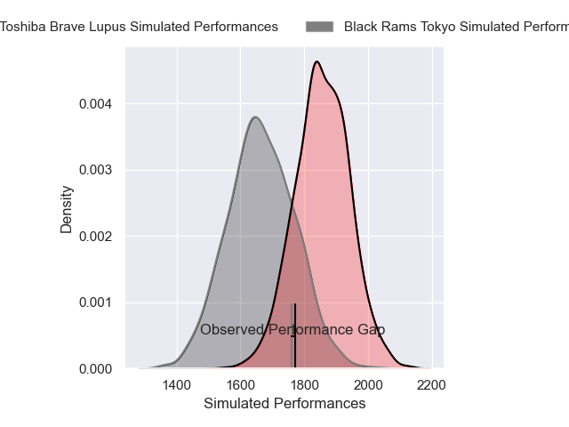
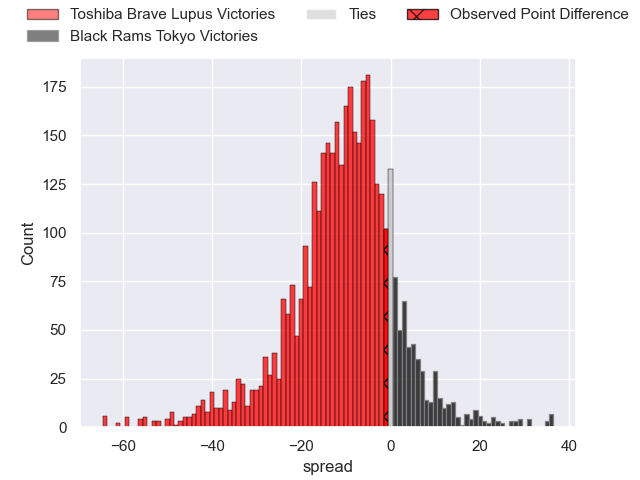
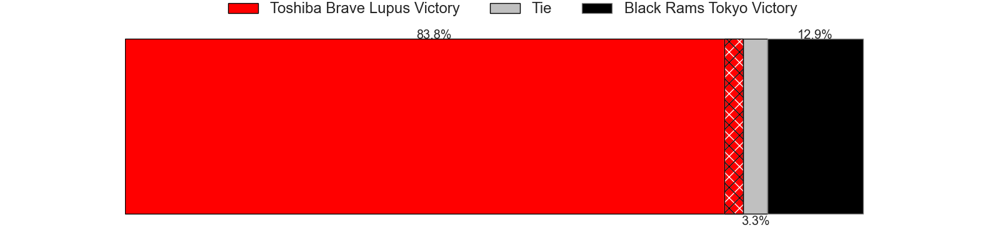
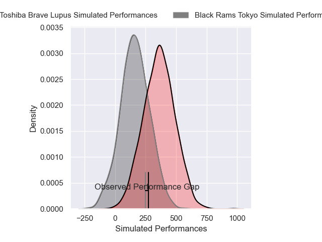
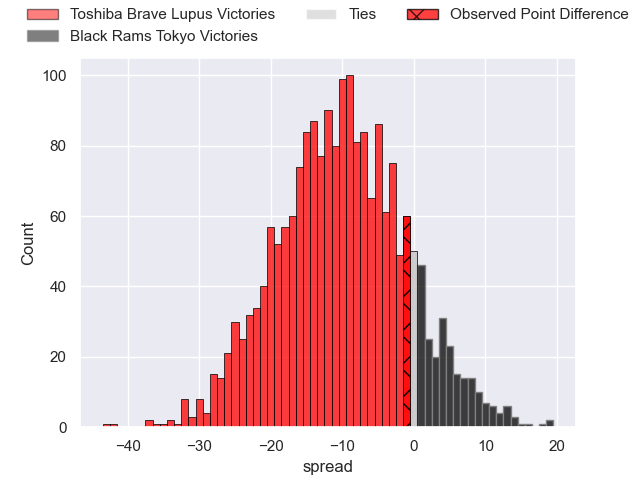
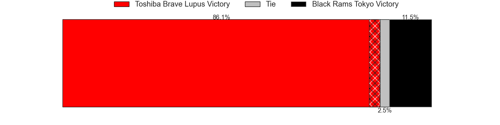

---  
layout: page  
title: Toshiba Brave Lupus at Black Rams Tokyo; 45-44  
date: 2025-02-22 18:00:00 -0500  
categories: "Japan Rugby League One 24/25" match review  
---
# Toshiba Brave Lupus at Black Rams Tokyo; 45-44

# Club Level Predictions

The first set of predictions treats a club as the smallest object, as the club develops its members, organizes a gameplan, and deploys its players as needed for each match. This club model has a prediction of 0.256, which translates to predicting Toshiba Brave Lupus to win by 9.6.

Our Over/Under is 56.5 - and combined with the spread above, we have a predicted scoreline of 33 to 23

Each club has a rating and a rating deviation (similar to a Glicko rating), and expected performances can be generated. This allows for simulated matches and spreads like the ones below.
## Projected Performances - Club Model

## Projected Spreads - Club Model

## Projected Results - Club Model

# Player Level Predictions

Treating teams instead as an entity made up of the currently active players, I have ratings for each player in an altogether different system. These can be combined to form team ratings once teamsheets are announced, weighting starters a bit higher than the reserves. After the match is played, players can be weighted by their minutes on the field, allowing for an accurate measure of the team's composition. With these compiled team ratings, we can make predictions, measure inaccuracy, and update the individual player ratings.
## Prediction without Player Minutes: Toshiba Brave Lupus by 9.4

Toshiba Brave Lupus by 13.5 on a neutral pitch

## Projected Performances - Player Model

## Projected Spreads - Player Model

## Projected Results - Player Model

|   Away Minutes | Away Player        |   Away Percentile |   Number |   Home Percentile | Home Player       |   Home Minutes |
|---------------:|:-------------------|------------------:|---------:|------------------:|:------------------|---------------:|
|              9 | Sena Kimura        |             94.22 |        1 |             49.36 | Kazuma Nishi      |             22 |
|             56 | Daigo Hashimoto    |             83.11 |        2 |             75.25 | Shin Ouchi        |             80 |
|             51 | Taufa Latu         |             63    |        3 |             21.67 | Shohei Oyama      |             67 |
|             80 | Shohei Ito         |             41.78 |        4 |             52.08 | Reijiro Yamamoto  |             80 |
|             80 | Samuela Anise      |             55.77 |        5 |             26.18 | Josh Goodhue      |             18 |
|              9 | Yoshitaka Tokunaga |             58.79 |        6 |              2.55 | Mike Stolberg     |             80 |
|             62 | Takeshi Sasaki     |             89.51 |        7 |             74.48 | Shuhei Matsuhashi |              6 |
|             62 | Michael Leitch     |             95.12 |        8 |             81.84 | Liam Gill         |             80 |
|             80 | Yuhei Sugiyama     |             81.58 |        9 |             96.9  | TJ Perenara       |             12 |
|             18 | Richie Mo'unga     |            100    |       10 |             50.84 | Ichigo Nakakusu   |             80 |
|             16 | Yuto Mori          |             60.57 |       11 |             33    | Semisi Tupou      |             32 |
|             62 | Rob Thompson       |             49.36 |       12 |             63.87 | Yuki Ikeda        |             53 |
|             29 | Seta Tamanivalu    |             96.94 |       13 |             10.76 | Viliami Lolohea   |             63 |
|             48 | Jone Naikabula     |             77.21 |       14 |             58.64 | Taira Main        |             80 |
|             29 | Takuro Matsunaga   |             94.92 |       15 |             57.11 | Kotaro Ito        |             80 |
|             80 | Takahiro Ogawa     |            nan    |       16 |            nan    | Penieli Jr Latu   |             29 |
|             71 | Masataka Mikami    |             82.34 |       17 |             98.87 | Paddy Ryan        |             29 |
|             80 | Mamoru Harada      |             89.46 |       18 |              8.98 | Amato Fakatava    |             58 |
|             80 | Yuta Kokaji        |             92.46 |       19 |             31.38 | Taishi Tsumura    |             62 |
|             29 | Taichi Mano        |             79.07 |       20 |             36.58 | Daiki Yanagawa    |             58 |
|             67 | Hiroki Yamamoto    |            nan    |       21 |             61.37 | Masaaki Onishi    |             18 |
|             59 | Michael Collins    |             92.68 |       22 |             66.08 | Netani Vakayalia  |             80 |
|             80 | Asaeli Lausii      |             34.77 |       23 |            nan    | nan               |            nan |

